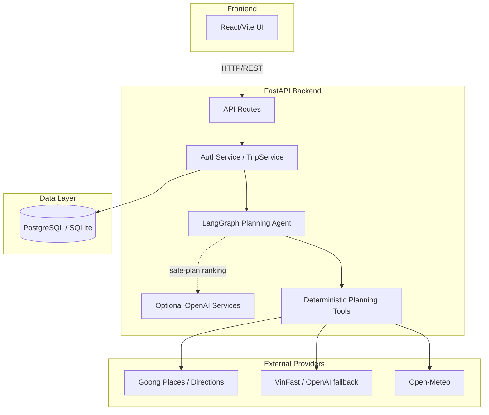
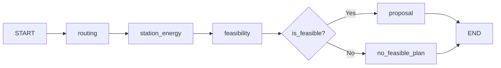
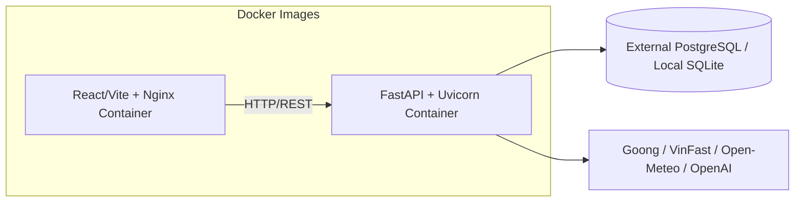

# Architecture Document

## System Overview

P-210 là monorepo gồm React/Vite frontend và FastAPI backend, hỗ trợ xác thực, quản lý xe và lập kế hoạch chuyến đi cho xe điện. LangGraph điều phối các công cụ tất định để lấy tuyến đường, tìm trạm, mô phỏng SOC và kiểm tra an toàn; OpenAI chỉ được dùng tùy chọn để tìm trạm fallback hoặc xếp hạng/giải thích các phương án đã an toàn. Dữ liệu nghiệp vụ được lưu bằng SQLAlchemy trên PostgreSQL ở môi trường triển khai hoặc SQLite khi chạy local/test.

## Architecture Diagram

## Components

### 1. Frontend (React/Vite)

- **Purpose:** Cung cấp giao diện đăng nhập, quản lý xe, nhập hành trình và trực quan hóa phương án sạc.
- **Key Features:** Goong Places autocomplete, chọn xe, tạo trip, bản đồ tuyến đường, biểu đồ SOC, danh sách trạm, cảnh báo rủi ro và kết quả `INFEASIBLE`.
- **State Management:** React hooks và React Hook Form; Zod validate form phía client, không dùng global state library.

### 2. Backend (FastAPI)

- **Purpose:** Cung cấp API, xác thực/ủy quyền, quản lý trip và điều phối planning workflow cùng các external providers.
- **API Design:** RESTful
- **Authentication:** Opaque Bearer token gắn với session có thể thu hồi trong database; backend chỉ lưu SHA-256 hash của token, không dùng JWT.

### 3. AI Agent (LangGraph)

- **Agent Type:** Custom deterministic planning workflow với nhánh quyết định an toàn.
- **State:** `AgentState` (`TypedDict`) chứa trip context, vehicle profile, assumption snapshot, route, station candidates, environment, kết quả mô phỏng năng lượng, feasibility verdict và output plan/refusal.
- **Nodes:** `routing`, `station_energy`, `feasibility`, `proposal`, `no_feasible_plan`.
- **Tools:** `RoutingProvider`, `StationService`, `EnvironmentProvider`, `EnergyTool` và `FeasibilityTool`.
- **Flow:**

### 4. Database

- **Type:** PostgreSQL cho deployment; SQLite được hỗ trợ cho local/test.
- **Tables:** `users`, `auth_sessions`, `user_vehicles`, `vehicle_profiles`, `trips`, `policy_configs`, `plan_versions`.
- **Migrations:** Alembic

### 5. Vector Store (Not Implemented)

- **Type:** Không có vector store trong runtime hiện tại.
- **Embeddings:** Không sử dụng.
- **Purpose:** Hệ thống hiện không dùng RAG hoặc similarity search; `CHROMA_PERSIST_DIR` chỉ là cấu hình kế thừa chưa được nối vào code.

## Data Flow

1. User đăng nhập, chọn xe và gửi thông tin hành trình từ Frontend.
2. API xác thực Bearer token, kiểm tra ownership và validate input bằng Pydantic.
3. `TripService` geocode địa điểm, chụp `AssumptionSnapshot` và lưu `Trip` ở trạng thái `DRAFT`.
4. Khi user yêu cầu lập kế hoạch, `TripService` gọi LangGraph pipeline.
5. Các deterministic tools lấy route/trạm/môi trường, mô phỏng SOC và đánh giá feasibility.
6. Nếu an toàn, hệ thống tạo tối đa ba phương án; LLM có thể xếp hạng/giải thích nhưng không được thay đổi route, SOC hoặc verdict.
7. Selected plan được lưu ở trạng thái `PENDING`; kết quả không khả thi trả `NoFeasiblePlan` và không lưu plan có thể xác nhận.
8. Response trả về Frontend để hiển thị bản đồ, SOC, trạm và cảnh báo.

## Deployment Architecture

## Security

- API keys stored in `.env` (never commit)
- Input validation via Pydantic ở backend và Zod ở frontend
- Opaque access tokens được hash trước khi lưu; mật khẩu dùng PBKDF2-HMAC-SHA256 với salt
- Trip và plan được bảo vệ bằng kiểm tra authenticated owner
- CORS configured for frontend domain
- Backend Docker container chạy bằng non-root user
- Rate limiting chưa được triển khai và là hạng mục cần bổ sung trước khi mở rộng production

## Design Decisions

| Decision | Choice | Reason |
|----------|--------|--------|
| Framework | FastAPI | Pydantic validation, OpenAPI tự động và type hints rõ ràng |
| Agent | LangGraph custom workflow | Điều phối state và nhánh fail-closed minh bạch, dễ kiểm thử |
| Database | PostgreSQL / SQLite | PostgreSQL cho deployment; SQLite giúp local/test gọn và tất định |
| Frontend | React 18 + Vite | SPA nhẹ, build nhanh và phù hợp luồng tương tác bản đồ/dashboard |
