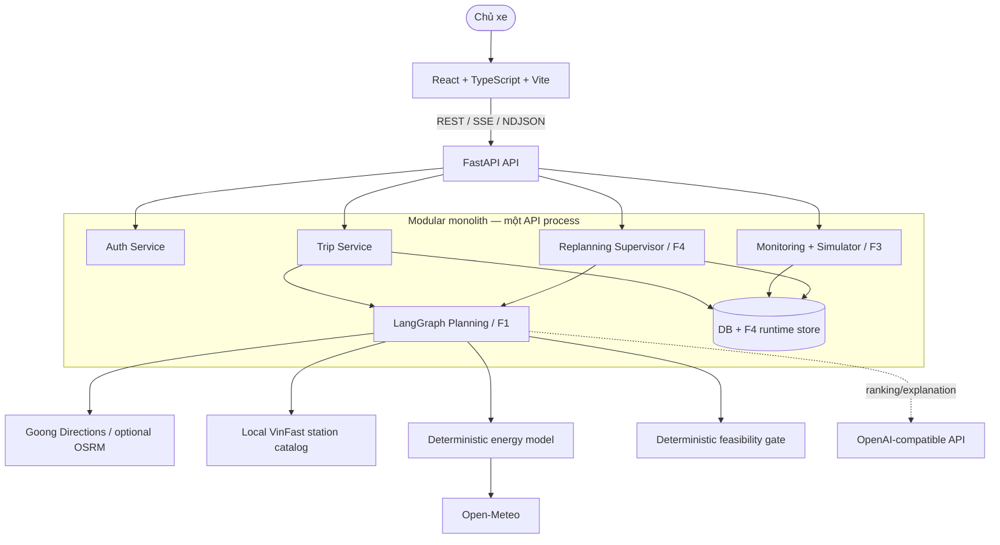
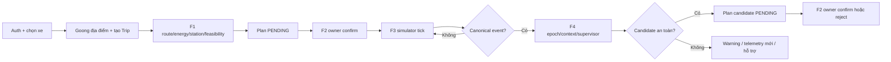

# P-210 Architecture (As-built)

**Cập nhật:** 01/09/2026

**Trạng thái:** Đối chiếu với code hiện tại

P-210 là monorepo gồm React 18/Vite frontend và FastAPI backend cho việc lập kế hoạch, theo dõi mô phỏng và tái lập hành trình xe điện. LangGraph điều phối các công cụ tất định; AI có thể hỗ trợ xếp hạng, phản tư và giải thích nhưng không được tạo hoặc ghi đè safety facts.

Chi tiết theo contract nằm tại [Technical Architecture](docs/TECHNICAL_ARCHITECTURE_AI_EV_AGENT_v3.1.md) và [Interface Design](docs/INTERFACE_DESIGN_AI_EV_AGENT_v1.0.md).

## System overview



Runtime hiện tại không sử dụng microservices, PostgreSQL job queue hoặc worker process tách biệt. Planning stream chạy trong thread của API; F4 stream chạy trong background thread/task của API.

## Thành phần

### Frontend — `src/apps/web`

- React 18, TypeScript, Vite, React Hook Form và Zod.
- Ba không gian chính: Planning, Tracking và History; Auth là màn hình vào hệ thống.
- `TripPlanMap` hiển thị route, station và vị trí telemetry; `SocChart` hiển thị SOC dự kiến/thực tế.
- `TrackingWorkspace` chạy catalog simulation; `TripMonitoringDashboard` chạy simulator trên plan đã xác nhận.
- `ReplanningSupervisorPanel` hiển thị public decision trace, evidence, missing evidence, plan diff và action.
- API base URL đọc từ `VITE_API_BASE_URL`; mặc định local là `http://localhost:8000`.

### FastAPI API — `src/apps/api`

- `main.py` cấu hình CORS, middleware `X-Trace-Id`, exception envelope và `/health`.
- Routes gồm auth, places, trips/plans, monitoring simulator, simulation catalog và replanning.
- API xác thực Bearer token, kiểm ownership trip/vehicle/plan và giao việc cho application services.
- `/health` hiện là liveness đơn giản, chưa phải dependency readiness check.

### Trip và planning — `src/packages/core/trips`, `src/packages/agent/planning`

- `TripService` là write boundary cho Trip, PlanVersion và F2 confirmation/rejection.
- Planning graph chạy theo dependency `Route → Energy + Station → Feasibility → Proposal`.
- `EnergyTool` và `FeasibilityTool` là deterministic; safety verdict không phụ thuộc LLM.
- Plan outcome là union: `PLAN_CREATED`, `PROVEN_INFEASIBLE`, `CONDITIONAL`, `ACTION_REQUIRED`.
- `PROVEN_INFEASIBLE` không tạo plan hoặc charging stop giả.

### Monitoring và simulator — `src/packages/core/monitoring`, `src/packages/core/simulator`

- Telemetry demo có provenance `SIMULATED`, seed, scenario, tick và freshness.
- Event canonical: `ROUTE_DEVIATION`, `SOC_UNDERPERFORMANCE`, `STATION_UNAVAILABLE`, `STALE_TELEMETRY`.
- Ngưỡng mặc định: lệch tuyến `>2.0 km`, SOC hụt `>5.0%`, telemetry cũ `>60 s`.
- Chỉ plan đã `CONFIRMED` mới được simulator chạy; plan chưa xác nhận trả `409 PLAN_NOT_CONFIRMED`.
- Catalog benchmark có 90 target cases từ 6 profile; fixture có `READY`, `NOT_APPLICABLE` hoặc `INVALID`.
- Fault injection (`NONE`, `F1_PROVIDER_FAILURE`, `F1_PROVEN_INFEASIBLE`) mặc định tắt và chỉ cho telemetry mô phỏng.

### Replanning — `src/packages/core/replanning`, `src/packages/agent/replanning`

- Event Coordinator deduplicate, sort, coalesce và gom event vào `DecisionEpoch`.
- `TripContextSnapshot` giữ context version, telemetry hiện tại, active constraints và excluded stations.
- Supervisor chọn strategy/tool trong allowlist, nhận structured observation, reflection theo evidence và bounded budget.
- `PlanDiffEngine` so sánh quãng đường, thời gian, SOC đích, reserve margin và station changes.
- `ActionGuard` phân biệt safe candidate, insufficient evidence, search exhausted và proven infeasible.
- Candidate luôn `PENDING`; chỉ owner mới có thể confirm/reject. Event mới có thể làm candidate thành `STALE_BY_NEW_CONTEXT`.
- `ReplanningRuntimeStore` lưu outcome/context/event/idempotency qua API runtime abstraction; scale nhiều instance cần shared durable store.

## Data và contracts

Pydantic contracts là nguồn schema dùng chung:

| Phạm vi | File |
| --- | --- |
| Trip, plan, assumptions, provenance | `src/packages/contracts/trips.py` |
| Telemetry, monitoring events, simulator | `src/packages/contracts/monitoring.py`, `simulator.py` |
| F4 context, epoch, decision, plan diff | `src/packages/contracts/replanning.py` |
| Frontend API types/client | `src/apps/web/src/lib/types.ts`, `api.ts` |

Storage dùng PostgreSQL/Supabase cho môi trường chia sẻ và SQLite cho local/test. Alembic migrations quản lý auth, vehicles, trips, policies, plans, station catalog và F4 schema. Không có vector store hoặc RAG trong runtime; `CHROMA_PERSIST_DIR` chỉ là cấu hình kế thừa chưa được nối vào code.

Mọi dữ liệu quan trọng phải giữ source/provenance và freshness: `MANUAL`, `REAL_API`, `CACHED_SNAPSHOT`, `SIMULATED`. Station metadata từ VinFast không đại diện số cổng trống real-time; SOC demo do simulator tạo, không phải dữ liệu OEM/OBD-II.

## API và execution

| Nhóm | Endpoint tiêu biểu |
| --- | --- |
| Auth/vehicles | `/api/v1/auth/*`, `/api/v1/vehicle-profiles`, `/api/v1/me/vehicles` |
| Places | `/api/v1/places/autocomplete`, `/api/v1/places/detail` |
| Trip/planning | `/api/v1/trips`, `/api/v1/trips/{id}/plans`, `/plans/stream`, `/plans/replan` |
| F2 decision | `/api/v1/plans/{plan_id}/confirm|reject` |
| F3 simulator | `/api/v1/simulator/capabilities`, `/simulator/trips/{id}/...` |
| Benchmark simulator | `/api/v1/simulation-cases`, `/api/v1/simulation-runs/...` |
| F4 replanning | `/api/v1/trips/{id}/replans`, `/replans/stream` |
| F4 audit/decision | `/agent-runs/{id}`, `/trips/{id}/context`, `/events`, `/decision-epochs/{id}`, `/plan-diffs/{id}`, `/plans/{version}/confirm|reject` |

Planning SSE (`text/event-stream`) phát `progress`, `heartbeat`, `result`, `error`, `done`. F4 NDJSON (`application/x-ndjson`) phát các frame `trace` rồi `complete` hoặc `error`. Frontend có watchdog/cancel và fallback planning direct khi stream không khả dụng.

Endpoint public `/api/v1/trips/{trip_id}/telemetry-events` chưa tồn tại; telemetry demo đi qua simulator routes.

## Data flow F1–F4



## Deployment

- `Dockerfile` chạy backend bằng Python 3.11/Uvicorn dưới user non-root.
- `docker-compose.yml` chạy backend; OSRM là profile tùy chọn với dataset tại `data/osrm`.
- Frontend production URL cần được truyền vào backend `CORS_ORIGINS`; frontend dùng `VITE_API_BASE_URL` trỏ tới backend.
- Secrets chỉ cấu hình qua environment variables; không commit `.env`.
- CI tại `.github/workflows/ci.yml` chạy Ruff/pytest backend và `npm run build` frontend trên push/PR `main`/`dev`.

## Security và reliability

- Bearer token là opaque token; backend lưu hash/session, kiểm tra ownership cho trip, vehicle, plan và simulation.
- `X-Trace-Id` được sinh hoặc giữ qua request; error envelope không trả secret/provider token.
- `If-Match` bảo vệ F2 plan decision; F4 dùng expected plan/context version.
- Replan server-side idempotency dựa trên trip, telemetry snapshot, base version và event IDs.
- Provider failure, WAF/access denied, stale cache và search exhausted được tách khỏi `INFEASIBLE` nếu chưa có deterministic proof.
- LLM fallback không được thay đổi route, station facts, SOC hoặc feasibility verdict.
- Fault injection mặc định tắt; monitoring/replanning fail-closed khi thiếu evidence bắt buộc.

## Design decisions

| Quyết định | Lựa chọn hiện tại | Lý do |
| --- | --- | --- |
| Kiến trúc | Modular monolith | Phù hợp team/MVP, dễ debug và giữ module boundary |
| Planning execution | Direct response hoặc SSE/NDJSON stream | Có progress/public trace mà chưa cần queue riêng |
| Safety | Deterministic energy + feasibility | Tái lập, kiểm thử được, không phụ thuộc LLM |
| Station data | Local VinFast catalog + provenance/freshness | Benchmark ổn định, tránh gọi locator trực tiếp trong mỗi plan |
| Database | PostgreSQL/Supabase hoặc SQLite local/test | Một contract storage cho shared và local environments |
| Frontend | React 18 + Vite | SPA nhẹ, phù hợp map/dashboard và build hiện tại |
| Queue | Chưa triển khai | Giảm hạ tầng; nâng cấp khi cần durable scheduling/scale ngang |
| Vector store | Không dùng | MVP không có RAG/similarity search |

## Kiểm tra local

```powershell
.\.venv\Scripts\python.exe -m ruff check src tests
.\.venv\Scripts\python.exe -m pytest tests -q
cd src/apps/web
npm test
npm run typecheck
npm run build
```
