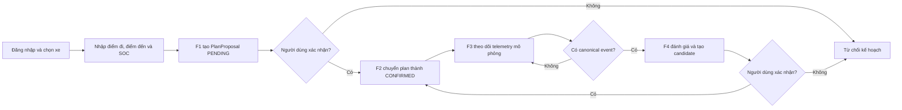
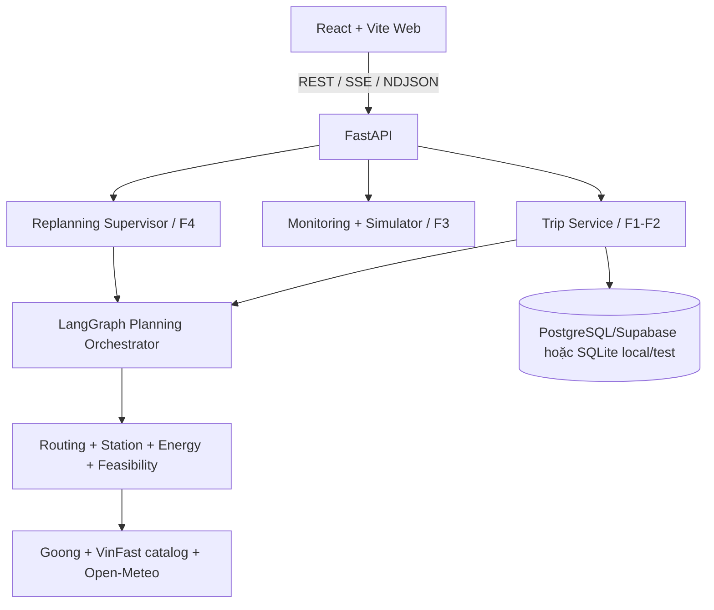

# P-210: AI EV Trip Planner

Ứng dụng web hỗ trợ chủ xe điện lập kế hoạch hành trình: chọn xe, nhập điểm đi/đến, tính tuyến đường, tìm trạm sạc phù hợp, dự báo SOC và đánh giá rủi ro. Hệ thống dùng dữ liệu có cấu trúc cùng các công cụ tất định cho các kết luận an toàn; AI hỗ trợ điều phối, phản tư trên bằng chứng và giải thích.

## Liên kết quan trọng

| Hạng mục | Liên kết |
| --- | --- |
| Ứng dụng đã deploy | [http://p-210-web.vercel.app/](http://p-210-web.vercel.app/) |
| Video demo | [YouTube](https://www.youtube.com/watch?v=9dvlh2EsEyQ&lc=UgyIFv1FkR5TMUXt35h4AaABAg) |
| Mã nguồn | [GitHub](https://github.com/AI20K-Build-Phase-Cohort-3/P-210) |
| Báo cáo đánh giá F3/F4 | [docs/evaluation.md](docs/evaluation.md) |
| Kết quả đánh giá F1 | [eval/results/report.md](eval/results/report.md) |

## Vấn đề và giải pháp

Trước một chuyến đi dài, chủ xe điện phải tự ghép tuyến đường, mức pin, mức tiêu hao, vị trí và đầu nối trạm sạc, thời gian dừng và mức pin an toàn từ nhiều nguồn. Kế hoạch thủ công khó kiểm chứng và có thể mất tính khả thi khi xe đi lệch tuyến, pin tụt nhanh hoặc trạm dự kiến không dùng được.

P-210 khép kín bốn năng lực: **F1** lập kế hoạch tất định, **F2** giải thích và xác nhận phiên bản, **F3** theo dõi telemetry mô phỏng, và **F4** tạo phương án thay thế từ vị trí/SOC hiện tại. AI điều phối và giải thích; các kết luận về tuyến, trạm, năng lượng, SOC và feasibility phải do công cụ tất định xác minh.

## Tính năng hiện có

- Đăng ký, đăng nhập và quản lý xe cá nhân.
- Tìm kiếm địa điểm với Goong Places; xử lý địa chỉ mơ hồ bằng danh sách gợi ý.
- Tạo trip với snapshot giả định và policy dự phòng SOC.
- Lập kế hoạch qua Goong Directions, catalog trạm VinFast đã ingest/chuẩn hóa cục bộ và mô hình năng lượng tất định.
- Đề xuất nhiều phương án, hiển thị tuyến trên bản đồ, các điểm sạc, SOC theo hành trình và dữ liệu nguồn.
- Lưu version kế hoạch và cho phép xác nhận kế hoạch.
- Mô phỏng F3 cho các sự kiện lệch tuyến, SOC thấp hơn dự kiến, trạm không khả dụng và telemetry cũ.
- F4 Replanning: gom sự kiện, tạo safety envelope, lập candidate mới từ telemetry hiện tại, so sánh thay đổi với kế hoạch cũ và yêu cầu người dùng xác nhận hành động.
- Catalog benchmark gồm 90 target case (`5 routes × 3 SOC × 6 profiles`) với gate `READY`, `NOT_APPLICABLE`, `INVALID`.

Trong chế độ mô phỏng ngẫu nhiên, `NORMAL` và mỗi tình huống rủi ro khả dụng có xác suất bằng nhau. Khi plan có trạm sạc, mỗi trong 5 tình huống có xác suất 20%; nếu không có trạm, mỗi trong 4 tình huống có xác suất 25%.

## Luồng nghiệp vụ



## Kiến trúc



```text
src/
  apps/api/           FastAPI routes, bootstrap và middleware
  apps/web/           React + Vite frontend
  packages/agent/     LangGraph planning và replanning supervisor
  packages/contracts/ Pydantic contracts dùng chung
  packages/core/      trips, monitoring, replanning và policies
migrations/           Alembic migrations
tests/                Unit/API/integration tests
docs/                 PRD, kiến trúc và feature specifications
```

Các quy tắc về tuyến, năng lượng, SOC, khả năng tiếp cận trạm và feasibility nằm ở `packages/core`. LLM không được phép tự tạo các số liệu hoặc vượt qua safety gate.

## Công nghệ

- Backend: Python, FastAPI, Pydantic, SQLAlchemy, Alembic, LangGraph.
- Frontend: React 18, TypeScript, Vite, React Hook Form.
- Data providers: Goong Places/Directions, catalog dữ liệu trạm VinFast, Open-Meteo; OSRM tùy chọn.
- Database: PostgreSQL/Supabase cho môi trường dùng chung; SQLite cho local/test.
- Streaming: SSE cho planning progress; NDJSON cho public F4 decision trace.
- DevOps: Docker, Docker Compose, GitHub Actions; frontend Vercel.

## Kết quả đánh giá F3/F4

Benchmark local ngày 01/09/2026 dùng dataset đóng băng `f3-f4-golden-v1` gồm 60 case. Đây là bằng chứng đánh giá local, không phải cam kết production.

| Chỉ số | Kết quả | Trạng thái |
| --- | ---: | --- |
| Golden cases hoàn tất | 60/60 | PASS |
| F3 classification Macro F1 | 94.72% | PASS |
| Infeasible candidate recall | 100% | PASS |
| Forbidden safety violation rate | 0% | PASS |
| Outcome exact-match accuracy | 85% | PARTIAL |
| F3/F4 latency p95 tại CCU=1 | 2.08 / 5.63 ms | PASS |
| Mức tải cao nhất đã thử | 20 CCU | PASS |
| Functional availability khi fault injection local | 48.65% | PARTIAL |
| MTTR | 1.85 giây | PASS |

Xem phương pháp, giới hạn và kết quả đầy đủ tại [docs/evaluation.md](docs/evaluation.md).

## Chạy local

Yêu cầu: Python 3.11+, Node.js 20+ và npm.

```powershell
python -m venv .venv
.\.venv\Scripts\Activate.ps1
pip install -r requirements.txt
Copy-Item .env.example .env
cd src/apps/web
npm install
cd ../../..
```

Cập nhật `.env` với ít nhất `DATABASE_URL`, `GOONG_API_KEY`, `GOONG_MAPTILES_KEY` và `OPENAI_API_KEY` khi chạy agent ngoài `APP_ENV=test`. Không commit file `.env`.

Frontend đọc backend URL từ `VITE_API_BASE_URL` (mặc định local là `http://localhost:8000`).

Chạy migrations:

```powershell
.\.venv\Scripts\python.exe -m alembic upgrade head
```

Chạy API:

```powershell
.\.venv\Scripts\uvicorn.exe src.apps.api.main:app --reload --port 8000
```

Chạy frontend trong terminal khác:

```powershell
cd src/apps/web
cmd /c npm run dev
```

- Web local: `http://localhost:5173`
- API docs: `http://localhost:8000/docs`

Chạy backend bằng Docker:

```powershell
docker compose up --build backend
```

OSRM là profile tùy chọn và cần dataset đã chuẩn bị trong `data/osrm`:

```powershell
docker compose --profile routing up --build
```

## API chính

| Nhóm | Endpoint |
| --- | --- |
| Auth | `POST /api/v1/auth/register`, `POST /api/v1/auth/login`, `GET /api/v1/auth/me` |
| Xe | `GET /api/v1/vehicle-profiles`, `GET/POST/PATCH /api/v1/me/vehicles` |
| Địa điểm | `GET /api/v1/places/autocomplete`, `GET /api/v1/places/detail` |
| Trip | `POST /api/v1/trips`, `GET /api/v1/trips/{trip_id}`, `GET /api/v1/trips/history` |
| Planning | `POST /api/v1/trips/{trip_id}/plans`, `POST /api/v1/trips/{trip_id}/plans/stream`, `GET /api/v1/trips/{trip_id}/plans` |
| F2 decision | `POST /api/v1/plans/{plan_id}/confirm`, `POST /api/v1/plans/{plan_id}/reject` |
| Monitoring | `POST /api/v1/simulator/trips/{trip_id}/start`, `POST /api/v1/simulator/trips/{trip_id}/tick` |
| Replanning | `POST /api/v1/trips/{trip_id}/replans`, `POST /api/v1/trips/{trip_id}/replans/stream` |
| F4 decision | `POST /api/v1/trips/{trip_id}/plans/{version}/confirm`, `POST /api/v1/trips/{trip_id}/plans/{version}/reject` |
| Simulation catalog | `GET /api/v1/simulation-cases`, `POST /api/v1/simulation-runs` |

Xem schema đầy đủ tại Swagger UI hoặc các contract trong `src/packages/contracts/`.

## Kiểm tra chất lượng

```powershell
.\.venv\Scripts\python.exe -m ruff check src tests
.\.venv\Scripts\python.exe -m pytest tests -q
cd src/apps/web
cmd /c npm test
cmd /c npm run typecheck
cmd /c npm run build
```

CI chạy backend lint/test và frontend typecheck/build khi push hoặc mở pull request vào `main`/`dev`.

## Tài liệu

- [Product brief](docs/BRIEF_AI_EV_AGENT_v3.0.md)
- [Product requirements](docs/PRD_AI_EV_AGENT_v3.0.md)
- [Technical architecture](docs/TECHNICAL_ARCHITECTURE_AI_EV_AGENT_v3.1.md)
- [Interface design](docs/INTERFACE_DESIGN_AI_EV_AGENT_v1.0.md)
- [Feature 1 implementation](docs/FEATURE1.md)
- [Feature 3 implementation](docs/FEATURE_3_IMPLEMENT.md)
- [F4 implementation specification](docs/FEATURE_4_IMPLEMENTATION_SPEC_v2.0.md)
- [Agent architecture](docs/agent_architecture.md)

## Lưu ý vận hành

- Trạng thái trạm từ VinFast là metadata nguồn dữ liệu, không phải số cổng trống theo thời gian thực.
- Fallback và dữ liệu cache phải hiển thị kèm provenance/freshness; không kết luận an toàn khi thiếu bằng chứng.
- Khi deploy frontend trên Vercel, cấu hình URL backend cho frontend; ở backend, cấu hình `CORS_ORIGINS`, database và các API key bằng environment variables của nền tảng triển khai.
- Backend hiện chạy modular monolith trong một API process; planning/replanning stream dùng thread/task trong process, chưa có durable queue/worker riêng.

### Luồng khép kín F1–F4

1. F1 tạo phương án ở trạng thái `PENDING`.
2. Người dùng bấm **Xác nhận hành trình**; F2 kiểm tra phiên bản plan/context và chuyển phương án thành `CONFIRMED`.
3. F3 chỉ cho phép mô phỏng đúng phiên bản đã xác nhận. Plan chưa xác nhận trả `409 PLAN_NOT_CONFIRMED`.
4. Khi F3 phát canonical event, frontend tự gửi sự kiện đó sang F4 đúng một lần theo `event_id`.
5. F4 chạy chuỗi kiểm tra nhiều bước, phản tư sau mỗi bằng chứng, gọi F1 tạo candidate khi đủ điều kiện và vẫn để candidate ở `PENDING` chờ người dùng xác nhận.

Feature 4 hiển thị nhật ký quyết định bằng tiếng Việt. Nhật ký chỉ gồm mục tiêu, công cụ đã dùng, bằng chứng, phần còn thiếu, kết luận và hành động; không lưu hoặc hiển thị chain-of-thought riêng tư của mô hình.

Kiểm thử frontend bổ sung:

```powershell
cd src/apps/web
npm test
npm run build
```

## Nhóm phát triển

**AI20K Build Phase Cohort 3 — Team P-210.** Phân công và tiến độ được ghi tại [WORKLOG.md](WORKLOG.md) và [JOURNAL.md](JOURNAL.md).
