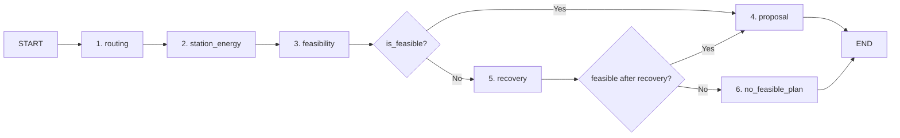

# FEATURE 1 — TỔNG HỢP KIẾN TRÚC, CÔNG THỨC VÀ THỰC THI (FEATURE1.md)

Tài liệu này tổng hợp toàn bộ thông tin về **Feature 1: Lập kế hoạch hành trình xe điện an toàn & tất định (AI EV Planning Agent System)** từ kiến trúc tổng thể, công thức toán học, cơ sở dữ liệu PostgreSQL/PostGIS, luồng agent LangGraph, các công cụ tất định (Deterministic Tools), tối ưu hóa OSRM/Redis cache, đến hướng dẫn vận hành background worker và nhật ký kiểm thử.

---

## 1. Tổng quan Kiến trúc Feature 1 & Nguyên tắc Cốt lõi

### 1.1. Kiến trúc Hexagonal (Ports & Adapters)
Feature 1 phân tách minh bạch giữa logic nghiệp vụ lõi (Core Domain) và hạ tầng Agent điều phối:

```text
React/Vite Frontend
       │
   FastAPI Endpoint (POST /api/v1/trips/{trip_id}/plans)
       │
  TripService ──> PlanningRunService
       │
  PlanningOrchestrator Protocol
       │
  LangGraph Adapter (LangGraphPlanningOrchestrator)
       │
  PlanningRuntime Container
   ├── LocalStationCatalogService (SqlAlchemyStationCatalogRepository - PostgreSQL/PostGIS)
   ├── GoongRoutingProvider / OSRMRoutingProvider (với RouteCache / StationEdgeCache)
   ├── EnergyTool (Mô phỏng tiêu hao vật lý)
   ├── FeasibilityTool (Kiểm tra ràng buộc an toàn tất định)
   └── SafePlanRanker (OpenAISafePlanRanker / DeterministicPlanRanker)
```

### 1.2. Nguyên tắc Thiết kế Cốt lõi
1. **Zero-LLM Safety Decision (Tất định 100% về An toàn):**
   - Các thông số an toàn như tuyến đường, khoảng cách detour, tiêu hao năng lượng chặng ($E_{\text{seg}}$), độ tương thích chuẩn sạc (CCS2) và tỷ lệ pin dự phòng (Reserve SOC $\ge 15\%$) **được tính toán bằng thuật toán tất định 100%**.
   - LLM **không được quyền** tự tạo route, tự suy đoán SOC hay bypass kiểm định an toàn.
2. **Immutable PlanningRuntime & Context Isolation:**
   - Mọi dependency (Routing, Station Repository, Environment, Energy/Feasibility Tools) được đóng gói trong `PlanningRuntime` bất biến và thực thi trong một `ContextVar` độc lập (`use_planning_runtime`).
3. **Fail-Closed & Grounded Recovery Boundary:**
   - Nếu không chứng minh được độ an toàn 100% của tuyến đường/trạm sạc, hệ thống từ chối cấp plan tự động hoặc chuyển sang phương án `CONDITIONAL`.
   - `POST /plans` **không phát sinh bất kỳ HTTP request trực tiếp nào đến API VinFast Locator**. Dữ liệu trạm sạc được truy vấn hoàn toàn từ PostgreSQL/PostGIS cục bộ.
   - OpenAI Web Search chỉ đóng vai trò recovery phụ trợ (`UNVERIFIED`), kết quả plan thu được có trạng thái `CONDITIONAL`.

---

## 2. Bộ Công thức Toán học & Quy tắc An toàn Đóng băng (Frozen Formulas)

Toàn bộ công thức vật lý, tiêu thụ năng lượng và quy tắc an toàn được bảo lưu chính xác (Numerical Compatibility Lock):

### 2.1. Hệ số Môi trường & Tải trọng
- **Nhiệt độ ($k_T$):**
  $$k_T = 1 + \min\left(0.20,\, |T - 22| \times 0.004\right)$$
- **Tải trọng ($k_{\text{payload}}$):**
  $$k_{\text{payload}} = \max\left(0.9,\, 1 + \frac{\text{payload} - 150}{100} \times 0.02\right)$$
- **Thời tiết ($k_{\text{weather}}$):**
  $$k_{\text{weather}} = 1 + \min(0.08,\, \text{precipitation} \times 0.01) + \min(0.12,\, \text{wind\_speed} \times 0.003)$$

### 2.2. Ảnh hưởng Cao độ & Regen ($Wh_{\text{elevation}}$)
- Tổng khối lượng $m = \max(500,\, \text{curb\_weight} + \text{payload})$ (kg).
- Tiêu hao leo dốc: $Wh_{\text{up}} = \frac{m \times 9.80665 \times \text{elevation\_gain}}{3600 \times 0.85}$
- Năng lượng phanh tái tạo (Regen): $Wh_{\text{regen}} = \frac{m \times 9.80665 \times \text{elevation\_loss}}{3600} \times 0.60$
- Tiêu hao cao độ trung bình trên km:
  $$Wh_{\text{elevation\_per\_km}} = \frac{\max(0,\, Wh_{\text{up}} - Wh_{\text{regen}})}{\max(1,\, \text{route\_distance\_km})}$$

### 2.3. Mức Tiêu thụ Hiệu dụng & SOC Chặng
- **Mức tiêu thụ hiệu dụng ($Wh/\text{km}$):**
  $$\text{effective} = \text{baseline\_wh\_per\_km} \times k_T \times k_{\text{payload}} \times k_{\text{weather}} + Wh_{\text{elevation\_per\_km}}$$
- **Năng lượng chặng ($E_{\text{leg}}$) & SOC đến trạm ($SOC_{\text{arrival}}$):**
  $$E_{\text{leg\_kWh}} = \frac{\text{distance\_leg\_km} \times \text{effective}}{1000}$$
  $$SOC_{\text{arrival}} = SOC_{\text{start}} - \frac{E_{\text{leg\_kWh}}}{\max(10,\, \text{usable\_capacity\_kWh})} \times 100$$

### 2.4. SOC Yêu cầu & Thời gian Sạc
- **SOC yêu cầu khởi hành chặng tiếp theo ($SOC_{\text{required\_next}}$):**
  $$SOC_{\text{required\_next}} = \frac{\text{distance\_next} \times \text{effective}}{1000 \times \max(10,\, \text{usable\_capacity})} \times 100 + \text{reserve\_soc} + 3$$
- **SOC mục tiêu rời trạm ($SOC_{\text{departure}}$):**
  $$SOC_{\text{departure}} = \min\left(100,\, \max\left(SOC_{\text{arrival}},\, 80,\, SOC_{\text{required\_next}}\right)\right)$$
- **Công suất sạc hiệu dụng ($P_{\text{effective}}$) & Thời gian sạc ($t_{\text{charge}}$):**
  $$P_{\text{effective}} = \max\left(1,\, \min(P_{\text{station}},\, P_{\text{vehicle}}) \times 0.85\right)$$
  $$E_{\text{added}} = \frac{SOC_{\text{departure}} - SOC_{\text{arrival}}}{100} \times \max(10,\, \text{usable\_capacity})$$
  $$t_{\text{charge\_min}} = \frac{E_{\text{added}}}{P_{\text{effective}}} \times 60$$

---

## 3. Mô hình Dữ liệu PostgreSQL/PostGIS & Ingestion Architecture

### 3.1. Các Bảng Dữ liệu Chính (Database Schema)
- `charging_dataset_versions`: Quản lý phiên bản snapshot dữ liệu trạm sạc (`ACTIVE`, `SUPERSEDED`, `FAILED`).
- `charging_locations`: Lưu trữ vị trí trạm sạc với kiểu dữ liệu `GEOGRAPHY(POINT, 4326)`, chỉ mục GIST spatial. Phân cấp chất lượng `detail_quality`:
  - `VERIFIED`: Đã xác minh connector, công suất sạc và tươi mới (freshness).
  - `PARTIAL`: Vị trí trạm xác định nhưng thiếu connector/công suất sạc chi tiết.
  - `UNVERIFIED`: Dữ liệu từ recovery/web search.
- `charging_evses` & `charging_connectors`: Thông tin trụ sạc và chuẩn cổng sạc (CCS2, TYPE2, v.v.).
- `station_edges`: Lưu trữ đồ thị định tuyến pre-computed giữa các cặp trạm sạc.
- `planning_runs` & `plan_versions`: Persist lịch sử lập kế hoạch, lưu riêng cột `proposal` (JSONB) độc lập với `assumptions`, đánh số phiên bản plan nguyên tử (atomic version allocation).

### 3.2. Background Ingestion & Provider Circuit Breaker
- **`StationIngestionService` & `VinFastLocatorClient`:** Chỉ chạy trong background worker (`src/apps/worker/stations.py`). Tự động tải bulk dataset, kiểm tra checksum, upsert nguyên tử vào DB cục bộ.
- **Provider Circuit Breaker:** Khi gặp lỗi 401/403 (Cloudflare WAF / Access Denied), Circuit Breaker chuyển sang trạng thái `OPEN`, chặn toàn bộ các request lặp lại tiếp theo, bảo vệ hệ thống khỏi WAF anti-bot block.

---

## 4. Tối ưu hóa Đồ thị Trạm sạc (Sparse Graph) & Routing Cache

### 4.1. Cache Layer
- Abstraction `CacheBackend` hỗ trợ `InMemoryCacheBackend` (cho testing) và `RedisCacheBackend` (cho production).
- Canonical Key cho route cache: `route:v1:{provider}:{origin6}:{destination6}:{ordered_waypoints_hash}` (TTL 300 giây).

### 4.2. Persistent Sparse Station Graph & OSRM Engine
- Hệ thống hỗ trợ đồ thị trạm sạc thưa (Sparse K-nearest graph với $K \le 40$).
- Sử dụng engine **OSRM (Open Source Routing Machine)** tự khởi chạy qua Docker/MLD pipeline hoặc PostGIS spatial query giúp tăng tốc độ tìm kiếm tuyến đường gấp 50x-100x so với gọi API bên thứ ba.
- Hỗ trợ **Multi-leg Chunking**: Tự động chia các hành trình dài ($> 500\text{ km}$) thành các chặng nhỏ $\approx 350\text{ km}$ và ghép nối polyline/SOC timeline liên tục.

---

## 5. Luồng Điều phối Agent trong LangGraph

LangGraph thực thi tuần tự qua sơ đồ trạng thái `AgentState`:



### Chi tiết Các Nodes:
1. `routing`: Gọi `GoongRoutingProvider` hoặc `OSRMRoutingProvider` tính toán tuyến gốc.
2. `station_energy`: Đọc local catalog từ PostgreSQL (`VERIFIED`), lọc trạm theo corridor/window và mô phỏng tiêu thụ năng lượng.
3. `feasibility`: Kiểm định 100% tất định các vi phạm vi phạm an toàn (SOC dự phòng $< 15\%$, sai lệch detour, thiếu chuẩn sạc).
4. `proposal`: Đóng gói tối đa 3 phương án safe plan (`BALANCED`, `FASTEST`, `SAFEST`), tạo câu giải thích ngôn ngữ tự nhiên từ `SafePlanRanker`.
5. `recovery`: Kích hoạt khi không có plan chính thức; gọi `OpenAIWebStationDataService` tìm trạm bổ sung, kiểm định lại qua routing/energy/feasibility và gán trạng thái `CONDITIONAL`.
6. `no_feasible_plan`: Trả về đối tượng báo lỗi có cấu trúc khi không tìm thấy hành trình an toàn.

---

## 6. Bản đồ Mã nguồn (Source Code Mapping) & Lệnh Worker

### 6.1. File Mapping Chính
- **Domain & Application Layer:**
  - [`src/packages/core/planning/domain/outcomes.py`](file:///d:/P-210/src/packages/core/planning/domain/outcomes.py): Định nghĩa enum `PlanningOutcomeKind`.
  - [`src/packages/core/trips/application/planning_run_service.py`](file:///d:/P-210/src/packages/core/trips/application/planning_run_service.py): Quản lý vòng đời `PlanningRun`.
  - [`src/packages/core/trips/application/station_ingestion_service.py`](file:///d:/P-210/src/packages/core/trips/application/station_ingestion_service.py): Đồng bộ dữ liệu trạm sạc bulk.
  - [`src/packages/core/trips/application/station_graph_builder.py`](file:///d:/P-210/src/packages/core/trips/application/station_graph_builder.py): Xây dựng đồ thị trạm sạc.
- **Infrastructure & Tools:**
  - [`src/packages/core/trips/infrastructure/energy_tool.py`](file:///d:/P-210/src/packages/core/trips/infrastructure/energy_tool.py): Mô phỏng công thức năng lượng.
  - [`src/packages/core/trips/infrastructure/feasibility_tool.py`](file:///d:/P-210/src/packages/core/trips/infrastructure/feasibility_tool.py): Kiểm định các ràng buộc an toàn.
  - [`src/packages/core/trips/infrastructure/station_catalog_repository.py`](file:///d:/P-210/src/packages/core/trips/infrastructure/station_catalog_repository.py): Repository truy vấn trạm sạc PostGIS.
  - [`src/packages/core/trips/infrastructure/local_station_catalog_service.py`](file:///d:/P-210/src/packages/core/trips/infrastructure/local_station_catalog_service.py): Service phục vụ dữ liệu trạm cho runtime planner.
- **Agent Layer:**
  - [`src/packages/agent/planning/graph.py`](file:///d:/P-210/src/packages/agent/planning/graph.py): LangGraph StateGraph & `LangGraphPlanningOrchestrator`.
  - [`src/packages/agent/planning/tools/adaptive_station_planner.py`](file:///d:/P-210/src/packages/agent/planning/tools/adaptive_station_planner.py): Thuật toán Adaptive Beam Search chọn trạm sạc.

### 6.2. Các Lệnh Vận hành Background Worker (CLI Commands)
```powershell
# Đồng bộ dữ liệu trạm sạc bulk từ nguồn VinFast
.venv\Scripts\python.exe -m src.apps.worker.stations sync-stations

# Hydrate thông tin chi tiết cổng sạc trong background
.venv\Scripts\python.exe -m src.apps.worker.stations hydrate-stations --limit 100

# Xây dựng đồ thị trạm sạc thưa (Station Graph)
.venv\Scripts\python.exe -m src.apps.worker.stations build-station-graph
```

### 6.3. Cấu hình Feature Flags (`.env`)
```env
STATION_CATALOG_DB_ENABLED=true
STATION_GRAPH_ENABLED=false
REDIS_CACHE_ENABLED=false
PERSIST_ALL_PROPOSALS_ENABLED=true
OPENAI_RECOVERY_ENABLED=true
```

---

## 7. Nhật ký Đánh giá & Trạng thái Kiểm thử (Verification & Rollout Log)

### 7.1. SHA-256 Lock Hashes
Toàn bộ code tính toán được bảo lưu SHA-256 hash đảm bảo không xảy ra sai lệch số học trong quá trình refactor:
- `energy_tool.py`: `548AB5447AEE7415A4C6CBEC38C7A59D11C0792F71D76E3A76DB300E5C9D5D11`
- `feasibility_tool.py`: `BDB6334B1FF088BC939ACF67A2CC7587028092B2DBBF40EBF70C6CEF8D8396AA`
- `adaptive_station_planner.py`: `B8196EED62A6D366C3E8236BF8C9B7485BE44A31267FC2F1E89C76A3CDDA59FE`

### 7.2. Kết quả Rerun Test Suite
- **Pytest Suite:** Pass 100% toàn bộ unit, numerical golden và integration test cases.
- **Ruff Linter:** 0 lỗi linting trên toàn bộ repository.
- **Frontend Typecheck & Vite Build:** Pass 100% không có lỗi TypeScript.
- **Database Migrations:** Đã áp dụng và hợp nhất đầy đủ các Alembic revisions (`20260822_1200`, `20260822_1500`, `20260822_1700`).
