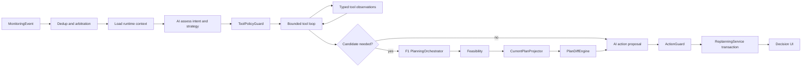

# FEATURE 4 IMPLEMENT

**Phiên bản:** 1.0  
**Ngày:** 22/08/2026  
**Trạng thái:** Source of truth cho triển khai  
**Phạm vi:** AI phân tích MonitoringEvent, chọn chiến lược/tool, so sánh plan và đề xuất hành động

**Tài liệu liên quan:** [FEATURE_3_IMPLEMENT.md](FEATURE_3_IMPLEMENT.md), [agent_architecture_for_f1.md](agent_architecture_for_f1.md)

## 1. Mục tiêu

F4 bổ sung **Replanning Supervisor Agent** đứng trên workflow lập kế hoạch F1:

```text
MonitoringEvent
  -> AI phân loại handling intent
  -> AI chọn strategy và tool
  -> tool trả fact có cấu trúc
  -> AI quan sát và quyết định bước tiếp
  -> F1 tạo candidate đã kiểm định
  -> backend so sánh old remaining plan với candidate
  -> AI đề xuất action + grounded explanation
  -> ActionGuard xác minh
  -> F2 lifecycle lưu plan version và chờ chủ xe xác nhận
```

F4 không phải một `switch(event_type)` gọi planner và không phải chatbot giải thích kết quả đã có. AI sở hữu quá trình quyết định; deterministic tools sở hữu safety facts.

## 2. Quan hệ với F1, F2 và F3

| Feature | F4 tái sử dụng | Không được làm |
|---|---|---|
| F1 | Routing, station search, AdaptiveStationPlanner, EnergyTool, FeasibilityTool, PlanProposal | Không fork planner; không tự tính route/SOC bằng LLM |
| F2 | Explanation references, plan history/version, ownership, confirm/reject | Không tự confirm candidate; không bỏ expected-version check |
| F3 | Current telemetry, MonitoringEvent, simulator provenance | Không tự phát hiện threshold; không sửa event facts |

Luồng ownership:

```text
F3 owns facts/events
F4 owns intent/strategy/tool/action proposal
F1 owns candidate calculation and feasibility
F2 owns proposal lifecycle and user decision
```

F4 gọi F1 qua `PlanningOrchestrator` port. Core không import trực tiếp global `planning_agent`.

## 3. Quyền quyết định và invariant

| Quyết định | Owner |
|---|---|
| Event canonical, threshold, actual value | F3 deterministic monitoring |
| Intent, uncertainty, objective | AI Agent 1 |
| Strategy, tool và bước tiếp theo | AI trong policy allowlist |
| Route, station compatibility/reachability, SOC, reserve | Deterministic tools |
| Candidate feasibility | F1 `FeasibilityTool` |
| Plan diff metrics | `PlanDiffEngine` deterministic |
| Trade-off, action proposal, explanation | AI Agent 1 |
| Action có được phép hay không | `ActionGuard` deterministic |
| Persist/invalidate/confirm/reject | `TripService` transaction |
| Áp dụng candidate | Chủ xe confirm |

Invariant:

- không safety fact nào do LLM tự sinh;
- thiếu/stale evidence thì fail closed;
- candidate luôn cần owner confirmation;
- plan cũ chỉ bị invalidate khi deterministic verdict là `INFEASIBLE`;
- provider failure/search exhausted không đồng nghĩa infeasible;
- không lưu chain-of-thought; chỉ lưu reason code, summary và evidence refs;
- mọi run truy được event → intent → tool → diff → action → plan version.

## 4. Kiến trúc



### Decision graph

```text
validate_event
  -> load_context
  -> assess_intent
  -> select_strategy
  -> decide_next_tool
  -> execute_tool
  -> observe_result
  -> repeat until enough evidence or budget exhausted
  -> build_candidate_with_F1 when required
  -> project_old_remaining_plan
  -> compare_plans
  -> propose_action
  -> action_guard
  -> persist_decision
```

Tool loop tối đa `6` call; mỗi tool tối đa một retry transient. Agent không tự tăng budget.

## 5. Input và structured AI output

### Replan context

```python
class ReplanningRequest:
    trip_id: str
    event_ids: list[str]
    telemetry_snapshot_id: str
    current_lat: float
    current_lng: float
    current_soc_percent: float
    destination_lat: float
    destination_lng: float
    base_plan_version: int
    excluded_station_ids: list[str]
    assumption_snapshot: AssumptionSnapshot
```

Input adapter phải dùng:

```text
origin = current telemetry GPS
initial_soc = current telemetry SOC
destination = trip destination
vehicle = trip vehicle snapshot
policy = trip assumption snapshot
excluded stations = event constraint
```

### AI schemas

```python
class IntentAssessment(BaseModel):
    intent: Literal[
        "ROUTE_RECOVERY",
        "ENERGY_RESCUE",
        "STATION_SUBSTITUTION",
        "TELEMETRY_RECOVERY",
    ]
    confidence: float
    objective: str
    strategy: str
    reason_codes: list[str]
    evidence_refs: list[str]
    missing_facts: list[str]

class ToolDecision(BaseModel):
    tool_name: str
    arguments: dict[str, object]
    reason_code: str
    expected_evidence: list[str]

class ActionProposalDraft(BaseModel):
    action: str
    reason_codes: list[str]
    evidence_refs: list[str]
    user_message: str
    limitations: list[str]
```

Event type là constraint cứng. Intent sai event hoặc confidence `<0.80` được sửa một lần; nếu vẫn sai, dùng deterministic event→intent fallback và ghi `classification_source=FALLBACK`.

## 6. Chiến lược theo event

| Event | Intent | Tool bắt buộc đầu | Mục tiêu |
|---|---|---|---|
| `ROUTE_DEVIATION` | `ROUTE_RECOVERY` | `route_from_current_position` | Route lại từ GPS hiện tại |
| `SOC_UNDERPERFORMANCE` | `ENERGY_RESCUE` | `nearest_station_reachability` | Chứng minh xe tới được trạm phù hợp gần nhất |
| `STATION_UNAVAILABLE` | `STATION_SUBSTITUTION` | `station_search` có blacklist | Thay trạm bị loại, thay đổi tối thiểu |
| `STALE_TELEMETRY` | `TELEMETRY_RECOVERY` | `request_telemetry_refresh` | Không replan dựa trên dữ liệu cũ |

### 6.1. `ROUTE_DEVIATION`

```text
route(current_position, destination)
  -> search station trên corridor mới khi cần
  -> energy + feasibility
  -> project old remaining plan từ current position/SOC
  -> compare
  -> continue/replan/assistance
```

Không dùng origin và SOC lúc tạo trip. Nếu xe off-route, baseline cũ phải bao gồm route rejoin đã được RoutingProvider xác minh.

### 6.2. `SOC_UNDERPERFORMANCE`

```text
nearest compatible/available station candidates
  -> route tới candidate gần nhất
  -> energy từ actual SOC
  -> arrival SOC >= reserve?
  -> nếu không: AI mở rộng corridor/backtracking trong budget
  -> F1 đánh giá toàn hành trình
```

“Gần nhất” dùng route distance/time, không kết luận reachability bằng đường chim bay. Phải kiểm tra reachability trước tối ưu ETA.

### 6.3. `STATION_UNAVAILABLE`

```text
excluded_station_ids += event.station_ids
  -> search replacement
  -> giữ các stop còn hợp lệ khi có thể
  -> route + energy + feasibility
  -> validate candidate excludes blacklist
```

Blacklist được kiểm tra ở cả tool input và candidate output. AI không được xóa blacklist.

### 6.4. `STALE_TELEMETRY`

Chỉ gọi `request_telemetry_refresh`. Không gọi routing, station, energy, F1 planner hoặc diff; `candidate_plan_version=null`. Sample mới phải tạo evaluation/run mới.

### 6.5. Nhiều event và negative profile

Arbitration tạo constraint envelope, không tự chọn action:

1. `STALE_TELEMETRY` chặn planning đến khi có sample mới.
2. `SOC_UNDERPERFORMANCE + STATION_UNAVAILABLE` dùng `ENERGY_RESCUE` cùng blacklist.
3. `ROUTE_DEVIATION` kết hợp các constraint còn lại trong một AgentRun.

Profile F3 `NO_FEASIBLE_ALTERNATIVE` không tạo event type riêng; nó phát event canonical có căn cứ. F4 chỉ trả no-feasible sau khi F1 tools chứng minh.

## 7. Tool registry và policy

```python
TOOL_REGISTRY = {
    "route_from_current_position": RouteFromCurrentPositionTool,
    "nearest_station_reachability": NearestStationReachabilityTool,
    "station_search": StationSearchTool,
    "energy_simulation": EnergyTool,
    "feasibility_check": FeasibilityTool,
    "build_candidate_plan": PlanningOrchestratorTool,
    "project_current_plan": CurrentPlanProjector,
    "compare_plans": PlanDiffEngine,
    "request_telemetry_refresh": TelemetryRefreshTool,
}
```

| Intent | Tool được phép | Constraint |
|---|---|---|
| `ROUTE_RECOVERY` | route, station, energy, feasibility, build, project, diff | current GPS/SOC |
| `ENERGY_RESCUE` | nearest, route, station, energy, feasibility, build, project, diff | nearest trước expanded search |
| `STATION_SUBSTITUTION` | station, route, energy, feasibility, build, project, diff | mọi station call nhận blacklist |
| `TELEMETRY_RECOVERY` | telemetry refresh | cấm planning tools |

`ToolPolicyGuard` reject khi:

- tool ngoài allowlist hoặc sai thứ tự;
- telemetry thiếu/stale/khác snapshot của run;
- station call thiếu blacklist;
- AI truyền route geometry, SOC result hoặc safety verdict tự tạo;
- output thiếu schema/provenance/freshness;
- vượt budget hoặc yêu cầu confirm/apply.

Tool result memoize theo input hash trong run. F1 dùng observation/cache đã xác minh, không gọi provider lặp lại.

## 8. Baseline, plan diff và action

### 8.1. Baseline đúng

Không so candidate với toàn bộ plan cũ từ origin ban đầu. `CurrentPlanProjector` tạo `old_remaining_plan` tại cùng telemetry snapshot:

- map-match progress hoặc route rejoin;
- loại segment/stop đã hoàn thành;
- thay SOC đầu kỳ bằng actual SOC;
- áp station blacklist;
- chạy lại energy và feasibility cho phần còn lại.

Baseline và candidate phải có cùng current GPS/SOC, destination, vehicle và policy snapshot.

### 8.2. PlanDiff

```json
{
  "base_version": 3,
  "telemetry_snapshot_id": "tel-123",
  "route": {"distance_delta_km": 4.8, "duration_delta_min": 9.0},
  "stations": {"removed": ["ST-102"], "added": ["ST-205"]},
  "energy": {
    "final_soc_delta_percent": 1.8,
    "reserve_margin_percent": 7.0
  },
  "safety": {
    "old_remaining": "INFEASIBLE",
    "candidate": "FEASIBLE",
    "reason_codes": ["STATION_REPLACED"]
  }
}
```

Diff còn phải chứa stop order, arrival/departure SOC, charge duration, provenance/freshness và risk reason changes. AI chỉ diễn giải, không sửa metric.

### 8.3. Action

```python
Action = Literal[
    "CONTINUE_CURRENT_PLAN",
    "PROPOSE_REPLAN",
    "PROPOSE_CONDITIONAL_REPLAN",
    "INVALIDATE_CURRENT_PLAN_AND_PROPOSE_REPLAN",
    "REQUEST_NEW_TELEMETRY",
    "NO_FEASIBLE_PLAN_REQUEST_ASSISTANCE",
]
```

| Evidence | Action hợp lệ |
|---|---|
| Telemetry stale | Chỉ `REQUEST_NEW_TELEMETRY` |
| Baseline feasible, candidate không cải thiện đáng kể | `CONTINUE_CURRENT_PLAN` |
| Baseline và candidate feasible, candidate phù hợp intent hơn | `PROPOSE_REPLAN` |
| Candidate safety-feasible nhưng station fact chưa authoritative | `PROPOSE_CONDITIONAL_REPLAN` |
| Baseline infeasible, candidate feasible | `INVALIDATE_CURRENT_PLAN_AND_PROPOSE_REPLAN` |
| Tools chứng minh không có candidate feasible | `NO_FEASIBLE_PLAN_REQUEST_ASSISTANCE` |

`ActionGuard` validate proposal, không âm thầm đổi action. AI được sửa một lần theo policy error; sai lần hai thì safe fallback và audit `AI_ACTION_REJECTED`.

## 9. Agent output

```json
{
  "agent_run_id": "ar-123",
  "trip_id": "trip-1",
  "event_types": ["SOC_UNDERPERFORMANCE"],
  "intent": "ENERGY_RESCUE",
  "intent_confidence": 0.94,
  "strategy": "CHECK_NEAREST_THEN_EXPAND",
  "tool_run_ids": ["tr-1", "tr-2", "tr-3"],
  "base_plan_version": 3,
  "candidate_plan_version": 4,
  "plan_diff_ref": "diff-1",
  "action": "PROPOSE_REPLAN",
  "action_guard": "PASSED",
  "requires_owner_confirmation": true,
  "reason_codes": [
    "ACTUAL_SOC_BELOW_EXPECTED",
    "NEAREST_STATION_REACHABLE"
  ],
  "evidence_refs": ["event-1", "tel-1", "tr-1", "diff-1"],
  "limitations": [],
  "agent_version": "f4-supervisor-v1",
  "policy_version": "pilot-policy-v1"
}
```

## 10. Async execution và lifecycle

MVP dùng modular monolith + PostgreSQL-backed worker:

```text
MonitoringEvent
  -> ReplanningService creates AgentRun/PlanningRun QUEUED
  -> worker row-lock claim
  -> RUNNING
  -> supervisor/F1
  -> SUCCEEDED | INFEASIBLE | INSUFFICIENT_EVIDENCE | FAILED
```

Không cần Redis/Kafka/Celery ở vertical slice đầu. REST polling 1–2 giây; database là source of truth.

### Idempotency

```text
trip_id + sorted(event_ids) + telemetry_snapshot_id + base_plan_version
```

Retry cùng key trả run cũ. Telemetry hoặc base version đổi trong lúc chạy thì candidate bị stale, không được persist.

### Plan lifecycle

Repo hiện dùng `PENDING`; giữ giá trị này và hiển thị “Chờ xác nhận”.

```text
candidate: PENDING -> CONFIRMED | REJECTED
old confirmed: CONFIRMED -> SUPERSEDED
old unsafe: CONFIRMED -> INVALIDATED_BY_SAFETY
```

Candidate không tự confirm. Confirm mới chuyển plan cũ sang `SUPERSEDED`. Bổ sung `INVALIDATED_BY_SAFETY` bằng migration/contract/frontend change riêng.

### Transaction persist candidate

1. Lock trip/current confirmed version.
2. Validate telemetry snapshot và base version.
3. Validate evidence refs thuộc AgentRun.
4. Chạy lại feasibility và ActionGuard.
5. Tạo đúng một PlanVersion `PENDING` nếu action cần candidate.
6. Invalidate old plan chỉ khi verdict `INFEASIBLE`.
7. Commit decision, diff, run và plan refs atomically.

## 11. Code structure

```text
src/apps/api/routes/
└── replanning.py

src/packages/contracts/
└── replanning.py              # API request/response only

src/packages/core/replanning/
├── api/dependencies.py
├── domain/
│   ├── decisions.py           # intent, strategy, action, AgentDecision
│   └── policies.py            # action invariants/arbitration
├── application/
│   ├── ports.py               # ReplanningOrchestrator, repositories
│   ├── commands.py
│   ├── service.py
│   ├── plan_projector.py
│   └── plan_diff.py
└── infrastructure/
    ├── models.py
    ├── repositories.py
    └── planning_worker.py

src/packages/agent/replanning/
├── orchestrator.py            # implements core port
├── state.py
├── schemas.py                 # internal LLM structured outputs
├── graph.py
├── nodes/
│   ├── assess_intent.py
│   ├── select_strategy.py
│   ├── select_tool.py
│   ├── observe.py
│   └── propose_action.py
├── tools/
│   ├── routing.py
│   ├── station.py
│   ├── planning.py
│   └── telemetry.py
├── policy_guard.py
└── action_guard.py
```

F3 sở hữu `MonitoringEvent`; F4 import từ `core/monitoring/domain`, không khai báo lại.

### Refactor prerequisite ở F1

Code hiện tại để `TripService` import trực tiếp global `planning_agent`. Trước F4:

- định nghĩa `PlanningOrchestrator` port;
- tạo `LangGraphPlanningOrchestrator` adapter;
- inject routing/station/environment runtime;
- thêm current origin/SOC, `excluded_station_ids` và trigger metadata vào request;
- giữ `agent/planning/AgentState` cho F1; F4 dùng `ReplanAgentState` riêng.

## 12. API và UI

| Method | Endpoint | Kết quả |
|---|---|---|
| `POST` | `/api/v1/trips/{trip_id}/replans` | Internal/manual retry, trả `202 + run_id` |
| `GET` | `/api/v1/planning-runs/{run_id}` | Poll run/outcome |
| `GET` | `/api/v1/agent-runs/{agent_run_id}` | Intent, strategy, tools, action, evidence |
| `GET` | `/api/v1/trips/{trip_id}/plan-diffs/{diff_id}` | Old/candidate diff |
| `POST` | `/api/v1/trips/{trip_id}/plans/{version}/confirm` | F2 transaction |
| `POST` | `/api/v1/trips/{trip_id}/plans/{version}/reject` | F2 transaction |

UI phải hiện:

- event và actual/threshold;
- “AI nhận định” intent/strategy;
- tool đã gọi và trạng thái, không hiện chain-of-thought;
- old remaining plan và candidate;
- route/station/SOC/time/reserve/risk diff;
- action, limitations, Safety Gate;
- provenance `SIMULATED/REAL_*`;
- confirm/reject khi candidate `PENDING`;
- critical assistance khi no feasible.

Frontend không tự tính feasibility hoặc plan diff.

## 13. Persistence và observability

F4 sở hữu:

```text
agent_runs
tool_runs
planning_runs
plan_diffs
```

Tái sử dụng F1/F2:

```text
trips
plan_versions
plan_decisions
assumption snapshots
```

Record tối thiểu:

- `agent_runs`: event refs, intent, confidence, strategy, action, model/prompt/policy version, input hash, status;
- `tool_runs`: sequence, tool, typed input/output refs, provenance, latency, error;
- `planning_runs`: kind, base version, status, attempt, timestamps;
- `plan_diffs`: telemetry/base/candidate refs và deterministic metrics.

Log/metric:

```text
trace_id, trip_id, event_ids, telemetry_snapshot_id
agent_run_id, planning_run_id, base/new version
intent, strategy, tool count, policy reject
latency, provider error, action, outcome
```

## 14. Failure và security

| Trường hợp | Hành vi |
|---|---|
| LLM timeout | deterministic intent/strategy/explanation fallback; safety không đổi |
| Routing/station provider lỗi | `INSUFFICIENT_EVIDENCE`, không `INFEASIBLE` |
| Search budget hết | `SEARCH_EXHAUSTED`, có retry option |
| F1 chứng minh infeasible | assistance action, không tạo fake plan |
| Tool output sai schema/provenance | reject observation, fail closed |
| Telemetry/base version conflict | hủy persist, enqueue run mới khi phù hợp |
| Worker crash | lease timeout và bounded retry |
| Invalid AI action | correction một lần, sau đó safe fallback |

API/internal event path kiểm tra ownership/trust boundary. Không tin event type, station blacklist hoặc trip ID tùy ý từ public client. Không lưu secret hoặc precise telemetry ngoài retention policy.

## 15. Triển khai và acceptance tests

### Thứ tự

1. Freeze enum, schemas, multi-event arbitration và action invariant.
2. Refactor F1 thành injected `PlanningOrchestrator`.
3. Tạo AgentRun/ToolRun/PlanningRun/PlanDiff persistence.
4. Implement `STALE_TELEMETRY` và `ROUTE_DEVIATION`.
5. Implement nearest-station energy rescue và station blacklist.
6. Implement CurrentPlanProjector, PlanDiffEngine, ActionGuard.
7. Nối lifecycle F2 và worker.
8. Làm UI decision trace/diff.
9. Chạy 90-case catalog và failure/concurrency tests.

### Acceptance tests

| ID | Scenario | Assertion |
|---|---|---|
| F4-01 | Route deviation | Current GPS/SOC, không origin/SOC ban đầu |
| F4-02 | SOC underperformance | Nearest reachability trước expanded search |
| F4-03 | Station unavailable | Mọi station call có blacklist; candidate không chứa target |
| F4-04 | Stale telemetry | Chỉ refresh; planning tool count = 0 |
| F4-05 | Plan comparison | So old remaining, không full old plan |
| F4-06 | Old feasible | Chỉ continue/propose; không invalidate |
| F4-07 | Old infeasible, candidate feasible | Old invalidated; candidate vẫn `PENDING` |
| F4-08 | No feasible alternative | Assistance chỉ sau proven infeasible |
| F4-09 | Provider failure | Không kết luận infeasible |
| F4-10 | Invalid AI tool/action | Guard reject, audit và fallback |
| F4-11 | Multi-event same snapshot | Một AgentRun, một candidate, constraint hợp nhất |
| F4-12 | Retry/concurrency | Một run/version cho idempotency key |
| F4-13 | LLM unavailable | Fallback giữ toàn bộ safety invariants |
| F4-14 | Confirm/reject | Expected version và transaction đúng |

## 16. Definition of Done

- Bốn event canonical và negative combination chạy đúng strategy.
- AI tạo structured intent, strategy, adaptive tool decision, action và grounded explanation.
- F4 tái sử dụng F1 qua port; không fork planner hoặc làm bẩn F1 AgentState.
- Mọi candidate qua deterministic routing/energy/feasibility.
- Plan diff dùng cùng runtime baseline và policy snapshot.
- Stale telemetry không replan mù.
- Blacklist station là invariant input/output.
- Candidate không tự confirm; safety invalidation và F2 lifecycle có transaction test.
- Idempotency, concurrency, worker crash, provider failure và LLM fallback có test.
- UI thể hiện rõ AI đã nhận định gì, dùng tool nào, plan đổi gì và đề xuất action nào.
- Toàn bộ event/run/tool/diff/action/version có audit chain.

## 17. Quyết định cuối

F4 là AI supervisor có quyền lựa chọn trong policy envelope:

1. hiểu event thành intent và strategy;
2. chọn tool/bước tiếp theo dựa trên observation;
3. đọc plan diff để đề xuất action có lý do.

Tool deterministic chứng minh fact; ActionGuard bảo vệ invariant; F2 và chủ xe kiểm soát việc áp dụng. Cách phân quyền này giữ vai trò AI rõ ràng mà không trao cho LLM quyền tạo safety fact hoặc tự áp dụng plan.
