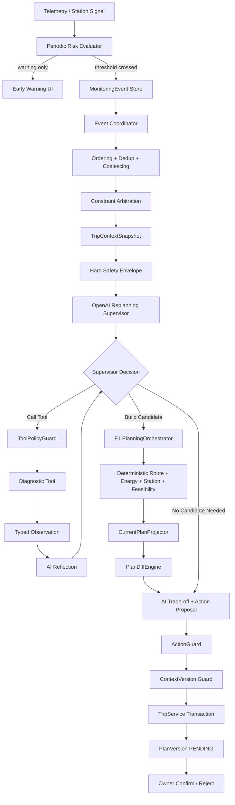
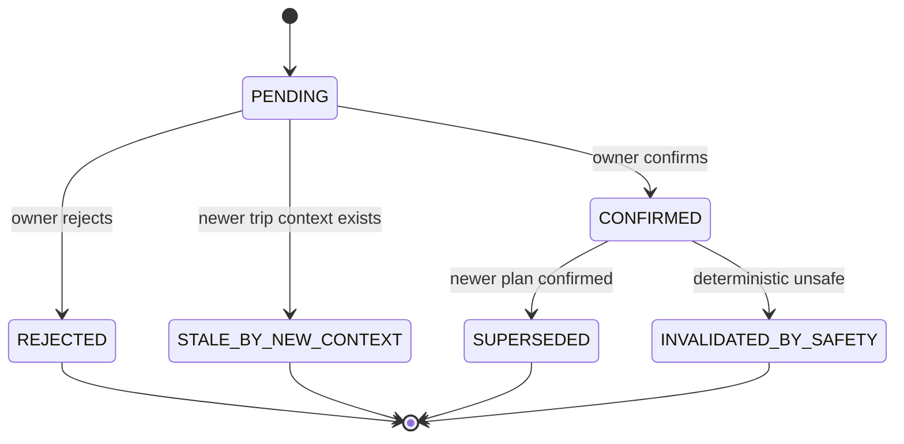
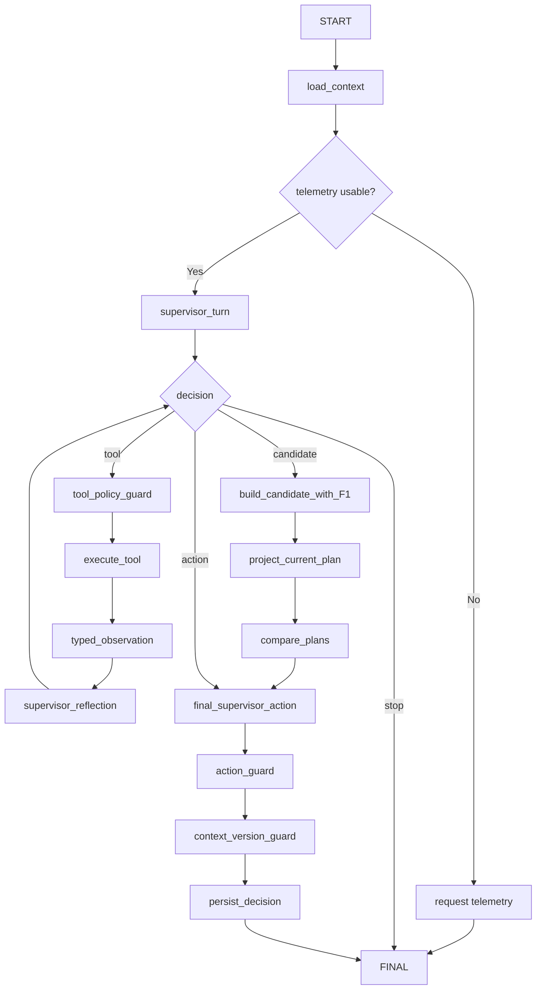

# FEATURE 4 IMPLEMENTATION SPEC — AI REPLANNING SUPERVISOR

**Version:** 2.0  
**Date:** 24/08/2026  
**Status:** Proposed Source of Truth for F4 implementation  
**Scope:** AI Replanning Supervisor phân tích MonitoringEvent, hợp nhất nhiều event, chọn chiến lược và tool, reflection theo observation, tạo candidate qua F1, so sánh với plan hiện hành và đề xuất action trong deterministic safety boundary. Hãy thể hiện rõ quá trình AI Agent suy luận replanning như nào trên UI 

**Related documents:**
- `BRIEF_AI_EV_AGENT_v3.0.md`
- `PRD_AI_EV_AGENT_v3.0.md`
- `TECHNICAL_ARCHITECTURE_AI_EV_AGENT_v3.1.md`
- `agent_architecture.md`
- `FEATURE_4_IMPLEMENT.md` v1.0

---

# 0. Những thay đổi chính so với F4 v1.0

F4 v2.0 giữ nguyên các invariant quan trọng của v1.0:

- F3 sở hữu telemetry fact và MonitoringEvent.
- F4 sở hữu reasoning/orchestration/action proposal.
- F1 sở hữu route/energy/station/feasibility calculation.
- F2/TripService sở hữu lifecycle, persistence, confirm/reject.
- LLM không sinh safety fact.
- Missing/stale safety evidence phải fail closed.
- Candidate không tự confirm.
- Provider failure/search exhausted không được đánh đồng với `INFEASIBLE`.
- Mọi run phải audit được event → AI decision → tool → plan diff → action → PlanVersion.

F4 v2.0 bổ sung các phần còn thiếu để cover unhappy path:

1. **Policy-Constrained AI Supervisor** thay cho event → fixed intent → fixed tool.
2. **Reflection loop** là output structured chính thức của AI.
3. **Event Coordinator** cho dedup, ordering, coalescing và arbitration.
4. **DecisionEpoch** để nhiều event cùng thời điểm chỉ tạo tối đa một replan candidate.
5. **TripContextSnapshot + context_version** để giữ constraint từ event cũ sang event mới.
6. **ActiveConstraintContext** để Event A có thể tiếp tục ảnh hưởng Plan B nếu chưa được resolve.
7. **Event time ordering** gồm `occurred_at`, `received_at`, `source_sequence`.
8. **Periodic Risk Evaluator** để cảnh báo sớm trước khi canonical event xảy ra.
9. **SOC trend tracking** bằng residual/trend/hysteresis.
10. **Pending Plan Staleness Policy** khi event mới đến trong lúc user đang confirm.
11. **PlanVersion state `STALE_BY_NEW_CONTEXT`**.
12. **Explicit Event ↔ AgentRun ↔ PlanVersion mapping**.
13. **Provider/GPS/LLM fail-over behavior**.
14. **Bounded replan search** phân biệt `INFEASIBLE`, `INSUFFICIENT_EVIDENCE`, `SEARCH_EXHAUSTED`.

---

# 1. Mục tiêu của F4

F4 xử lý tình huống một kế hoạch đã được xác nhận có thể không còn phù hợp do trạng thái chuyến đi thay đổi.

Bốn canonical event trọng tâm:

- `ROUTE_DEVIATION`
- `SOC_UNDERPERFORMANCE`
- `STATION_UNAVAILABLE`
- `STALE_TELEMETRY`

Mục tiêu của F4 không phải:

```text
event
→ switch-case
→ call planner
→ LLM viết explanation
```

Mà là:

```text
MonitoringEvent(s)
→ Event Coordinator
→ TripContextSnapshot
→ AI Supervisor hiểu tình huống và objective
→ AI chọn strategy / next tool
→ deterministic tool trả fact
→ AI reflection
→ lặp đến khi đủ evidence hoặc hết budget
→ gọi F1 để build candidate khi cần
→ deterministic plan comparison
→ AI đề xuất action
→ ActionGuard
→ F2 lifecycle
→ owner confirm/reject
```

**Nguyên tắc cốt lõi:**

> AI quyết định **HOW TO INVESTIGATE** và **WHAT TO TRY NEXT**.  
> Deterministic tools quyết định **WHAT IS TRUE** và **WHAT IS SAFE**.

---

# 2. Quan hệ giữa F1, F2, F3 và F4

| Feature | Ownership |
|---|---|
| **F1 Planning** | Tạo candidate route + charging plan + SOC timeline + feasibility |
| **F2 Explain/Confirm** | PlanVersion lifecycle, ownership, confirm/reject, history |
| **F3 Monitoring** | Telemetry, freshness, threshold, risk signal, canonical MonitoringEvent |
| **F4 Replanning** | Multi-event arbitration, situation assessment, strategy, tool sequence, reflection, candidate decision, plan trade-off, action proposal |

Luồng ownership:

```text
F3 owns facts / risk signals / canonical events
↓
F4 owns investigation strategy / tool sequence / action proposal
↓
F1 owns candidate calculation / deterministic feasibility
↓
F2 owns version lifecycle / user decision
```

F4 phải gọi F1 qua `PlanningOrchestrator` port.

Core không import trực tiếp một global `planning_agent`.

---

# 3. Decision ownership và safety boundary

| Quyết định | Owner |
|---|---|
| Telemetry value | F3 |
| Event canonical type | F3 deterministic logic |
| Threshold và severity base | `PolicyConfig` |
| Event ordering/dedup/coalescing | Event Coordinator |
| Active constraints | Trip Context Manager |
| Situation objective | AI Supervisor |
| Investigation strategy | AI Supervisor |
| Next tool | AI Supervisor trong allowlist |
| Khi nào đủ evidence | AI Supervisor reflection |
| Có cần build candidate hay không | AI Supervisor trong policy |
| Route geometry | Routing tool/provider |
| Station existence/connector/freshness | Station tool/service |
| Energy/SOC estimate | Energy tool |
| Feasibility verdict | F1 `FeasibilityTool` |
| Old remaining plan | `CurrentPlanProjector` |
| Plan diff metrics | `PlanDiffEngine` |
| Trade-off interpretation | AI Supervisor |
| Action proposal | AI Supervisor |
| Action allowed hay không | `ActionGuard` |
| Persist / invalidate / confirm / reject | `TripService` transaction |
| Apply candidate | Chủ xe confirm |

## 3.1. Hard invariants

- LLM không được tạo:
  - station ID;
  - station availability fact;
  - tọa độ;
  - route geometry;
  - route distance;
  - SOC;
  - reachability;
  - reserve margin;
  - feasibility verdict.
- Missing/stale safety-critical evidence → fail closed.
- LLM không override `INFEASIBLE`.
- LLM không remove station blacklist.
- Candidate luôn cần owner confirmation.
- Một confirmed plan chỉ bị `INVALIDATED_BY_SAFETY` khi deterministic policy chứng minh unsafe.
- Provider failure không được map thành `INFEASIBLE`.
- Search budget hết không được map thành `INFEASIBLE`.
- Không lưu chain-of-thought.
- Chỉ lưu structured summary, reason code, evidence refs, model/prompt/policy version.
- Một `DecisionEpoch` chỉ được tạo tối đa một effective candidate.
- Pending candidate được tạo từ context cũ không được confirm sau khi context đã thay đổi.

---

# 4. Kiến trúc tổng thể F4 v2.0



---

# 5. Runtime components

## 5.1. Event Coordinator

Chịu trách nhiệm:

- nhận MonitoringEvent;
- validate schema/trust boundary;
- deduplicate;
- order theo event time;
- coalesce event liên quan;
- tạo `DecisionEpoch`;
- merge unresolved constraints;
- xác định event obsolete;
- không tự chọn business action.

Không chịu trách nhiệm:

- tính route;
- tính SOC;
- kết luận feasibility;
- quyết định strategy thay AI.

## 5.2. Trip Context Manager

Chịu trách nhiệm:

- tạo `TripContextSnapshot`;
- giữ `context_version`;
- carry-forward unresolved constraints;
- xác định last confirmed plan;
- xác định pending candidate hiện có;
- mark pending candidate stale khi context đổi.

## 5.3. AI Replanning Supervisor

Chịu trách nhiệm:

- situation assessment;
- primary objective;
- urgency;
- strategy;
- next tool;
- reflection;
- candidate-needed decision;
- trade-off interpretation;
- action proposal;
- grounded explanation.

## 5.4. ToolPolicyGuard

Chịu trách nhiệm:

- allowlist;
- dependency;
- telemetry freshness;
- blacklist propagation;
- budget;
- schema validation;
- provenance requirement;
- block dangerous/invalid LLM request.

## 5.5. F1 PlanningOrchestrator

Chịu trách nhiệm:

```text
verified route
→ energy + station
→ feasibility
→ candidate PlanProposal
```

F4 không fork F1.

## 5.6. CurrentPlanProjector

Tạo baseline `old_remaining_plan` tại cùng current telemetry snapshot.

## 5.7. PlanDiffEngine

Tính deterministic diff giữa:

```text
old_remaining_plan
vs
candidate_plan
```

## 5.8. ActionGuard

Validate AI action proposal theo invariant.

Không âm thầm đổi action.

AI được correction một lần nếu ActionGuard reject.

## 5.9. Periodic Risk Evaluator

Chạy trong F3/monitoring layer.

Mục tiêu:

- phát hiện risk trend trước canonical threshold;
- tạo warning sớm;
- không gọi F4/LLM mỗi telemetry tick;
- chỉ emit canonical MonitoringEvent khi policy condition được thỏa.

---

# 6. Event model

```python
class MonitoringEvent(BaseModel):
    event_id: str
    trip_id: str

    event_type: Literal[
        "ROUTE_DEVIATION",
        "SOC_UNDERPERFORMANCE",
        "STATION_UNAVAILABLE",
        "STALE_TELEMETRY",
    ]

    occurred_at: datetime
    received_at: datetime

    telemetry_snapshot_id: str | None
    source_sequence: int | None

    related_plan_version: int
    severity: Literal["LOW", "MEDIUM", "HIGH", "CRITICAL"]

    threshold_ref: str | None
    evidence_refs: list[str]

    correlation_id: str
    causation_id: str | None

    station_ids: list[str] = []
```

## 6.1. `occurred_at` vs `received_at`

`occurred_at`:

- thời điểm event thực sự xảy ra theo source.

`received_at`:

- thời điểm backend nhận event.

Không dùng `received_at` đơn độc để xác định event mới/cũ.

Ví dụ:

```text
A occurred_at = 10:01:00
B occurred_at = 10:02:00

Backend nhận:
B = 10:02:01
A = 10:02:03
```

Chronology đúng vẫn là:

```text
A → B
```

## 6.2. Obsolete event rule

Nếu một event tới muộn và:

```text
event.telemetry_snapshot_id
<
current TripContextSnapshot telemetry snapshot
```

Event Coordinator phải đánh giá:

- constraint đã resolve → `OBSOLETE`;
- constraint còn safety-relevant → merge vào context mới;
- không tự tạo thêm replan chỉ vì event tới server muộn.

---

# 7. Periodic Risk Evaluator

Không chờ đến lúc canonical event xảy ra mới bắt đầu quan sát risk.

## 7.1. SOC risk tracking

Các field gợi ý:

```python
class SOCRiskState(BaseModel):
    expected_soc_percent: float
    actual_soc_percent: float
    residual_percent: float

    residual_slope: float | None
    consecutive_negative_count: int
    consecutive_threshold_breach_count: int

    warning_level: Literal[
        "NONE",
        "WATCH",
        "WARNING",
        "EVENT"
    ]
```

Công thức cơ bản:

```text
residual =
actual_soc - expected_soc
```

Ví dụ:

```text
T1 = -2%
T2 = -3%
T3 = -5%
T4 = -8%
```

Có thể phát:

```text
SOC TREND WARNING
```

trước khi chính thức emit:

```text
SOC_UNDERPERFORMANCE
```

## 7.2. Hysteresis / debounce

Không emit event chỉ vì một sample nhiễu.

Ví dụ policy:

```text
warning:
2 sample liên tiếp residual <= warning threshold

canonical event:
N sample liên tiếp dưới event threshold
hoặc một critical breach
```

Các giá trị threshold cụ thể phải nằm trong `PolicyConfig`, không đặt trong prompt.

---

# 8. DecisionEpoch

`DecisionEpoch` là đơn vị replanning logical.

Mục tiêu:

> Nhiều event mô tả cùng một trạng thái chuyến đi phải được xử lý cùng nhau, không tạo replan liên tiếp.

```python
class DecisionEpoch(BaseModel):
    epoch_id: str
    trip_id: str

    telemetry_snapshot_id: str
    context_version: int
    base_plan_version: int

    event_ids: list[str]

    opened_at: datetime
    sealed_at: datetime | None

    status: Literal[
        "OPEN",
        "SEALED",
        "RUNNING",
        "COMPLETED",
        "SUPERSEDED"
    ]
```

## 8.1. Coalescing rule

Event có thể được coalesce nếu:

- cùng `trip_id`;
- cùng telemetry snapshot, hoặc nằm trong một short coalescing window;
- chưa có newer authoritative context;
- cùng ảnh hưởng remaining trip.

## 8.2. Rule

Một epoch:

```text
N events
→ 1 AgentRun
→ 0 hoặc 1 candidate PlanVersion
```

Không:

```text
3 events
→ 3 replan
→ 3 pending candidate
```

---

# 9. TripContextSnapshot

```python
class TripContextSnapshot(BaseModel):
    trip_id: str
    context_version: int

    current_confirmed_plan_version: int
    pending_plan_version: int | None

    telemetry_snapshot_id: str

    current_lat: float | None
    current_lng: float | None
    current_soc_percent: float | None

    destination_lat: float
    destination_lng: float

    vehicle_profile_version: str
    policy_version: str
    assumption_snapshot_id: str

    active_event_ids: list[str]
    unresolved_constraints: "ActiveConstraintContext"

    created_at: datetime
```

## 9.1. ActiveConstraintContext

```python
class ActiveConstraintContext(BaseModel):
    route_deviation_active: bool = False
    soc_underperformance_active: bool = False
    telemetry_blocked: bool = False

    excluded_station_ids: list[str] = []

    required_evidence: list[str] = []
    unresolved_reason_codes: list[str] = []
```

Constraint không tự biến mất khi một AgentRun kết thúc.

Chỉ remove khi:

- state mới chứng minh constraint đã resolve;
- event obsolete;
- candidate được confirm và constraint không còn applicable;
- monitoring state trở lại bình thường theo policy.

---

# 10. Context carry-forward giữa các event

Ví dụ:

```text
Plan v3 = CONFIRMED

Event A:
STATION_UNAVAILABLE(ST-10)

→ candidate v4 = PENDING
```

Trước khi user confirm:

```text
Event B:
SOC_UNDERPERFORMANCE
```

Không base v5 trên v4 vì v4 chưa confirmed.

Phải dùng:

```text
base_plan = v3
+
constraint A: exclude ST-10
+
constraint B: SOC underperformance
+
latest telemetry
```

Sau đó:

```text
new AgentRun
→ candidate v5
```

v4:

```text
PENDING
→ STALE_BY_NEW_CONTEXT
```

---

# 11. AI Supervisor model

## 11.1. Không dùng “event → fixed intent”

Event type là fact của F3.

AI không cần “đoán lại event”.

AI phải hiểu:

- objective;
- urgency;
- interaction giữa event;
- strategy;
- evidence thiếu;
- tool cần gọi tiếp.

## 11.2. SituationAssessment

```python
class SituationAssessment(BaseModel):
    primary_objective: Literal[
        "RESTORE_SAFE_ROUTE",
        "PROTECT_RESERVE_SOC",
        "REPLACE_UNAVAILABLE_STATION",
        "RECOVER_TELEMETRY",
        "PRESERVE_CURRENT_PLAN",
        "COMPOSITE_RECOVERY",
    ]

    urgency: Literal[
        "LOW",
        "MEDIUM",
        "HIGH",
        "CRITICAL",
    ]

    strategy: str

    known_facts: list[str]
    constraints: list[str]
    missing_evidence: list[str]

    reason_codes: list[str]
    evidence_refs: list[str]

    confidence: float
```

## 11.3. ToolDecision

```python
class ToolDecision(BaseModel):
    decision: Literal[
        "CALL_TOOL",
        "BUILD_CANDIDATE",
        "PROPOSE_ACTION",
        "STOP",
    ]

    tool_name: str | None
    arguments: dict[str, object]

    expected_evidence: list[str]
    reason_codes: list[str]
    evidence_refs: list[str]
```

## 11.4. ReflectionDecision

```python
class ReflectionDecision(BaseModel):
    evidence_sufficient: bool

    hypothesis_status: Literal[
        "SUPPORTED",
        "REJECTED",
        "UNCERTAIN",
    ]

    missing_evidence: list[str]

    next_step: Literal[
        "CALL_TOOL",
        "BUILD_CANDIDATE",
        "COMPARE_PLANS",
        "PROPOSE_ACTION",
        "REQUEST_TELEMETRY",
        "STOP_INSUFFICIENT_EVIDENCE",
        "STOP_SEARCH_EXHAUSTED",
    ]

    next_tool: str | None

    reason_codes: list[str]
    evidence_refs: list[str]
```

Reflection không chứa chain-of-thought.

Chỉ là structured operational decision.

## 11.5. ActionProposalDraft

```python
class ActionProposalDraft(BaseModel):
    action: Literal[
        "CONTINUE_CURRENT_PLAN",
        "PROPOSE_REPLAN",
        "PROPOSE_CONDITIONAL_REPLAN",
        "INVALIDATE_CURRENT_PLAN_AND_PROPOSE_REPLAN",
        "REQUEST_NEW_TELEMETRY",
        "NO_FEASIBLE_PLAN_REQUEST_ASSISTANCE",
        "STOP_INSUFFICIENT_EVIDENCE",
    ]

    reason_codes: list[str]
    evidence_refs: list[str]

    user_message: str
    limitations: list[str]

    requires_owner_confirmation: bool
```

---

# 12. OpenAI integration

## 12.1. Vị trí API key

Chỉ backend/worker:

```text
React
→ FastAPI
→ Replanning Worker
→ OpenAI API
```

Không:

```text
React
→ OpenAI
```

Config:

```env
OPENAI_API_KEY=...
OPENAI_REPLANNING_MODEL=...
OPENAI_REPLANNING_PROMPT_VERSION=f4-supervisor-v2
```

## 12.2. Vai trò OpenAI

OpenAI được dùng cho:

- situation assessment;
- composite strategy;
- next-tool selection;
- reflection;
- candidate-needed decision;
- plan trade-off interpretation;
- action proposal;
- grounded explanation.

Không dùng OpenAI cho:

- threshold detection;
- event timestamp ordering;
- SOC calculation;
- route calculation;
- station truth;
- feasibility;
- plan persistence;
- confirmation.

## 12.3. Runtime pattern

Không nên gọi model riêng cho:

```text
assess_intent
select_strategy
select_tool
```

trước tool đầu tiên.

Nên gộp thành:

```text
Supervisor Turn #1
=
situation assessment
+ objective
+ strategy
+ next tool
```

Sau tool:

```text
Supervisor Turn #2
=
observation
+ reflection
+ next tool / build candidate / stop
```

Cuối:

```text
Supervisor Final Turn
=
read plan diff
+ action proposal
+ explanation
```

## 12.4. Budget

```text
max_tool_calls_per_agent_run = 6
max_llm_turns_per_agent_run = 4
max_retry_per_llm_turn = 1

soft_replanning_budget = 30s
hard_deadline = 60s
```

Supervisor state phải biết:

```text
remaining_tool_budget
remaining_time_budget
```

---

# 13. Tool registry

F4 chỉ expose **supervisor/diagnostic tools**.

```python
SUPERVISOR_TOOL_REGISTRY = {
    "project_current_plan": CurrentPlanProjectorTool,
    "route_from_current_position": RouteFromCurrentPositionTool,
    "nearest_station_reachability": NearestStationReachabilityTool,
    "station_search": StationSearchTool,
    "request_telemetry_refresh": TelemetryRefreshTool,
    "build_candidate_plan": PlanningOrchestratorTool,
    "compare_plans": PlanDiffTool,
}
```

Không expose trực tiếp ở F4:

```text
EnergyTool
FeasibilityTool
```

Hai tool này là internal deterministic safety tools của F1.

Lý do:

- tránh duplicate F1;
- tránh AI bypass workflow;
- giữ dependency rõ.

---

# 14. ToolPolicyGuard

Reject tool call nếu:

- tool ngoài allowlist;
- dependency không hợp lệ;
- telemetry stale/missing;
- telemetry snapshot khác run;
- route tool dùng stale GPS;
- station call thiếu blacklist;
- AI cố truyền tự tạo route geometry;
- AI cố truyền tự tạo SOC;
- AI cố truyền tự tạo feasibility verdict;
- tool output thiếu schema;
- thiếu provenance/freshness;
- vượt tool budget;
- vượt time budget;
- AI cố confirm/apply plan.

Structured reject:

```python
class ToolPolicyViolation(BaseModel):
    code: str
    message: str
    allowed_next_steps: list[str]
    evidence_refs: list[str]
```

Policy error được feed lại cho AI một lần để correction.

---

# 15. Strategy theo từng canonical event

Không fix cứng “event → một tool đầu tiên”.

Event tạo **policy envelope**.

AI chọn path trong envelope.

---

## 15.1. `ROUTE_DEVIATION`

Objective candidates:

- `RESTORE_SAFE_ROUTE`
- `PRESERVE_CURRENT_PLAN`
- `COMPOSITE_RECOVERY`

AI có thể:

```text
project_current_plan
→ route_from_current_position
```

hoặc:

```text
route_from_current_position
→ station_search
→ build_candidate_plan
```

tùy context.

### Case nhẹ

```text
Deviation nhỏ
Current route có thể rejoin
SOC ổn
Charging stop cũ vẫn reachable
```

Possible result:

```text
CONTINUE_CURRENT_PLAN
```

không bắt buộc build candidate.

### Case lớn

```text
Deviation lớn
Charging corridor cũ không còn hợp lệ
```

Possible flow:

```text
route_from_current_position
→ reflection
→ station_search
→ reflection
→ build_candidate_plan
→ compare_plans
→ PROPOSE_REPLAN
```

### Invariant

- dùng current GPS/SOC;
- không dùng trip origin/current SOC ban đầu;
- nếu baseline cũ cần route rejoin thì rejoin phải được RoutingProvider xác minh.

---

## 15.2. `SOC_UNDERPERFORMANCE`

Primary objective:

```text
PROTECT_RESERVE_SOC
```

AI có thể kiểm tra:

```text
project_current_plan
```

Nếu remaining plan vẫn feasible:

```text
CONTINUE_CURRENT_PLAN
```

Nếu next station không reachable:

```text
nearest_station_reachability
→ reflection
```

Nếu nearest candidate không đủ:

```text
station_search(expanded corridor)
```

Nếu policy cho phép:

```text
allow backtracking
```

Cuối cùng:

```text
build_candidate_plan
```

### Invariant

- reachability trước optimization;
- route distance/time, không dùng Euclidean distance để kết luận;
- actual current SOC là source;
- reserve do deterministic feasibility quyết định.

---

## 15.3. `STATION_UNAVAILABLE`

Hard constraint:

```text
event.station_ids
→ excluded_station_ids
```

AI không được remove.

Trước tiên AI nên xác định station có còn ảnh hưởng remaining plan hay không.

### Station đã đi qua

```text
station completed
→ no impact
→ CONTINUE_CURRENT_PLAN
```

### Station là next stop

Possible strategy:

```text
MINIMAL_SUBSTITUTION
```

Flow:

```text
project_current_plan
→ station_search(blacklist)
→ build_candidate_plan
→ compare
```

### Station removal làm route thay đổi lớn

Possible strategy:

```text
FULL_REPLAN
```

### Invariant

Blacklist check ở:

- tool input;
- F1 request;
- candidate output;
- transaction validation.

---

## 15.4. `STALE_TELEMETRY`

Hard gate:

```text
planning_allowed = false
```

Allowed:

```text
request_telemetry_refresh
REQUEST_NEW_TELEMETRY
```

Blocked:

- routing;
- station search;
- build candidate;
- plan diff.

AI có thể xác định:

- GPS stale;
- SOC stale;
- cả hai stale;
- field nào cần refresh.

Nhưng không được đoán missing value.

---

# 16. Multi-event arbitration

## 16.1. Principle

Không chọn một event và bỏ event còn lại.

Phải tạo:

```text
ConstraintEnvelope
```

```python
class ConstraintEnvelope(BaseModel):
    event_ids: list[str]

    telemetry_blocked: bool

    route_recovery_required: bool
    energy_risk_active: bool

    excluded_station_ids: list[str]

    severity: str
    active_reason_codes: list[str]
```

## 16.2. Safety priority

Priority layer:

```text
1. DATA VALIDITY
2. ENERGY / REACHABILITY SAFETY
3. HARD RESOURCE CONSTRAINT
4. ROUTE / EFFICIENCY
```

### Example 1

```text
STALE_TELEMETRY
+
SOC_UNDERPERFORMANCE
```

Result:

```text
telemetry gate wins
→ no planning
→ request refresh
```

SOC risk context vẫn được giữ lại để evaluate lại trên sample mới.

### Example 2

```text
SOC_UNDERPERFORMANCE
+
STATION_UNAVAILABLE(ST-10)
```

Possible composite objective:

```text
PROTECT_RESERVE_SOC
```

Hard constraint:

```text
exclude ST-10
```

### Example 3

```text
ROUTE_DEVIATION
+
SOC_UNDERPERFORMANCE
+
STATION_UNAVAILABLE(ST-10)
```

Possible composite strategy:

```text
ENERGY_SAFE_REROUTE_WITH_STATION_SUBSTITUTION
```

Không:

```text
replan route
→ replan SOC
→ replan station
```

Chỉ:

```text
1 DecisionEpoch
→ 1 AgentRun
→ 1 candidate
```

---

# 17. ReplanningRequest v2

```python
class ReplanningRequest(BaseModel):
    trip_id: str

    decision_epoch_id: str
    event_ids: list[str]

    telemetry_snapshot_id: str
    trip_context_version: int

    base_plan_version: int
    pending_plan_version: int | None

    current_lat: float | None
    current_lng: float | None
    current_soc_percent: float | None

    destination_lat: float
    destination_lng: float

    excluded_station_ids: list[str]

    vehicle_profile_version: str
    policy_version: str
    assumption_snapshot_id: str

    active_constraints: ActiveConstraintContext
```

---

# 18. CurrentPlanProjector

Không compare candidate với full plan cũ.

Phải tạo:

```text
old_remaining_plan
```

tại cùng runtime context với candidate.

Bao gồm:

- current GPS;
- current SOC;
- same destination;
- same vehicle version;
- same policy version;
- same assumption snapshot;
- same station blacklist;
- same telemetry snapshot;
- same context version.

Projector:

- map-match current progress;
- remove completed segments;
- remove completed stops;
- apply current SOC;
- apply blacklist;
- recompute remaining energy;
- recompute remaining feasibility;
- route rejoin nếu cần và phải verified.

---

# 19. PlanDiff

```python
class PlanDiff(BaseModel):
    diff_id: str

    base_plan_version: int
    candidate_plan_version: int | None

    telemetry_snapshot_id: str
    context_version: int

    route_distance_delta_km: float
    route_duration_delta_min: float

    stations_removed: list[str]
    stations_added: list[str]

    stop_order_changed: bool

    final_soc_delta_percent: float
    reserve_margin_delta_percent: float

    old_remaining_verdict: str
    candidate_verdict: str | None

    risk_reason_added: list[str]
    risk_reason_removed: list[str]

    provenance_refs: list[str]
```

AI chỉ đọc và diễn giải diff.

Không sửa metric.

---

# 20. Action model

```python
Action = Literal[
    "CONTINUE_CURRENT_PLAN",
    "PROPOSE_REPLAN",
    "PROPOSE_CONDITIONAL_REPLAN",
    "INVALIDATE_CURRENT_PLAN_AND_PROPOSE_REPLAN",
    "REQUEST_NEW_TELEMETRY",
    "NO_FEASIBLE_PLAN_REQUEST_ASSISTANCE",
    "STOP_INSUFFICIENT_EVIDENCE",
]
```

| Evidence | Action hợp lệ |
|---|---|
| Telemetry stale/incomplete | `REQUEST_NEW_TELEMETRY` |
| Current remaining plan feasible, event không ảnh hưởng | `CONTINUE_CURRENT_PLAN` |
| Current feasible, candidate tốt hơn theo objective | `PROPOSE_REPLAN` |
| Candidate feasible nhưng một non-safety station fact chưa authoritative | `PROPOSE_CONDITIONAL_REPLAN` |
| Current remaining deterministic `INFEASIBLE`, candidate feasible | `INVALIDATE_CURRENT_PLAN_AND_PROPOSE_REPLAN` |
| Deterministic tools chứng minh không có feasible candidate | `NO_FEASIBLE_PLAN_REQUEST_ASSISTANCE` |
| Provider/tool không đủ evidence | `STOP_INSUFFICIENT_EVIDENCE` |

---

# 21. No-feasible vs provider failure vs search exhausted

Phải phân biệt rõ.

## 21.1. `INFEASIBLE`

Chỉ khi:

```text
deterministic feasibility
```

chứng minh candidate không đáp ứng safety rule.

## 21.2. `INSUFFICIENT_EVIDENCE`

Ví dụ:

- routing provider fail;
- station provider fail;
- GPS unavailable;
- station safety-critical field thiếu;
- provider fallback cũng không đủ.

Không nói:

```text
không có plan
```

mà nói:

```text
chưa đủ evidence để kết luận
```

## 21.3. `SEARCH_EXHAUSTED`

AI đã dùng hết search/tool budget nhưng chưa chứng minh toàn bộ search space infeasible.

Không được map thành `INFEASIBLE`.

## 21.4. Proven no feasible alternative

Sau bounded strategy:

```text
nearest candidate
→ expanded corridor
→ optional backtracking
→ F1 feasibility
```

nếu deterministic tool chứng minh không có candidate:

```text
NO_FEASIBLE_PLAN_REQUEST_ASSISTANCE
```

---

# 22. PlanVersion lifecycle v2



## 22.1. Rule

`PENDING` candidate lưu:

```text
generated_from_context_version
generated_from_telemetry_snapshot_id
base_confirmed_plan_version
```

Confirm chỉ hợp lệ nếu:

```text
generated_from_context_version
==
trip.current_context_version
```

và:

```text
base_confirmed_plan_version
==
trip.current_confirmed_plan_version
```

---

# 23. Event mới đến trong lúc confirm

## Case A — Event mới persist trước commit confirm

```text
Plan v4:
context_version=17
```

Event mới:

```text
Trip context → 18
```

Confirm request:

```text
expected context = 17
actual context = 18
```

Result:

```text
409 PLAN_CONTEXT_CHANGED
```

v4:

```text
STALE_BY_NEW_CONTEXT
```

F4 tạo candidate mới trên context 18.

## Case B — Confirm commit trước event mới

```text
v4 → CONFIRMED
```

Sau đó event mới:

```text
base_plan_version = v4
→ new DecisionEpoch
→ candidate v5
```

Không race mập mờ.

---

# 24. Event ↔ Plan mapping

Không thiết kế:

```text
1 event = 1 plan
```

Phải support many-to-many.

## 24.1. AgentRunEvent

```text
agent_run_id
event_id
```

## 24.2. PlanVersionEvent

```text
plan_version_id
event_id
relationship_type
```

Ví dụ:

```text
Event A ─┐
Event B ─┼──→ AgentRun 12 → Plan v5
Event C ─┘
```

Một event cũng có thể tham gia nhiều run nếu:

- provider fail;
- retry với telemetry/context mới;
- previous candidate stale.

---

# 25. Async execution

```text
MonitoringEvent(s)
→ Event Coordinator
→ DecisionEpoch SEALED
→ ReplanningService
→ AgentRun / PlanningRun QUEUED
→ worker atomic claim
→ RUNNING
→ AI Supervisor
→ diagnostic tool loop
→ F1 if required
→ PlanDiff
→ action
→ guard
→ transaction
```

PlanningRun status:

```text
QUEUED
RUNNING
SUCCEEDED
INFEASIBLE
INSUFFICIENT_EVIDENCE
SEARCH_EXHAUSTED
FAILED
TIMED_OUT
SUPERSEDED_BY_NEW_CONTEXT
```

---

# 26. Idempotency và concurrency

Idempotency key:

```text
trip_id
+ decision_epoch_id
+ telemetry_snapshot_id
+ context_version
+ base_plan_version
```

Retry cùng key:

```text
return existing run
```

Nếu trong lúc run:

```text
context_version changes
```

run cũ:

```text
SUPERSEDED_BY_NEW_CONTEXT
```

Candidate không được persist thành confirmable current proposal.

---

# 27. GPS / telemetry fail-over

## 27.1. GPS missing

Nếu:

```text
current location missing
```

không route từ guessed position.

Policy:

```text
last GPS fresh enough
→ có thể hiển thị last known location
→ provenance rõ

last GPS stale
→ planning blocked
→ REQUEST_NEW_TELEMETRY
```

## 27.2. SOC missing

Nếu SOC safety-critical và unavailable:

```text
planning blocked
```

Không infer bằng LLM.

## 27.3. Partial telemetry

Có thể biểu diễn:

```text
TELEMETRY_INCOMPLETE
```

như reason/status dưới umbrella telemetry recovery.

Không nhất thiết phải thêm canonical F4 event trong MVP nếu muốn giữ 4-event scope.

---

# 28. Provider fail-over

## Routing provider

```text
primary provider
→ bounded retry
→ configured route fallback/cache
→ nếu vẫn fail: INSUFFICIENT_EVIDENCE / ROUTING_UNAVAILABLE
```

## Station provider

```text
primary provider
→ bounded retry
→ versioned snapshot
→ nếu safety field thiếu: fail closed
```

## LLM

```text
OpenAI unavailable
→ deterministic safe fallback
```

Fallback chỉ được:

- chọn conservative event handling;
- yêu cầu telemetry;
- gọi fixed safe path;
- template explanation.

Không ảnh hưởng deterministic verdict.

---

# 29. Replan vẫn không đáp ứng

## Case A — Candidate fail nhưng còn strategy budget

```text
AI reflection
→ thử allowed strategy khác
```

## Case B — hết search budget

```text
SEARCH_EXHAUSTED
```

## Case C — thiếu provider evidence

```text
INSUFFICIENT_EVIDENCE
```

## Case D — deterministic tools chứng minh no feasible

```text
NO_FEASIBLE_PLAN_REQUEST_ASSISTANCE
```

Không replan vô hạn.

---

# 30. Agent state

```python
class ReplanAgentState(TypedDict):
    trip_id: str
    agent_run_id: str
    planning_run_id: str
    decision_epoch_id: str

    event_ids: list[str]

    context_version: int
    telemetry_snapshot_id: str
    base_plan_version: int

    active_constraints: ActiveConstraintContext

    assessment: SituationAssessment | None

    tool_budget_remaining: int
    llm_turn_budget_remaining: int

    tool_runs: list[str]
    observations: list[str]

    reflection: ReflectionDecision | None

    candidate_plan_version: int | None
    plan_diff_ref: str | None

    action_proposal: ActionProposalDraft | None

    status: str
```

---

# 31. LangGraph F4

LangGraph chịu trách nhiệm runtime, không làm safety reasoning thay tool.



---

# 32. Persistence model

## 32.1. `monitoring_events`

Key fields:

```text
event_id
trip_id
event_type
occurred_at
received_at
source_sequence
telemetry_snapshot_id
related_plan_version
severity
correlation_id
causation_id
status
```

## 32.2. `decision_epochs`

```text
epoch_id
trip_id
telemetry_snapshot_id
context_version
base_plan_version
opened_at
sealed_at
status
```

## 32.3. `decision_epoch_events`

```text
epoch_id
event_id
```

## 32.4. `trip_context_snapshots`

```text
context_version
trip_id
telemetry_snapshot_id
confirmed_plan_version
pending_plan_version
active_constraints_json
created_at
```

## 32.5. `agent_runs`

```text
agent_run_id
trip_id
decision_epoch_id
context_version
event refs
model
prompt version
policy version
assessment summary
strategy
action
status
input hash
timestamps
```

## 32.6. `tool_runs`

```text
tool_run_id
agent_run_id
sequence
tool
input hash
output ref
provider
provenance
freshness
latency
error
```

## 32.7. `planning_runs`

```text
planning_run_id
trip_id
agent_run_id
base version
context version
kind
status
attempt
deadline
timestamps
outcome_ref
```

## 32.8. `plan_diffs`

```text
diff_id
trip_id
base version
candidate version
context version
telemetry snapshot
metrics
provenance refs
```

## 32.9. `plan_version_events`

```text
plan_version_id
event_id
relationship_type
```

---

# 33. API

| Method | Endpoint | Mục đích |
|---|---|---|
| `POST` | `/api/v1/trips/{trip_id}/replans` | manual/internal replan retry |
| `GET` | `/api/v1/planning-runs/{run_id}` | poll PlanningRun |
| `GET` | `/api/v1/agent-runs/{agent_run_id}` | AI assessment, strategy, tools, action |
| `GET` | `/api/v1/trips/{trip_id}/events` | event timeline |
| `GET` | `/api/v1/trips/{trip_id}/decision-epochs/{epoch_id}` | multi-event grouping |
| `GET` | `/api/v1/trips/{trip_id}/context` | current TripContextSnapshot |
| `GET` | `/api/v1/trips/{trip_id}/plan-diffs/{diff_id}` | old remaining vs candidate |
| `POST` | `/api/v1/trips/{trip_id}/plans/{version}/confirm` | owner confirm |
| `POST` | `/api/v1/trips/{trip_id}/plans/{version}/reject` | owner reject |
| `POST` | `/api/v1/trips/{trip_id}/telemetry-refresh` | request/update telemetry |

Confirm request nên có:

```json
{
  "expected_plan_version": 4,
  "expected_context_version": 17
}
```

---

# 34. UI requirements

UI phải hiện:

- current plan version;
- candidate version;
- trip context version;
- event timeline;
- event occurrence time;
- AI situation assessment;
- AI strategy;
- tool sequence;
- tool status;
- warning nếu data stale;
- active station blacklist;
- old remaining plan;
- candidate plan;
- plan diff;
- SOC / reserve / time / route changes;
- action proposal;
- limitation;
- Safety Gate status;
- provenance;
- confirm/reject;
- `STALE_BY_NEW_CONTEXT` khi pending plan hết hiệu lực;
- critical assistance khi proven no feasible.

Không hiển thị chain-of-thought.

---

# 35. Observability

## 35.1. AgentRun metrics

```text
decision_epoch_id
event_count
context_version
model
prompt_version
strategy
LLM turn count
tool count
guard reject count
fallback used
action
latency
```

## 35.2. Multi-event metrics

```text
events_coalesced_per_epoch
duplicate_event_rate
out_of_order_event_rate
obsolete_event_rate
replan_suppression_rate
```

## 35.3. AI quality metrics

```text
strategy_selection_accuracy
next_tool_accuracy
tool_sequence_policy_compliance
reflection_stop_accuracy
unnecessary_tool_call_rate
unnecessary_candidate_creation_rate
action_recommendation_accuracy
guard_rejection_rate
LLM_fallback_rate
```

## 35.4. Safety metrics

```text
INFEASIBLE recall
feasibility accuracy
valid charging plan rate
high-risk recall
hallucinated route/station facts
stale plan confirm prevented
```

---

# 36. Security

- OpenAI API key chỉ ở server/secret store.
- Không log secret.
- Không đưa precise telemetry vào log nếu không cần.
- Tool call phải qua authorization/trust boundary.
- Không tin event type/station blacklist/trip ID do public client tự khai báo.
- Agent không có business write credential trực tiếp.
- Persist đi qua TripService/application boundary.
- Missing safety field fail closed.
- Simulator endpoint chỉ dùng demo/test hoặc role được phép.

---

# 37. Failure matrix

| Failure | Behavior |
|---|---|
| LLM timeout | deterministic safe fallback; safety unchanged |
| LLM invalid structured output | retry một lần; sau đó fallback |
| Invalid AI tool | ToolPolicyGuard reject; correction một lần |
| Invalid AI action | ActionGuard reject; correction một lần |
| Routing provider fail | configured fallback; nếu không đủ → `INSUFFICIENT_EVIDENCE` |
| Station provider fail | snapshot fallback; thiếu safety field → fail closed |
| GPS unavailable | request telemetry; không guess location |
| SOC unavailable | block planning nếu safety-critical |
| Telemetry stale | request new telemetry; planning tools blocked |
| Search budget exhausted | `SEARCH_EXHAUSTED` |
| Proven no feasible | assistance action |
| Worker crash | lease timeout + bounded retry |
| Duplicate event | dedup |
| Out-of-order old event | obsolete hoặc merge constraint |
| Context changes during run | run/candidate superseded |
| Context changes during confirm | 409 `PLAN_CONTEXT_CHANGED` |
| Duplicate confirm/retry | idempotency + version check |

---

# 38. Acceptance test catalog

## Single event

| ID | Scenario | Assertion |
|---|---|---|
| F4-01 | Route deviation nhỏ | AI có thể continue nếu old remaining vẫn feasible |
| F4-02 | Route deviation lớn | current GPS/SOC; candidate từ current position |
| F4-03 | SOC underperformance | reachability/safety trước optimization |
| F4-04 | Station unavailable | blacklist được giữ mọi layer |
| F4-05 | Stale telemetry | planning tool count = 0 |

## Multi-event

| ID | Scenario | Assertion |
|---|---|---|
| F4-06 | SOC + station unavailable | 1 epoch, blacklist + energy objective |
| F4-07 | Route + SOC | 1 AgentRun, composite strategy |
| F4-08 | Route + SOC + station | 1 candidate tối đa |
| F4-09 | Stale + any other event | telemetry gate block planning |

## Context continuity

| ID | Scenario | Assertion |
|---|---|---|
| F4-10 | Event A → pending v4 → Event B | v4 stale, new run base last confirmed |
| F4-11 | Constraint A unresolved | context A được carry sang run B |
| F4-12 | Constraint A resolved | không carry forward |

## Ordering

| ID | Scenario | Assertion |
|---|---|---|
| F4-13 | Event B received before older A | order theo occurred_at/source sequence |
| F4-14 | Old event arrives late | obsolete nếu state mới đã resolve |
| F4-15 | Duplicate event | không tạo new epoch |

## Plan lifecycle

| ID | Scenario | Assertion |
|---|---|---|
| F4-16 | Confirm pending current context | success |
| F4-17 | Event mới trước confirm commit | 409, candidate stale |
| F4-18 | Confirm commit trước event mới | new event base trên newly confirmed plan |
| F4-19 | Two concurrent confirm | exactly one valid transaction |

## Provider/failure

| ID | Scenario | Assertion |
|---|---|---|
| F4-20 | Routing fail | không kết luận infeasible |
| F4-21 | Station fail | fallback/snapshot hoặc insufficient evidence |
| F4-22 | GPS missing | không route từ guessed location |
| F4-23 | LLM unavailable | fallback vẫn giữ safety invariant |
| F4-24 | Invalid AI tool | guard reject |
| F4-25 | Invalid AI action | guard reject |

## No feasible / search

| ID | Scenario | Assertion |
|---|---|---|
| F4-26 | Candidate 1 fail, còn budget | AI thử strategy khác |
| F4-27 | Search budget hết | `SEARCH_EXHAUSTED` |
| F4-28 | Provider không đủ evidence | `INSUFFICIENT_EVIDENCE` |
| F4-29 | Deterministic proven infeasible | assistance only after proof |

## Proactive monitoring

| ID | Scenario | Assertion |
|---|---|---|
| F4-30 | SOC residual giảm dần | warning trước event |
| F4-31 | Một sample nhiễu | không emit event |
| F4-32 | Consecutive threshold breach | emit canonical event |

---

# 39. Evaluation dataset

F4 benchmark nên có ít nhất các nhóm:

```text
single-event
multi-event
ordering
context carry-forward
pending-plan race
provider failure
LLM failure
telemetry failure
no-feasible
search exhausted
proactive risk
idempotency/concurrency
```

Gold label không chỉ là final action.

Mỗi case nên có:

```text
expected constraint envelope
expected allowed strategy class
expected forbidden tool
expected minimum required tool
expected final action
expected plan lifecycle result
```

Các metric trọng tâm:

```text
tool-selection accuracy >= 90%
unnecessary tool-call rate <= 10%
multi-event one-candidate correctness = 100%
stale telemetry planning violation = 0
blacklist violation = 0
stale-context confirm accepted = 0
hallucinated safety fact = 0
INFEASIBLE recall = 100%
valid charging plan rate = 100%
```

---

# 40. Code structure đề xuất

```text
src/apps/api/routes/
├── replanning.py
├── monitoring.py
└── telemetry.py

src/packages/contracts/
├── replanning.py
├── monitoring.py
└── trip_context.py

src/packages/core/monitoring/
├── domain/
│   ├── events.py
│   ├── risk.py
│   └── telemetry.py
├── application/
│   ├── service.py
│   └── periodic_risk.py
└── infrastructure/
    └── repositories.py

src/packages/core/replanning/
├── domain/
│   ├── decisions.py
│   ├── policies.py
│   ├── epochs.py
│   ├── constraints.py
│   └── context.py
├── application/
│   ├── ports.py
│   ├── service.py
│   ├── event_coordinator.py
│   ├── context_manager.py
│   ├── plan_projector.py
│   └── plan_diff.py
└── infrastructure/
    ├── models.py
    ├── repositories.py
    └── planning_worker.py

src/packages/agent/replanning/
├── orchestrator.py
├── state.py
├── schemas.py
├── graph.py
├── prompts/
│   └── supervisor_v2.py
├── nodes/
│   ├── supervisor_turn.py
│   ├── reflection.py
│   └── propose_action.py
├── tools/
│   ├── projection.py
│   ├── routing.py
│   ├── station.py
│   ├── telemetry.py
│   ├── planning.py
│   └── diff.py
├── policy_guard.py
└── action_guard.py
```

---

# 41. Implementation order

## Phase 1 — Foundation

1. Freeze event schema:
   - `occurred_at`
   - `received_at`
   - `source_sequence`
   - telemetry snapshot.
2. Implement `TripContextSnapshot`.
3. Add `context_version`.
4. Add `DecisionEpoch`.
5. Add event dedup/order/coalescing.
6. Add `STALE_BY_NEW_CONTEXT`.

## Phase 2 — Safe supervisor shell

7. Refactor F1 thành injected `PlanningOrchestrator`.
8. Implement ToolPolicyGuard.
9. Implement ActionGuard.
10. Implement AgentRun / ToolRun / PlanningRun persistence.
11. Implement OpenAI structured supervisor output.
12. Implement reflection loop.

## Phase 3 — Single-event workflows

13. `STALE_TELEMETRY`.
14. `ROUTE_DEVIATION`.
15. `SOC_UNDERPERFORMANCE`.
16. `STATION_UNAVAILABLE`.

## Phase 4 — Multi-event

17. ConstraintEnvelope.
18. composite objective.
19. multi-event one-epoch-one-candidate.
20. unresolved constraint carry-forward.

## Phase 5 — Plan lifecycle/race

21. Pending-plan context guard.
22. `STALE_BY_NEW_CONTEXT`.
23. confirm `expected_context_version`.
24. transaction concurrency tests.

## Phase 6 — Proactive risk

25. SOC residual tracking.
26. warning/debounce/hysteresis.
27. periodic risk UI.
28. canonical event escalation.

## Phase 7 — Hardening

29. provider fallback.
30. GPS missing.
31. LLM timeout/fallback.
32. out-of-order event.
33. duplicate event.
34. search exhausted.
35. no-feasible assistance.
36. load/concurrency tests.

---

# 42. Definition of Done

F4 chỉ được coi là done khi:

- 4 canonical event chạy đúng.
- Multi-event được coalesce thành một DecisionEpoch phù hợp.
- 3 event cùng lúc không tạo 3 plan.
- AI tạo structured situation assessment.
- AI chọn strategy/tool trong allowlist.
- AI reflection dựa trên typed observation.
- F4 không fork F1.
- F1 vẫn là sole owner của deterministic feasibility.
- Station blacklist không thể bị AI xóa.
- Stale telemetry không trigger planning.
- Event có event-time metadata đầy đủ.
- Out-of-order event không làm overwrite context mới.
- Context chưa resolve được carry-forward.
- Pending candidate cũ bị stale khi context đổi.
- Confirm dùng `expected_context_version`.
- Plan/event mapping trace được many-to-many.
- Provider failure không bị hiểu là infeasible.
- Search exhausted không bị hiểu là infeasible.
- Proven no feasible mới trigger assistance.
- SOC trend warning hoạt động trước canonical event.
- OpenAI unavailable không phá safety.
- Không lưu chain-of-thought.
- UI hiển thị AI assessment, strategy, tool trace, diff, action và safety gate.
- Idempotency/concurrency/worker crash/provider failure có test.
- Audit được:
  `MonitoringEvent → DecisionEpoch → TripContextSnapshot → AgentRun → ToolRun → PlanningRun → PlanDiff → Action → PlanVersion`.

---

# 43. Architectural decision cuối

F4 sử dụng **Hybrid Agentic Architecture with Deterministic Safety Boundary**.

```text
F3
=
Facts + telemetry + risk + canonical events

Event Coordinator
=
Ordering + dedup + coalescing + DecisionEpoch

Trip Context Manager
=
ContextVersion + active unresolved constraints

OpenAI Replanning Supervisor
=
Situation understanding
+ strategy
+ tool selection
+ reflection
+ candidate decision
+ trade-off
+ action proposal

F1
=
Deterministic route / energy / station / feasibility

Guards
=
Policy + invariant enforcement

F2 / TripService
=
Lifecycle + transaction + versioning

User
=
Final authority
```

Một câu chốt cho toàn bộ thiết kế:

> **Không phải mỗi event tạo ra một plan. Mỗi thay đổi có ý nghĩa tạo ra một phiên bản mới của trip context; AI Supervisor nhìn toàn bộ context mới nhất, điều tra bằng các tool được phép, và chỉ sau khi deterministic tools chứng minh safety mới đề xuất một plan/version mới cho người dùng xác nhận.**
