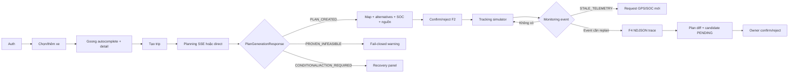

# INTERFACE DESIGN — P-210 AI EV Agent

**Phiên bản:** 1.0 (implementation-aligned revision)

**Ngày cập nhật:** 01/09/2026

**Trạng thái:** As-built UI/API baseline

> Contract thực thi nằm trong FastAPI routes, Pydantic models và client API tại `src/apps/web/src/lib/api.ts`. Tài liệu này mô tả đúng UI/API hiện tại; endpoint hoặc enum không có trong code không được xem là capability.

## 1. Nguyên tắc interface

- Public API dùng REST/JSON dưới `/api/v1`.
- Planning có endpoint trực tiếp và SSE; F4 có endpoint trực tiếp và NDJSON stream.
- `TripService` là write boundary cho Trip, PlanVersion và F2 decisions.
- AI chỉ điều phối tool và giải thích structured facts; deterministic tools quyết định safety.
- Thiếu safety evidence phải fail-closed.
- Plan/candidate mới chỉ áp dụng sau owner confirm.
- Mọi dữ liệu quan trọng hiển thị source/provenance và freshness.
- UI không mô tả SOC mô phỏng hoặc station metadata như dữ liệu live.

## 2. Cấu trúc trải nghiệm đang triển khai

Frontend là React 18 + TypeScript + Vite SPA, không dùng router framework riêng. `App.tsx` quản lý ba tab chính:

| Không gian | Component | Chức năng |
| --- | --- | --- |
| Auth | `AuthPage` | Đăng ký, đăng nhập, logout, remembered session |
| Planning | `GoongPlaceInput`, `VehicleSetup`, `TripPlanMap`, `ProposalSummary` | Chọn xe/địa điểm, SOC, tạo plan, alternatives, provenance, confirm/reject |
| Tracking | `TripMonitoringDashboard`, `TrackingWorkspace`, `SocChart` | Simulator controls, map telemetry, SOC expected/actual, event và action |
| F4 audit | `ReplanningSupervisorPanel` | Public decision trace, evidence, missing evidence, plan diff, candidate action |
| History | `TripHistoryPage`, `PlanHistoryTimeline` | Trip history và plan versions |
| Supporting panels | `AssumptionPanel`, `PlanDataPanel`, `ChargingStopList`, `RecoveryPanel`, `InfeasibleWarningBanner` | Assumptions, station/provenance, recovery/fail-closed states |

Trạng thái phải dùng text/icon cùng màu, không dựa duy nhất vào màu:

```text
Plan: PENDING | CONDITIONAL | CONFIRMED | REJECTED | SUPERSEDED
      STALE_BY_NEW_CONTEXT | INVALIDATED_BY_SAFETY
Outcome: PLAN_CREATED | PROVEN_INFEASIBLE | CONDITIONAL
         ACTION_REQUIRED | SEARCH_EXHAUSTED
Source: MANUAL | REAL_API | CACHED_SNAPSHOT | SIMULATED
Freshness: FRESH | STALE
```

## 3. UI workflow



## 4. Public API as-built

### 4.1. Endpoint inventory

| Method | Endpoint | Mục đích |
| --- | --- | --- |
| `GET` | `/health` | Liveness (`status`, `env`) |
| `POST` | `/api/v1/auth/register`, `/auth/login`, `/auth/logout` | Authentication |
| `GET` | `/api/v1/auth/me` | Khôi phục session |
| `GET` | `/api/v1/vehicle-profiles`, `/api/v1/me/vehicles` | Vehicle catalog/garage |
| `POST/PATCH` | `/api/v1/me/vehicles`, `/api/v1/me/vehicles/{vehicle_id}/default` | Thêm xe/chọn xe mặc định |
| `GET` | `/api/v1/places/autocomplete`, `/api/v1/places/detail` | Goong place search/detail |
| `GET` | `/api/v1/config/assumptions` | Policy/vehicle assumptions |
| `POST` | `/api/v1/trips` | Tạo Trip |
| `GET` | `/api/v1/trips/history`, `/api/v1/trips/{trip_id}` | History/detail |
| `POST` | `/api/v1/trips/{trip_id}/plans` | Tạo plan direct |
| `POST` | `/api/v1/trips/{trip_id}/plans/stream` | Tạo plan SSE |
| `GET` | `/api/v1/trips/{trip_id}/plans` | Plan list/history |
| `GET` | `/api/v1/plans/{plan_id}` | Plan detail |
| `POST` | `/api/v1/plans/{plan_id}/confirm`, `/api/v1/plans/{plan_id}/reject` | F2 decision; `If-Match` bắt buộc |
| `GET` | `/api/v1/simulator/capabilities` | Fault injection capability |
| `POST/GET` | `/api/v1/simulator/trips/{trip_id}/start|tick|pause|resume|reset|refresh-telemetry|activate-plan|decision` | Confirmed-plan simulator |
| `GET` | `/api/v1/simulation-cases` | Golden catalog (target 90) |
| `POST` | `/api/v1/simulation-runs` | Start một READY case |
| `GET/POST` | `/api/v1/simulation-runs/{run_id}` và `/step|pause|resume|reset|replan|refresh-telemetry` | Điều khiển benchmark run |
| `POST` | `/api/v1/trips/{trip_id}/replans` | F4 direct outcome (`202`) |
| `POST` | `/api/v1/trips/{trip_id}/replans/stream` | F4 NDJSON trace |
| `GET` | `/api/v1/agent-runs/{id}`, `/api/v1/planning-runs/{id}` | Đọc F4 outcome |
| `GET` | `/api/v1/trips/{trip_id}/context`, `/events`, `/decision-epochs/{epoch_id}`, `/plan-diffs/{diff_id}` | F4 audit/read model |
| `POST` | `/api/v1/trips/{trip_id}/plans/{version}/confirm|reject` | F4 candidate decision |

Endpoint proposed `/api/v1/trips/{trip_id}/telemetry-events` chưa có trong router. Browser không post Phone GPS trực tiếp; telemetry demo đi qua simulator endpoints.

### 4.2. Common headers và error

```http
Authorization: Bearer <token>
Content-Type: application/json
Accept: application/json
X-Trace-Id: <uuid>       # optional; server sinh nếu thiếu
If-Match: <version>      # F2 plan_id confirm/reject
```

Error ứng dụng:

```json
{
  "error": {
    "code": "PLAN_CONTEXT_CHANGED",
    "message": "Trip context changed before plan confirmation.",
    "details": {},
    "trace_id": "uuid"
  }
}
```

Validation error dùng HTTP 400. Trip/plan/event ownership errors được normalize thành 403/404/409 theo route.

## 5. Core request/response contracts

### 5.1. Tạo trip

`POST /api/v1/trips` nhận:

```json
{
  "origin": {"address": "Hà Nội", "lat": null, "lng": null, "source_type": "MANUAL"},
  "destination": {"address": "Vinh, Nghệ An", "lat": null, "lng": null, "source_type": "MANUAL"},
  "initial_soc_percent": 60,
  "soc_source_type": "MANUAL",
  "vehicle_profile_id": "vinfast-vf6-plus-v1",
  "preference": "balanced"
}
```

Rules:

- location có address hoặc cả lat/lng; geocode mơ hồ trả candidates, không tự chọn;
- SOC input `1..100`;
- MVP chỉ nhận `preference=balanced`;
- ngoài test, vehicle profile phải thuộc garage owner.

Response `201 TripCreatedResponse` gồm `trip_id`, status, `AssumptionSnapshot` (reserve SOC, policy/vehicle version) và timestamp.

### 5.2. Planning

`POST /api/v1/trips/{trip_id}/plans` không cần request body; response union `PlanCreatedResponse | NoFeasiblePlan | ConditionalPlanResponse | ActionRequiredResponse`.

Plan created gồm `PlanProposal`:

```text
plan_id, trip_id, version, status=PENDING
route (polyline, km, minutes, segments, provider)
charging_stops[] (CCS2/station metadata/SOC arrival-departure)
risk_assessment (FEASIBLE/RISKY/INFEASIBLE, reason_codes)
assumptions, soc_points, final_arrival_soc_percent
environment, provenance, summary, alternatives/strategy/explanation
```

`PROVEN_INFEASIBLE` không tạo charging stop giả hoặc PlanVersion. `CONDITIONAL` và `ACTION_REQUIRED` phải nêu recovery option/limitation; conditional plan vẫn cần owner confirm.

### 5.3. F2 confirm/reject

- `POST /api/v1/plans/{plan_id}/confirm` và `/reject` yêu cầu `If-Match: <plan version>`.
- Confirm response `PlanDecisionResponse` gồm plan, trip và action `CONFIRMED`.
- Reject yêu cầu body `{ "reason": "..." }`; current confirmed plan không bị thay đổi nếu candidate bị reject.
- Plan version transition: `PENDING → CONFIRMED|REJECTED`; newer confirmed plan làm plan cũ `SUPERSEDED`.

### 5.4. Simulator state

`SimulationState` gồm `trip_id`, `plan_id`, seed, fault, status, selected scenario, telemetry, events, unavailable stations, `replan_required`, invocation/tick count và SOC risk.

Scenario confirmed-trip: `RANDOM`, `NORMAL`, `ROUTE_DEVIATION`, `SOC_UNDERPERFORMANCE`, `STATION_UNAVAILABLE`, `STALE_TELEMETRY`, `MULTI_EVENT`.

Benchmark catalog profiles: `NORMAL`, `ROUTE_DEVIATION`, `SOC_UNDERPERFORMANCE`, `STATION_UNAVAILABLE`, `STALE_TELEMETRY`, `NO_FEASIBLE_ALTERNATIVE`; mỗi case có readiness `READY|NOT_APPLICABLE|INVALID`.

### 5.5. F4 submission/outcome

Request `ReplanSubmissionRequest`:

```json
{
  "telemetry": {"snapshot_id": "...", "lat": 21.0, "lon": 105.8, "soc_percent": 42, "expected_soc_percent": 50, "source": "SIMULATED", "scenario_id": "...", "tick": 12},
  "events": [{"event_id": "...", "trip_id": "...", "event_type": "SOC_UNDERPERFORMANCE", "related_plan_version": 1, "source": "SIMULATED"}],
  "simulation_fault": "NONE"
}
```

F4 outcome công khai:

```text
context: TripContextSnapshot + unresolved constraints
epoch: DecisionEpoch + event IDs/base version
assessment: objective, strategy, urgency, confidence, public summary
decision_trace[]: stage, tool, status, response_source, evidence/reason codes
reflection: hypothesis, evidence refs, missing evidence, public summary
candidate: optional PENDING candidate plan + feasibility verdict
plan_diff: distance/duration/final SOC/reserve deltas
action: ReplanAction + owner confirmation requirement + limitations
```

`ReplanAction` hiện có: `CONTINUE_CURRENT_PLAN`, `PROPOSE_REPLAN`, `PROPOSE_CONDITIONAL_REPLAN`, `INVALIDATE_CURRENT_PLAN_AND_PROPOSE_REPLAN`, `REQUEST_NEW_TELEMETRY`, `NO_FEASIBLE_PLAN_REQUEST_ASSISTANCE`, `STOP_INSUFFICIENT_EVIDENCE`.

## 6. Streaming contracts

### Planning SSE — `text/event-stream`

```text
data: {"type":"progress","message":"..."}
data: {"type":"heartbeat"}
data: {"type":"result","data":{...PlanGenerationResponse}}
data: {"type":"done"}
```

Stream có thể phát `error`; frontend có watchdog/cancel và fallback sang direct endpoint khi stream không khả dụng.

### F4 NDJSON — `application/x-ndjson`

```json
{"type":"trace","trace":{"stage":"...","response_source":"OPENAI"}}
{"type":"complete","outcome":{"agent_run_id":"..."}}
```

Kết thúc lỗi dùng `{"type":"error","message":"..."}`. Trace chỉ là public audit summary, không phải private chain-of-thought.

## 7. F4 decision UI

`ReplanningSupervisorPanel` hiển thị theo thứ tự:

1. Số event trong epoch, context version và base plan.
2. Mục tiêu an toàn, strategy, urgency và confidence.
3. Timeline trace từng bước với stage/tool/status/source.
4. Evidence đã thu thập, station bị loại và telemetry freshness.
5. Missing evidence hoặc thông báo không còn thiếu.
6. Plan diff: quãng đường, thời gian, SOC đích và reserve margin.
7. Candidate plan: version, strategy, route, stations và SOC.
8. Safety hypothesis, feasibility verdict, action, limitations.
9. Nút refresh telemetry hoặc owner confirm/reject candidate.

UI không hiển thị prompt, model hidden state hoặc private reasoning. Action chỉ chạy sau user confirmation modal; stale telemetry yêu cầu mẫu GPS/SOC mới thay vì replan từ dữ liệu cũ.

## 8. Provenance, accessibility và content safety

| Dữ liệu | Source hiện dùng | UI bắt buộc |
| --- | --- | --- |
| Origin/destination | `MANUAL` hoặc `REAL_API` sau Goong detail | Hiển thị địa chỉ/coordinates đã chọn |
| Route | `GOONG_DIRECTIONS`, option `OSRM` | Provider + retrieved time |
| Station metadata | `VINFAST_OFFICIAL`/cached catalog | Status, freshness, connector, source |
| Weather/elevation | `OPEN_METEO_*` hoặc fallback | Degraded/fallback warning |
| SOC/telemetry/event | `SIMULATED` trong demo | “Mô phỏng”, scenario, tick, age |

Accessibility đã triển khai: label cho form, inline validation, `role=dialog` cho ambiguity/confirm modal, `role=alert/status`, `aria-live` cho decision trace, text/icon đi cùng màu trạng thái.

## 9. Contract mapping tới code

| Contract | Code |
| --- | --- |
| Trip/plan schemas | `src/packages/contracts/trips.py` |
| Monitoring/simulator schemas | `src/packages/contracts/monitoring.py`, `simulator.py` |
| F4 schemas | `src/packages/contracts/replanning.py` |
| API client | `src/apps/web/src/lib/api.ts` |
| Public UI types | `src/apps/web/src/lib/types.ts` |
| F4 presentation labels | `src/apps/web/src/lib/replanningPresentation.ts` |
| F4 confirmation guard | `src/apps/web/src/lib/f4Confirmation.ts` |
| Planning stream watchdog | `src/apps/web/src/lib/planningStreamWatchdog.ts` |

Mọi thay đổi enum/field/endpoint phải cập nhật Pydantic contract, API route, frontend type/client, tests và tài liệu này trong cùng change.

## 10. Kiểm thử interface

```powershell
# Backend
.\.venv\Scripts\python.exe -m pytest tests -q

# Frontend (Node built-in test runner + typecheck/build)
cd src/apps/web
npm test
npm run typecheck
npm run build
```

CI chạy backend lint/test và frontend build trên push/PR vào `main`/`dev`.
