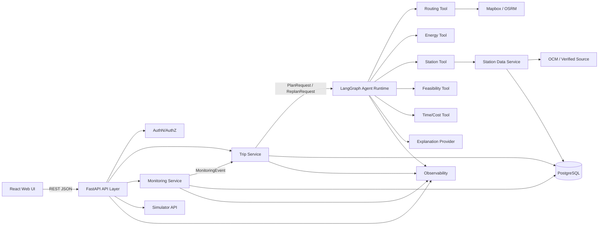
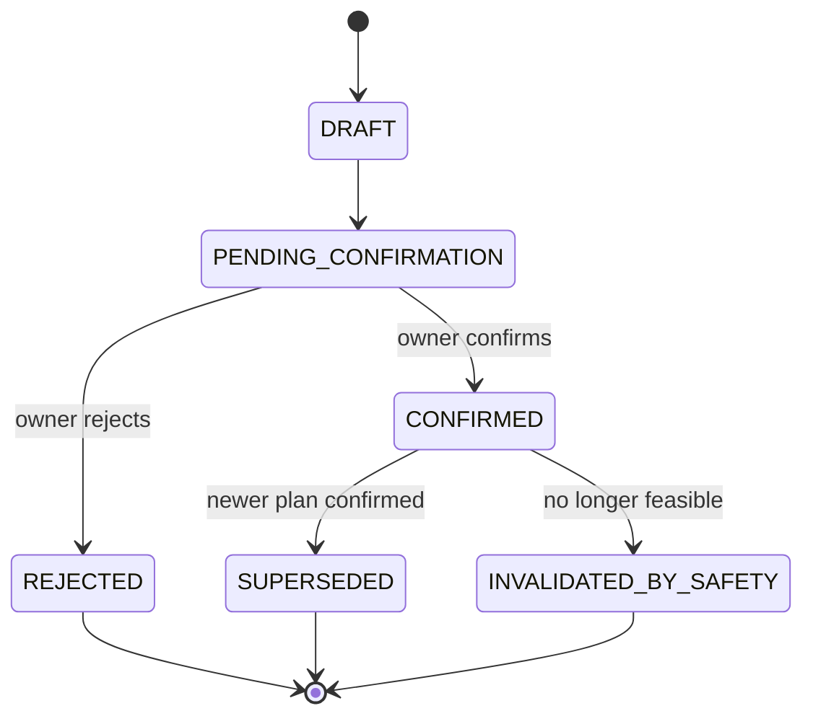

# INTERFACE DESIGN — AI EV Agent

**Phiên bản:** 1.0  
**Ngày:** 06/08/2026  
**Trạng thái:** Draft để FE/BE/Agent/QA review và freeze contract  
**Phạm vi:** F1–F4; F5 Support Workspace là Should/P1  


---

# 1. Mục tiêu của Interface Design

Interface phải trả lời rõ các câu hỏi sau:

1. Module nào gọi module nào?
2. Mỗi lời gọi nhận input gì?
3. Trả output gì?
4. Trường nào bắt buộc?
5. Enum và kiểu dữ liệu nào được dùng chung?
6. Khi lỗi thì trả code nào?
7. Khi retry, timeout hoặc fallback thì hành vi ra sao?
8. Module nào có quyền ghi business state?
9. Dữ liệu thật, mô phỏng, cached và manual được đánh dấu thế nào?
10. Contract nào phải được freeze để team code song song?

## 1.1 Nguyên tắc bắt buộc

- Contract public dùng REST/JSON dưới prefix `/api/v1`.
- Contract nội bộ dùng schema có cấu trúc và được validate bằng Pydantic.
- `Trip Service` là write boundary duy nhất cho `Trip`, `PlanVersion`, confirmation và business state.
- Agent chỉ điều phối tool, sinh structured proposal và explanation.
- Agent không có quyền ghi trực tiếp business data vào PostgreSQL.
- LLM không phải ground truth cho energy hoặc feasibility.
- Thiếu dữ liệu safety-critical phải **fail closed**.
- Plan mới chỉ có hiệu lực sau khi đúng chủ xe xác nhận.
- Route phải chạy trước Energy và Station.
- Feasibility chỉ chạy sau khi có cả Energy và Station result.
- Mọi dữ liệu quan trọng phải có provenance và freshness.
- Không mô tả SOC mô phỏng hoặc station snapshot như dữ liệu live.

---

# 2. Ranh giới hệ thống



## 2.1 Quyền sở hữu dữ liệu

| Component | Được ghi | Không được ghi |
|---|---|---|
| API Layer | Không ghi business state trực tiếp | Trip, PlanVersion |
| Trip Service | Trip, PlanVersion, confirmation, audit business state | Tool output giả |
| Monitoring Service | TelemetryEvent, MonitoringEvent, current telemetry state | Confirm plan, apply replan |
| Agent Runtime | AgentRun, ToolRun hoặc trace refs thông qua observability boundary | Trip, PlanVersion, confirmation |
| Simulator | Scenario execution state nếu cần | Business state |
| Station Data Service | StationSnapshot/cache có version | Trip plan |
| Support Workspace | Không ghi; read-only | Mọi write action |

---

# 3. Contract versioning và quy ước chung

## 3.1 API version

```text
/api/v1/...
```

Quy tắc:

- Thêm field optional: backward compatible.
- Đổi tên field, đổi kiểu hoặc xóa field: breaking change.
- Breaking change phải tạo `/api/v2`.
- Enum mới chỉ được thêm khi consumer đã xử lý unknown value hoặc contract đã được review.
- OpenAPI là nguồn contract chính cho FE/BE/QA.
- Internal schemas phải có `schema_version`.

## 3.2 Kiểu dữ liệu chung

| Loại | Quy ước |
|---|---|
| ID | UUID dạng string |
| Timestamp | ISO 8601 UTC, ví dụ `2026-08-06T09:10:00Z` |
| Tỷ lệ SOC | Number, đơn vị `%`, miền hợp lệ theo input MVP: `5..100` |
| Khoảng cách | Mét, hậu tố `_m` |
| Thời gian | Giây, hậu tố `_s` |
| Năng lượng | kWh, hậu tố `_kwh` |
| Công suất | kW, hậu tố `_kw` |
| Tọa độ | WGS84, `lat`, `lng` |
| Enum | UPPER_SNAKE_CASE, trừ preference public giữ `balanced` theo PRD |
| Field optional | Dùng `null`; không dùng chuỗi rỗng để biểu diễn thiếu dữ liệu |

## 3.3 Header chung

```http
Authorization: Bearer <token>
Content-Type: application/json
Accept: application/json
X-Trace-Id: <uuid>            # optional từ client; server sinh nếu thiếu
Idempotency-Key: <uuid>       # bắt buộc cho write action có nguy cơ gửi lặp
```

> Với `POST /plans` và `POST /replans`, tài liệu nguồn đang đặt `idempotency_key` trong body. V1 giữ field này trong body để tương thích. `Idempotency-Key` header có thể được chuẩn hóa ở lần freeze tiếp theo; không dùng đồng thời hai giá trị khác nhau.

## 3.4 Response envelope

Success response trả trực tiếp resource hoặc result object.

Error response luôn dùng:

```json
{
  "error": {
    "code": "ROUTING_UNAVAILABLE",
    "message": "Không thể tính tuyến tại thời điểm này.",
    "details": {},
    "retry_after_seconds": 30,
    "trace_id": "7aa920e4-a9b6-4bb6-b118-93de9fc222a3"
  }
}
```

---

# 4. Enum dùng chung

## 4.1 SourceType

```text
REAL_GPS
REAL_API
SIMULATED
CACHED_SNAPSHOT
MANUAL
```

## 4.2 FreshnessStatus

```text
FRESH
STALE
UNKNOWN
```

## 4.3 Verdict

```text
FEASIBLE
RISKY
INFEASIBLE
```

## 4.4 RiskLevel

```text
LOW
MEDIUM
HIGH
```

## 4.5 PlanState

```text
DRAFT
PENDING_CONFIRMATION
CONFIRMED
REJECTED
SUPERSEDED
INVALIDATED_BY_SAFETY
```

## 4.6 PlanTrigger

```text
PRE_TRIP
ROUTE_DEVIATION
SOC_UNDERPERFORMANCE
NEXT_STATION_UNREACHABLE
SIMULATED_STATION_UNAVAILABLE
STALE_TELEMETRY
```

`USER_REQUEST` chưa được chốt trong tài liệu nguồn. Nếu MVP cho phép chủ xe bấm replan thủ công thì enum này phải được thêm qua contract review.

## 4.7 RecommendedAction

```text
REQUEST_CONFIRMATION
SHOW_WARNING
RETRY_LATER
NO_ACTION
```

## 4.8 ExplanationMode

```text
LLM_GROUNDED
TEMPLATE_FALLBACK
```

---

# 5. Shared schemas

## 5.1 Coordinates

```json
{
  "lat": 21.0285,
  "lng": 105.8542
}
```

Ràng buộc:

- `-90 <= lat <= 90`
- `-180 <= lng <= 180`

## 5.2 LocationInput

```json
{
  "address": "Quốc Oai, Hà Nội",
  "lat": null,
  "lng": null,
  "source_type": "MANUAL"
}
```

Validation:

- Phải có `address`, hoặc có đồng thời `lat` và `lng`.
- Không chấp nhận chỉ có một trong hai `lat`, `lng`.
- Khi geocoding trả nhiều kết quả, hệ thống trả `AMBIGUOUS_LOCATION`; không tự chọn.

## 5.3 ProvenanceValue

Wrapper dùng cho field quan trọng:

```json
{
  "value": 42,
  "source_type": "SIMULATED",
  "source_name": "Telemetry Simulator",
  "updated_at": "2026-08-06T09:10:00Z",
  "freshness_seconds": 4,
  "freshness_status": "FRESH",
  "scenario_id": "SOC_DROP_01",
  "snapshot_version": null
}
```

Quy tắc:

- `scenario_id` bắt buộc khi `source_type = SIMULATED`.
- `snapshot_version` bắt buộc khi `source_type = CACHED_SNAPSHOT`.
- `source_name` bắt buộc cho `REAL_API`, `REAL_GPS`, `SIMULATED`, `CACHED_SNAPSHOT`.
- `updated_at` bắt buộc cho mọi dữ liệu có thể thay đổi.
- UI phải hiển thị badge theo `source_type`.

## 5.4 Assumption

```json
{
  "key": "reserve_soc_percent",
  "value": 15,
  "unit": "percent",
  "source": "POLICY_CONFIG",
  "policy_version": "pilot-policy-v1",
  "description": "Giả định pilot; không phải khuyến nghị chung."
}
```

## 5.5 TripAssumptions

```json
{
  "reserve_soc_percent": 15,
  "temperature_c": 25,
  "load_profile": "NOMINAL_2_TO_3_PEOPLE",
  "vehicle_profile_version": "xe-x-mvp-v1",
  "policy_version": "pilot-policy-v1"
}
```

## 5.6 ValueInterval

```json
{
  "min": 31.4,
  "expected": 34.8,
  "max": 38.2,
  "unit": "kwh"
}
```

## 5.7 ToolResultRef

```json
{
  "tool_run_id": "uuid",
  "tool_name": "ENERGY_TOOL",
  "result_ref": "tool-energy-1",
  "agent_run_id": "uuid",
  "schema_version": "1.0"
}
```

---

# 6. Public REST API

## 6.1 Danh sách endpoint

| Method | Endpoint | Owner | Mục đích |
|---|---|---|---|
| POST | `/api/v1/trips` | Trip Service | Tạo trip |
| POST | `/api/v1/trips/{trip_id}/plans` | Trip Service + Agent | Tạo pre-trip plan |
| POST | `/api/v1/trips/{trip_id}/telemetry-events` | Monitoring Service | Gửi GPS/SOC/station event |
| POST | `/api/v1/trips/{trip_id}/replans` | Trip Service + Agent | Tạo proposal mới |
| POST | `/api/v1/trips/{trip_id}/plans/{version}/confirm` | Trip Service | Xác nhận plan |
| POST | `/api/v1/trips/{trip_id}/plans/{version}/reject` | Trip Service | Từ chối plan |
| GET | `/api/v1/trips/{trip_id}` | Trip Service | Xem trip/current state |
| GET | `/api/v1/trips/{trip_id}/plans` | Trip Service | Xem plan history |

---

## 6.2 POST `/api/v1/trips`

### Mục đích

Tạo một trip ở trạng thái `DRAFT`, gắn owner và assumptions đã version hóa.

### Request

```json
{
  "origin": {
    "address": "Quốc Oai, Hà Nội",
    "lat": null,
    "lng": null,
    "source_type": "MANUAL"
  },
  "destination": {
    "address": "Hạ Long, Quảng Ninh",
    "lat": null,
    "lng": null,
    "source_type": "MANUAL"
  },
  "initial_soc_percent": 60,
  "soc_source_type": "MANUAL",
  "vehicle_profile_id": "xe-x-mvp-v1",
  "preference": "balanced"
}
```

### Validation

- `origin` bắt buộc.
- `destination` bắt buộc.
- `initial_soc_percent` trong `5..100`.
- `vehicle_profile_id` phải tồn tại.
- MVP chỉ hỗ trợ `preference = balanced`.
- Invalid input không được gọi Agent, Map provider hoặc Station provider.

### Success — `201 Created`

```json
{
  "trip_id": "uuid",
  "status": "DRAFT",
  "assumptions": {
    "reserve_soc_percent": 15,
    "policy_version": "pilot-policy-v1",
    "vehicle_profile_version": "xe-x-mvp-v1"
  },
  "created_at": "2026-08-06T09:00:00Z"
}
```

### Error

| HTTP | Code | Khi nào |
|---:|---|---|
| 400 | `VALIDATION_ERROR` | Input sai |
| 409 | `AMBIGUOUS_LOCATION` | Geocoding có nhiều candidate |
| 401 | `UNAUTHENTICATED` | Thiếu hoặc sai authentication |
| 403 | `FORBIDDEN` | Không có quyền tạo trip theo policy |
| 429 | `RATE_LIMITED` | Provider quota cạn |
| 500 | `INTERNAL_ERROR` | Lỗi không dự kiến |

### `AMBIGUOUS_LOCATION` details

```json
{
  "error": {
    "code": "AMBIGUOUS_LOCATION",
    "message": "Địa chỉ có nhiều kết quả. Vui lòng chọn lại.",
    "details": {
      "field": "origin",
      "candidates": [
        {
          "label": "Quốc Oai, Hà Nội, Việt Nam",
          "lat": 20.999,
          "lng": 105.642
        }
      ]
    },
    "retry_after_seconds": null,
    "trace_id": "uuid"
  }
}
```

---

## 6.3 POST `/api/v1/trips/{trip_id}/plans`

### Mục đích

Tạo một `PlanRequest`, chạy workflow planning và lưu `PlanVersion` ở trạng thái `PENDING_CONFIRMATION`.

### Request

```json
{
  "base_plan_version": null,
  "trigger": "PRE_TRIP",
  "idempotency_key": "uuid"
}
```

### Preconditions

- User sở hữu trip.
- Trip input hợp lệ.
- Vehicle profile và policy version tồn tại.
- Không có request cùng `idempotency_key` đang xử lý hoặc đã hoàn tất.

### Success — `201 Created`

```json
{
  "plan_id": "uuid",
  "version": 1,
  "state": "PENDING_CONFIRMATION",
  "verdict": "FEASIBLE",
  "route": {
    "route_id": "route-1",
    "geometry": "provider-specific-encoded-polyline",
    "distance_m": 190000,
    "duration_s": 10800,
    "source_type": "REAL_API",
    "source_name": "Mapbox",
    "updated_at": "2026-08-06T09:00:00Z",
    "freshness_status": "FRESH"
  },
  "energy": {
    "estimated_energy_kwh": {
      "min": 29.0,
      "expected": 32.0,
      "max": 35.0,
      "unit": "kwh"
    },
    "arrival_soc_percent": {
      "min": 14,
      "expected": 18,
      "max": 22,
      "unit": "percent"
    },
    "model_version": "energy-model-v1"
  },
  "charging_stops": [],
  "risk": "LOW",
  "assumptions": [],
  "explanation": {
    "text": "Phương án đạt mức pin dự phòng theo policy pilot.",
    "mode": "LLM_GROUNDED",
    "references": [
      "tool-route-1",
      "tool-energy-1",
      "tool-feasibility-1"
    ]
  },
  "tool_result_refs": []
}
```

### Không có phương án khả thi — `200 OK`

Không dùng error HTTP để biểu diễn kết quả nghiệp vụ hợp lệ `INFEASIBLE`.

```json
{
  "plan_id": null,
  "version": null,
  "state": null,
  "verdict": "INFEASIBLE",
  "result_type": "NO_FEASIBLE_PLAN",
  "reason_codes": [
    "ARRIVAL_SOC_BELOW_RESERVE"
  ],
  "failed_constraints": [
    {
      "constraint": "reserve_soc_percent",
      "required": 15,
      "actual_max": 11
    }
  ],
  "assumptions": [],
  "tool_result_refs": []
}
```

### Error

| HTTP | Code | Khi nào |
|---:|---|---|
| 400 | `VALIDATION_ERROR` | Body sai |
| 403 | `FORBIDDEN` | Không sở hữu trip |
| 404 | `TRIP_NOT_FOUND` | Trip không tồn tại |
| 409 | `VERSION_CONFLICT` | `base_plan_version` stale |
| 429 | `RATE_LIMITED` | Provider quota cạn |
| 503 | `ROUTING_UNAVAILABLE` | Route thất bại sau retry/fallback |
| 503 | `STATION_DATA_UNAVAILABLE` | Không có station source đủ dùng |
| 500 | `ENERGY_ESTIMATION_FAILED` | Energy tool fail closed |
| 500 | `FEASIBILITY_FAILED` | Feasibility tool fail closed |

---

## 6.4 POST `/api/v1/trips/{trip_id}/telemetry-events`

### Mục đích

Nhận vị trí, SOC và station event; lưu provenance; chỉ tạo `MonitoringEvent` khi vượt threshold.

### Request

```json
{
  "event_id": "uuid",
  "location": {
    "lat": 21.0285,
    "lng": 105.8542,
    "source_type": "REAL_GPS",
    "updated_at": "2026-08-06T09:10:00Z"
  },
  "soc": {
    "value_percent": 42,
    "source_type": "SIMULATED",
    "updated_at": "2026-08-06T09:10:00Z",
    "scenario_id": "SOC_DROP_01",
    "tick": 12
  },
  "station_event": null
}
```

### Validation

- `event_id` là idempotency key.
- GPS dùng `REAL_GPS`.
- SOC trong MVP dùng `SIMULATED` hoặc `MANUAL`; không claim OEM live SOC.
- `scenario_id` và `tick` bắt buộc với SOC mô phỏng.
- Trip phải có confirmed plan để compare threshold; nếu chưa có thì lưu telemetry nhưng không replan tự động.

### Success — không có meaningful event `202 Accepted`

```json
{
  "accepted": true,
  "duplicate": false,
  "monitoring_event": null,
  "agent_invoked": false,
  "last_updated_at": "2026-08-06T09:10:00Z"
}
```

### Success — có meaningful event `202 Accepted`

```json
{
  "accepted": true,
  "duplicate": false,
  "monitoring_event": {
    "monitoring_event_id": "uuid",
    "type": "SOC_UNDERPERFORMANCE",
    "occurred_at": "2026-08-06T09:10:00Z",
    "requires_replan": true
  },
  "agent_invoked": false
}
```

> Endpoint telemetry chỉ nhận và đánh giá event. Trip Service quyết định tạo authorized `ReplanRequest`.

### Error

| HTTP | Code | Khi nào |
|---:|---|---|
| 400 | `VALIDATION_ERROR` | Sai schema |
| 403 | `FORBIDDEN` | Không sở hữu trip |
| 404 | `TRIP_NOT_FOUND` | Trip không tồn tại |
| 409 | `DUPLICATE_EVENT_CONFLICT` | Cùng event_id nhưng payload khác |
| 422 | `STALE_TELEMETRY` | Event quá cũ và không được áp dụng vào current state |

---

## 6.5 POST `/api/v1/trips/{trip_id}/replans`

### Request

```json
{
  "trigger": "SOC_UNDERPERFORMANCE",
  "monitoring_event_id": "uuid",
  "base_plan_version": 1,
  "idempotency_key": "uuid"
}
```

### Preconditions

- `monitoring_event_id` thuộc đúng trip.
- Event yêu cầu replan.
- `base_plan_version` là current confirmed version hoặc version được Trip Service cho phép.
- User sở hữu trip hoặc request do trusted internal service tạo.
- Agent không tự quyết định authorization.

### Success

Response dùng cùng union contract với create plan:

```text
PlanProposalResponse | NoFeasiblePlanResponse
```

Plan mới được lưu `PENDING_CONFIRMATION`; plan cũ chưa bị supersede trước confirm.

### Error

| HTTP | Code |
|---:|---|
| 400 | `VALIDATION_ERROR` |
| 403 | `FORBIDDEN` |
| 404 | `TRIP_NOT_FOUND`, `MONITORING_EVENT_NOT_FOUND` |
| 409 | `VERSION_CONFLICT`, `EVENT_ALREADY_HANDLED` |
| 503 | `ROUTING_UNAVAILABLE`, `STATION_DATA_UNAVAILABLE` |
| 500 | `ENERGY_ESTIMATION_FAILED`, `FEASIBILITY_FAILED` |

---

## 6.6 POST `/api/v1/trips/{trip_id}/plans/{version}/confirm`

### Request

```json
{
  "expected_current_version": 1
}
```

### Header

```http
Idempotency-Key: <uuid>
```

### Preconditions

- User là owner của trip.
- Target plan ở `PENDING_CONFIRMATION`.
- `expected_current_version` khớp optimistic version hiện tại.
- Plan chưa bị invalidated.
- DB transaction phải commit thành công.

### Success — `200 OK`

```json
{
  "trip_id": "uuid",
  "confirmed_plan_version": 2,
  "confirmed_at": "2026-08-06T09:20:00Z",
  "state": "CONFIRMED",
  "superseded_version": 1,
  "trace_id": "uuid"
}
```

### Error

| HTTP | Code |
|---:|---|
| 403 | `FORBIDDEN` |
| 404 | `TRIP_NOT_FOUND`, `PLAN_NOT_FOUND` |
| 409 | `VERSION_CONFLICT`, `INVALID_PLAN_STATE`, `IDEMPOTENCY_CONFLICT` |
| 422 | `PLAN_INVALIDATED_BY_SAFETY` |
| 500 | `TRANSACTION_FAILED` |

---

## 6.7 POST `/api/v1/trips/{trip_id}/plans/{version}/reject`

### Request

```json
{
  "reason": "USER_PREFERS_CURRENT_PLAN"
}
```

### Header

```http
Idempotency-Key: <uuid>
```

### Business rule

- Proposal chuyển `REJECTED`.
- Nếu plan cũ còn feasible thì tiếp tục là current plan.
- Nếu plan cũ đã `INVALIDATED_BY_SAFETY`, không được hiển thị như phương án an toàn.

### Success — `200 OK`

```json
{
  "trip_id": "uuid",
  "rejected_plan_version": 2,
  "state": "REJECTED",
  "current_plan_version": 1,
  "current_plan_safety_state": "FEASIBLE",
  "rejected_at": "2026-08-06T09:21:00Z"
}
```

---

## 6.8 GET `/api/v1/trips/{trip_id}`

### Success — `200 OK`

```json
{
  "trip_id": "uuid",
  "status": "DRAFT",
  "owner_id": "uuid",
  "origin": {},
  "destination": {},
  "initial_soc": {},
  "assumptions": {},
  "confirmed_plan_version": 1,
  "latest_telemetry": {
    "location": {},
    "soc": {},
    "updated_at": "2026-08-06T09:10:00Z"
  },
  "active_warnings": [],
  "created_at": "2026-08-06T09:00:00Z",
  "updated_at": "2026-08-06T09:10:00Z"
}
```

Response không được trả secret, provider token hoặc internal prompt.

---

## 6.9 GET `/api/v1/trips/{trip_id}/plans`

### Query parameters

```text
limit: 1..100, default 20
cursor: optional
state: optional
```

### Success — `200 OK`

```json
{
  "items": [
    {
      "version": 2,
      "state": "PENDING_CONFIRMATION",
      "trigger": "SOC_UNDERPERFORMANCE",
      "verdict": "RISKY",
      "created_at": "2026-08-06T09:19:00Z"
    },
    {
      "version": 1,
      "state": "CONFIRMED",
      "trigger": "PRE_TRIP",
      "verdict": "FEASIBLE",
      "created_at": "2026-08-06T09:01:00Z"
    }
  ],
  "next_cursor": null
}
```

---

# 7. Internal service interfaces

Các interface dưới đây là Python-style protocol để chốt dependency, không bắt buộc implementation phải dùng class inheritance.

## 7.1 TripService

```python
from typing import Protocol
from uuid import UUID

class TripService(Protocol):
    async def create_trip(
        self,
        *,
        actor_id: UUID,
        request: CreateTripRequest,
        trace_id: UUID,
    ) -> Trip:
        ...

    async def request_plan(
        self,
        *,
        actor_id: UUID,
        trip_id: UUID,
        request: CreatePlanRequest,
        trace_id: UUID,
    ) -> PlanProposalResponse | NoFeasiblePlanResponse:
        ...

    async def request_replan(
        self,
        *,
        actor_id: UUID,
        trip_id: UUID,
        request: ReplanRequest,
        trace_id: UUID,
    ) -> PlanProposalResponse | NoFeasiblePlanResponse:
        ...

    async def confirm_plan(
        self,
        *,
        actor_id: UUID,
        trip_id: UUID,
        version: int,
        expected_current_version: int,
        idempotency_key: UUID,
        trace_id: UUID,
    ) -> ConfirmPlanResult:
        ...

    async def reject_plan(
        self,
        *,
        actor_id: UUID,
        trip_id: UUID,
        version: int,
        reason: str,
        idempotency_key: UUID,
        trace_id: UUID,
    ) -> RejectPlanResult:
        ...
```

### Trip Service invariants

- Kiểm tra ownership trước mọi read/write.
- Kiểm tra optimistic version.
- Validate tất cả tool result refs cùng một AgentRun.
- Không lưu final charging stop đã bị Station/Feasibility loại.
- Không lưu PlanProposal khi verdict là `INFEASIBLE`.
- Connector, reserve, provenance và freshness phải đủ.
- Agent không được truyền SQL model hoặc repository object vào contract.

## 7.2 MonitoringService

```python
class MonitoringService(Protocol):
    async def ingest_telemetry(
        self,
        *,
        trip_id: UUID,
        event: TelemetryEvent,
        trace_id: UUID,
    ) -> TelemetryIngestResult:
        ...

    async def evaluate_against_plan(
        self,
        *,
        trip: TripSnapshot,
        confirmed_plan: PlanSnapshot,
        telemetry: TelemetryState,
        policy: MonitoringPolicy,
        trace_id: UUID,
    ) -> MonitoringDecision:
        ...
```

```python
class MonitoringDecision(BaseModel):
    meaningful_event: MonitoringEvent | None
    requires_replan: bool
    reason_codes: list[str]
    evaluated_policy_version: str
```

Invariant:

- Nếu không có event: `requires_replan = false`.
- Trường hợp bình thường không được gọi Agent, LLM hoặc Routing.
- Threshold lấy từ versioned config, không đặt trong prompt.

## 7.3 PlanningAgent

```python
class PlanningAgent(Protocol):
    async def generate_plan(
        self,
        *,
        request: PlanRequest,
        trace_id: UUID,
    ) -> PlanProposal | NoFeasiblePlan:
        ...

    async def generate_replan(
        self,
        *,
        request: ReplanRequest,
        trace_id: UUID,
    ) -> PlanProposal | NoFeasiblePlan:
        ...
```

Invariant:

- Chỉ trả structured object.
- Không ghi DB.
- Không override verdict từ Feasibility Tool.
- Không thêm route/station fact ngoài tool result.
- Nếu LLM lỗi, dùng fixed graph và template explanation.
- Tool order phải trace được.

## 7.4 StationDataService

```python
class StationDataService(Protocol):
    async def query_corridor(
        self,
        *,
        route_geometry: RouteGeometry,
        connector: str,
        max_detour_m: int,
        freshness_policy: FreshnessPolicy,
        snapshot_version: str | None,
        trace_id: UUID,
    ) -> StationDataset:
        ...

    async def get_station(
        self,
        *,
        station_id: str,
        snapshot_version: str | None,
        trace_id: UUID,
    ) -> StationRecord | None:
        ...
```

Invariant:

- Không khẳng định live availability khi nguồn là snapshot.
- Mỗi station có source, updated_at và snapshot version.
- Snapshot dùng versioned key.

## 7.5 ExplanationProvider

```python
class ExplanationProvider(Protocol):
    async def explain(
        self,
        *,
        proposal: StructuredPlanForExplanation,
        allowed_result_refs: list[ToolResultRef],
        trace_id: UUID,
    ) -> GroundedExplanation:
        ...
```

```python
class GroundedExplanation(BaseModel):
    text: str
    mode: ExplanationMode
    references: list[str]
    generated_at: datetime
```

Validation:

- Mọi route/station ID được nhắc phải nằm trong `allowed_result_refs`.
- Nếu validation fail, thay bằng template fallback.
- Explanation không được thay đổi verdict.

---

# 8. Agent contracts

## 8.1 PlanRequest

```json
{
  "schema_version": "1.0",
  "trip_id": "uuid",
  "trigger": "PRE_TRIP",
  "authorized_user_id": "uuid",
  "base_plan_version": null,
  "input_refs": [
    "trip-input-ref",
    "vehicle-profile-ref",
    "policy-ref"
  ],
  "policy_version": "pilot-policy-v1"
}
```

## 8.2 ReplanRequest

```json
{
  "schema_version": "1.0",
  "trip_id": "uuid",
  "trigger": "SOC_UNDERPERFORMANCE",
  "authorized_user_id": "uuid",
  "base_plan_version": 1,
  "monitoring_event_ref": "monitoring-event-ref",
  "current_location_ref": "telemetry-location-ref",
  "current_soc_ref": "telemetry-soc-ref",
  "policy_version": "pilot-policy-v1"
}
```

## 8.3 PlanProposal

```json
{
  "schema_version": "1.0",
  "proposal_id": "uuid",
  "trip_id": "uuid",
  "base_plan_version": 1,
  "trigger": "SOC_UNDERPERFORMANCE",
  "verdict": "RISKY",
  "risk_level": "MEDIUM",
  "route_result_ref": "tool-route-1",
  "energy_result_ref": "tool-energy-1",
  "station_result_refs": [
    "tool-station-1"
  ],
  "feasibility_result_ref": "tool-feasibility-1",
  "cost_result_ref": "tool-cost-1",
  "charging_plan": [],
  "assumptions": [],
  "explanation": {
    "text": "",
    "mode": "LLM_GROUNDED",
    "references": []
  },
  "recommended_action": "REQUEST_CONFIRMATION",
  "agent_run_id": "uuid"
}
```

## 8.4 NoFeasiblePlan

```json
{
  "schema_version": "1.0",
  "result_type": "NO_FEASIBLE_PLAN",
  "trip_id": "uuid",
  "base_plan_version": 1,
  "trigger": "SOC_UNDERPERFORMANCE",
  "verdict": "INFEASIBLE",
  "reason_codes": [
    "NO_REACHABLE_COMPATIBLE_STATION"
  ],
  "failed_constraints": [],
  "assumptions": [],
  "route_result_ref": "tool-route-1",
  "energy_result_ref": "tool-energy-1",
  "station_result_refs": [
    "tool-station-1"
  ],
  "feasibility_result_ref": "tool-feasibility-1",
  "recommended_action": "SHOW_WARNING",
  "agent_run_id": "uuid"
}
```

---

# 9. Tool interfaces

## 9.1 RoutingProvider

```python
class RoutingProvider(Protocol):
    async def get_route(
        self,
        *,
        request: RouteRequest,
        trace_id: UUID,
    ) -> RouteResult:
        ...
```

### RouteRequest

```json
{
  "origin": {
    "lat": 20.999,
    "lng": 105.642
  },
  "destination": {
    "lat": 20.951,
    "lng": 107.080
  },
  "vehicle_profile_id": "xe-x-mvp-v1",
  "preference": "balanced"
}
```

### RouteResult

```json
{
  "route_id": "route-1",
  "geometry": "encoded-polyline",
  "geometry_format": "ENCODED_POLYLINE",
  "segments": [
    {
      "segment_id": "seg-1",
      "distance_m": 12000,
      "duration_s": 900,
      "average_speed_kph": 48
    }
  ],
  "distance_m": 190000,
  "duration_s": 10800,
  "provenance": {
    "source_type": "REAL_API",
    "source_name": "Mapbox",
    "updated_at": "2026-08-06T09:00:00Z",
    "snapshot_version": null
  }
}
```

### Failure

- Không tự trả route rỗng.
- Timeout/retry/fallback hết phải raise/return `ROUTING_UNAVAILABLE`.
- Provider adapter không để model Mapbox/OSRM rò sang Agent contract.

## 9.2 EnergyTool

```python
class EnergyTool(Protocol):
    async def estimate(
        self,
        *,
        route: RouteResult,
        vehicle: VehicleProfile,
        assumptions: TripAssumptions,
        initial_soc_percent: float,
        trace_id: UUID,
    ) -> EnergyResult:
        ...
```

### EnergyResult

```json
{
  "total_energy_kwh": {
    "min": 29.0,
    "expected": 32.0,
    "max": 35.0,
    "unit": "kwh"
  },
  "arrival_soc_percent": {
    "min": 14,
    "expected": 18,
    "max": 22,
    "unit": "percent"
  },
  "segment_estimates": [
    {
      "segment_id": "seg-1",
      "energy_kwh": {
        "min": 1.7,
        "expected": 1.9,
        "max": 2.2,
        "unit": "kwh"
      },
      "soc_after_percent": {
        "min": 56,
        "expected": 57,
        "max": 58,
        "unit": "percent"
      }
    }
  ],
  "model_version": "energy-model-v1",
  "assumption_refs": [
    "reserve_soc_percent",
    "temperature_c",
    "load_profile"
  ]
}
```

Invariant:

- Bắt buộc có route segments.
- Không dùng LLM để tính energy.
- Nếu thiếu battery capacity hoặc consumption thì fail closed.

## 9.3 StationTool

```python
class StationTool(Protocol):
    async def search(
        self,
        *,
        route: RouteResult,
        vehicle: VehicleProfile,
        policy: StationSearchPolicy,
        station_dataset: StationDataset,
        excluded_station_ids: set[str],
        trace_id: UUID,
    ) -> StationSearchResult:
        ...
```

### StationCandidate

```json
{
  "station_id": "STATION_A",
  "name": "Trạm A",
  "location": {
    "lat": 20.95,
    "lng": 106.30
  },
  "distance_along_route_m": 85000,
  "detour_m": 1400,
  "connectors": [
    {
      "type": "CCS2",
      "power_kw": 150
    }
  ],
  "compatibility": "COMPATIBLE",
  "freshness_status": "FRESH",
  "provenance": {
    "source_type": "CACHED_SNAPSHOT",
    "source_name": "OCM snapshot",
    "updated_at": "2026-08-05T12:00:00Z",
    "snapshot_version": "stations-v1"
  }
}
```

### RejectedStation

```json
{
  "station_id": "STATION_B",
  "reason_codes": [
    "CONNECTOR_MISMATCH"
  ]
}
```

### StationSearchResult

```json
{
  "candidates": [],
  "rejected_candidates": [],
  "dataset_snapshot_version": "stations-v1",
  "tool_run_id": "uuid"
}
```

Reason code tối thiểu:

```text
CONNECTOR_MISMATCH
CONNECTOR_UNKNOWN
DETOUR_EXCEEDS_LIMIT
STALE_BY_POLICY
SIMULATED_UNAVAILABLE
OUTSIDE_ROUTE_CORRIDOR
```

## 9.4 FeasibilityTool

```python
class FeasibilityTool(Protocol):
    async def evaluate(
        self,
        *,
        route: RouteResult,
        energy: EnergyResult,
        stations: StationSearchResult,
        policy: FeasibilityPolicy,
        trace_id: UUID,
    ) -> FeasibilityResult:
        ...
```

### FeasibilityResult

```json
{
  "verdict": "FEASIBLE",
  "risk_level": "LOW",
  "reserve_soc_percent": 15,
  "valid_station_ids": [
    "STATION_A"
  ],
  "rejected_station_ids": [
    "STATION_B"
  ],
  "reason_codes": [],
  "constraint_results": [
    {
      "name": "arrival_soc_at_destination",
      "required_min": 15,
      "actual_expected": 18,
      "actual_min": 14,
      "status": "PASS_WITH_RISK"
    }
  ],
  "policy_version": "pilot-policy-v1"
}
```

Invariant:

- Deterministic.
- Không nhận natural-language prompt.
- Không cho phép Agent override.
- Verdict `INFEASIBLE` không được tạo charging plan.
- Trạm sai hoặc unknown connector không được nằm trong `valid_station_ids`.

## 9.5 TimeCostTool

```python
class TimeCostTool(Protocol):
    async def calculate(
        self,
        *,
        route: RouteResult,
        charging_plan: list[ChargingStop],
        pricing_snapshot: PricingSnapshot | None,
        trace_id: UUID,
    ) -> TimeCostResult:
        ...
```

> Cost là bước sau feasibility. Tài liệu nguồn chưa chốt pricing source/currency cho MVP; vì vậy cost có thể là optional và không được chặn vertical slice.

## 9.6 LLMProvider abstraction

```python
class LLMProvider(Protocol):
    async def generate_structured(
        self,
        *,
        prompt_template_id: str,
        input_object: dict,
        output_schema: type[BaseModel],
        trace_id: UUID,
    ) -> BaseModel:
        ...
```

Invariant:

- Provider có thể là OpenAI hoặc Gemini.
- Không để provider-specific response rò sang Agent layer.
- Timeout dùng template fallback.
- Không gọi LLM khi chỉ cần deterministic monitoring.

---

# 10. Event contracts

## 10.1 TelemetryEvent

```json
{
  "schema_version": "1.0",
  "event_id": "uuid",
  "trip_id": "uuid",
  "location": {},
  "soc": {},
  "station_event": null,
  "received_at": "2026-08-06T09:10:01Z"
}
```

## 10.2 MonitoringEvent

```json
{
  "schema_version": "1.0",
  "monitoring_event_id": "uuid",
  "trip_id": "uuid",
  "type": "SOC_UNDERPERFORMANCE",
  "threshold": {
    "name": "soc_underperformance_percent",
    "configured_value": 8,
    "policy_version": "monitoring-policy-v1"
  },
  "telemetry_refs": [
    "telemetry-event-ref"
  ],
  "confirmed_plan_version": 1,
  "occurred_at": "2026-08-06T09:10:00Z",
  "requires_replan": true,
  "source_type": "SIMULATED"
}
```

## 10.3 Simulated station event

```json
{
  "type": "SIMULATED_STATION_UNAVAILABLE",
  "station_id": "STATION_A",
  "scenario_id": "REPLAN_STATION_01",
  "tick": 20,
  "occurred_at": "2026-08-06T09:15:00Z",
  "source_type": "SIMULATED"
}
```

UI bắt buộc ghi rõ đây là sự kiện mô phỏng.

---

# 11. Plan state machine



## 11.1 Transition rules

| Current | Action/Event | Next | Allowed actor |
|---|---|---|---|
| DRAFT | Proposal saved | PENDING_CONFIRMATION | Trip Service |
| PENDING_CONFIRMATION | Confirm | CONFIRMED | Owner |
| PENDING_CONFIRMATION | Reject | REJECTED | Owner |
| CONFIRMED | Newer plan confirmed | SUPERSEDED | Trip Service transaction |
| CONFIRMED | Safety invalidation | INVALIDATED_BY_SAFETY | Trip Service từ validated Monitoring/Feasibility result |

Không có transition trực tiếp:

```text
PENDING_CONFIRMATION → SUPERSEDED
REJECTED → CONFIRMED
INVALIDATED_BY_SAFETY → CONFIRMED
```

---

# 12. Error contract

## 12.1 Error schema

```python
class ErrorBody(BaseModel):
    code: str
    message: str
    details: dict
    retry_after_seconds: int | None
    trace_id: UUID

class ErrorResponse(BaseModel):
    error: ErrorBody
```

## 12.2 Error code catalogue

| Code | HTTP | Retryable | Ý nghĩa |
|---|---:|---:|---|
| `VALIDATION_ERROR` | 400 | No | Request sai schema/rule |
| `AMBIGUOUS_LOCATION` | 409 | No | Có nhiều geocoding candidate |
| `UNAUTHENTICATED` | 401 | No | Thiếu/sai auth |
| `FORBIDDEN` | 403 | No | Không có quyền |
| `TRIP_NOT_FOUND` | 404 | No | Không tìm thấy trip |
| `PLAN_NOT_FOUND` | 404 | No | Không tìm thấy plan |
| `MONITORING_EVENT_NOT_FOUND` | 404 | No | Không tìm thấy event |
| `VERSION_CONFLICT` | 409 | No | Optimistic version mismatch |
| `INVALID_PLAN_STATE` | 409 | No | State transition không hợp lệ |
| `IDEMPOTENCY_CONFLICT` | 409 | No | Cùng key nhưng payload khác |
| `ROUTING_UNAVAILABLE` | 503 | Yes | Routing fail sau retry/fallback |
| `STATION_DATA_UNAVAILABLE` | 503 | Yes | Station data không đủ |
| `ENERGY_ESTIMATION_FAILED` | 500 | Có thể | Energy tool lỗi |
| `FEASIBILITY_FAILED` | 500 | Có thể | Feasibility tool lỗi |
| `NO_FEASIBLE_PLAN` | 200 business result | No | Không có plan đạt policy |
| `RATE_LIMITED` | 429 | Yes | Provider quota/rate limit |
| `STALE_TELEMETRY` | 422 | No | Telemetry quá cũ |
| `PLAN_INVALIDATED_BY_SAFETY` | 422 | No | Không thể confirm plan không còn an toàn |
| `TRANSACTION_FAILED` | 500 | Có thể | DB commit thất bại |
| `INTERNAL_ERROR` | 500 | No mặc định | Lỗi không dự kiến |

## 12.3 Quy tắc message

- `message` dành cho người dùng hoặc FE.
- `details` chứa field/candidate/reason có cấu trúc.
- Không đưa stack trace, SQL, API key, prompt hoặc precise location không cần thiết.
- `trace_id` luôn có.
- FE không parse `message` để xử lý logic; chỉ parse `code`.

---

# 13. Timeout, retry, rate limit và fallback

| Dependency | Timeout | Retry | Fallback | Hành vi cuối |
|---|---:|---:|---|---|
| Mapbox | 5s | 1 | OSRM hoặc valid route cache | `ROUTING_UNAVAILABLE` |
| Station provider | 5s | 1 | Versioned station snapshot | Hiển thị source/freshness |
| LLM | 15s | 1 | Fixed graph + template explanation | Feasibility không bị ảnh hưởng |
| Energy Tool | 2s | 1 transient | Không | Fail closed |
| Feasibility Tool | 2s | 1 transient | Không | Không tạo plan |
| PostgreSQL | 3s | Transaction retry giới hạn | Không | Confirm chỉ thành công sau commit |

## 13.1 Retry policy

```text
max_attempts = 2
backoff = exponential + jitter
respect Retry-After
do not retry validation/schema errors
```

## 13.2 Hard timeout

- Toàn bộ replan target: median `< 10s`, p95 `< 30s`.
- Hard timeout mục tiêu: `60s`.
- Hết hard timeout phải trả error có `trace_id`; không treo vô hạn.

## 13.3 Rate-limit guard

- Dùng central provider client.
- Route/station cache dùng versioned key.
- Không gọi LLM/routing khi không có meaningful event.
- Quota cạn trả `RATE_LIMITED` và `retry_after_seconds`.

---

# 14. Security và authorization contract

## 14.1 Role/actor

| Actor | Read own trip | Create/plan/replan | Confirm/reject | Read support-granted trip | Modify telemetry |
|---|---:|---:|---:|---:|---:|
| Owner | Yes | Yes | Yes | N/A | Yes cho own trip |
| Support P1 | No mặc định | No | No | Yes nếu có grant | No |
| Internal Monitoring Service | Scoped | Tạo MonitoringEvent | No | No | Persist telemetry |
| Agent Runtime | Chỉ qua structured refs | Trả proposal | No | No | No |

## 14.2 Rules

- Auth dùng JWT hoặc session.
- API key provider chỉ tồn tại ở server.
- Ownership check thực hiện trong Trip Service.
- Agent không tham gia quyết định authorization write.
- Confirm/reject dùng optimistic version.
- SupportGrant có trip, permission và expiry.
- Unauthorized support access trả `403` và response không để lộ location, SOC hoặc plan history.
- Không log secret.
- Precise location phải được giảm hoặc ẩn trong application log nếu không cần.

---

# 15. Observability interface

## 15.1 Request trace

Mọi request có `trace_id`.

```json
{
  "trace_id": "uuid",
  "request_id": "uuid",
  "actor_id_hash": "hash",
  "endpoint": "/api/v1/trips/{trip_id}/plans",
  "status_code": 201,
  "duration_ms": 8432
}
```

## 15.2 AgentRun

```json
{
  "agent_run_id": "uuid",
  "trace_id": "uuid",
  "trip_id": "uuid",
  "trigger": "PRE_TRIP",
  "selected_tools": [
    "ROUTING",
    "ENERGY",
    "STATION",
    "FEASIBILITY"
  ],
  "tool_order": [
    "ROUTING",
    "ENERGY+STATION",
    "FEASIBILITY"
  ],
  "retry_count": 0,
  "final_verdict": "FEASIBLE",
  "total_latency_ms": 8100,
  "fallback_used": false,
  "status": "SUCCEEDED"
}
```

## 15.3 ToolRun

```json
{
  "tool_run_id": "uuid",
  "agent_run_id": "uuid",
  "trace_id": "uuid",
  "tool_name": "ROUTING",
  "input_hash": "sha256",
  "provider": "MAPBOX",
  "latency_ms": 1400,
  "result_ref": "tool-route-1",
  "error_code": null,
  "source_type": "REAL_API",
  "freshness_status": "FRESH"
}
```

## 15.4 Metric tối thiểu

- Feasibility accuracy.
- Infeasible recall.
- Valid charging plan rate.
- High-risk recall.
- Tool-selection accuracy.
- Unnecessary tool-call rate.
- Provider error rate.
- Replanning latency.
- Cache hit rate.
- Số lần template explanation fallback.
- Hallucinated route/station facts.

---

# 16. Persistence-facing data contracts

| Entity | Key fields |
|---|---|
| User | `id`, `role` |
| VehicleProfile | `id`, `version`, `usable_battery`, `consumption`, `connector`, `max_charge` |
| PolicyConfig | `version`, `reserve_soc`, `thresholds` |
| Trip | `id`, `owner_id`, `status`, `confirmed_plan_version` |
| PlanVersion | `trip_id`, `version`, `state`, `verdict`, `assumptions`, `explanation` |
| PlanProposal | `id`, `trigger`, `base_version`, `result_refs` |
| TelemetryEvent | `trip_id`, `location`, `soc`, `source_metadata`, `timestamp` |
| MonitoringEvent | `type`, `threshold`, `telemetry_refs` |
| StationSnapshot | `station_id`, `metadata`, `source`, `updated_at`, `snapshot_version` |
| SimulationScenario | `scenario_id`, `seed`, `timeline`, `fixture_versions` |
| ToolRun | `tool`, `input_hash`, `output_ref`, `latency`, `error` |
| AgentRun | `trigger`, `selected_tools`, `retry_count`, `status` |
| SupportGrant | `support_user_id`, `trip_id`, `permission`, `expires_at` |

## 16.1 Unique constraints tối thiểu

```text
PlanVersion: UNIQUE(trip_id, version)
TelemetryEvent: UNIQUE(trip_id, event_id)
Plan idempotency: UNIQUE(trip_id, idempotency_key, operation_type)
SupportGrant: UNIQUE(support_user_id, trip_id, permission)
```

---

# 17. Contract test matrix

## 17.1 Public API contract tests

| Case | Expected |
|---|---|
| Create trip valid | `201`, status `DRAFT`, assumptions có version |
| SOC < 5 hoặc > 100 | `400 VALIDATION_ERROR`, zero provider call |
| Ambiguous address | `409 AMBIGUOUS_LOCATION`, có candidates |
| Create plan happy path | `201`, `PENDING_CONFIRMATION` |
| Route timeout + fallback fail | `503 ROUTING_UNAVAILABLE`, không tạo plan |
| Station sai connector | Không xuất hiện trong charging plan |
| Arrival SOC dưới reserve | `RISKY` hoặc `INFEASIBLE` theo policy |
| Không có feasible option | `NoFeasiblePlan`, không có charging plan giả |
| Unauthorized confirm | `403`, state không đổi |
| Double confirm | Idempotent hoặc `409` theo cùng key/payload rule |
| Version conflict | `409 VERSION_CONFLICT` |
| LLM timeout | Plan vẫn có template explanation |
| Normal telemetry | `agent_invoked = false` |
| Stale telemetry | `STALE_TELEMETRY` + last updated |
| Replan result | Version n+1 `PENDING_CONFIRMATION` |
| Reject new plan khi old plan safe | Old plan tiếp tục current |
| Reject new plan khi old plan unsafe | Không hiển thị old plan như safe |

## 17.2 Internal contract tests

- Routing adapter của Mapbox và OSRM trả cùng `RouteResult`.
- Energy tool không chạy khi thiếu route segments.
- Station tool không chạy khi thiếu route geometry.
- Feasibility tool chỉ nhận Energy + Station result hợp lệ.
- Agent tool order đúng:
  `Route → Energy + Station → Feasibility`.
- Tool refs trong proposal phải cùng `agent_run_id`.
- Explanation không chứa route/station ID ngoài refs.
- Agent không có repository/business DB credential.
- Monitoring no-event tạo zero Agent/LLM/Routing call.

---

# 18. Contract freeze checklist

## 18.1 Trước khi freeze

- [ ] FE review request/response và error code.
- [ ] BE review validation, auth, idempotency và transaction.
- [ ] Agent review PlanRequest, ReplanRequest, PlanProposal và tool refs.
- [ ] Data/QA review energy, station và feasibility fields.
- [ ] Simulator review telemetry/event schema.
- [ ] QA có fixture cho success, boundary và failure.
- [ ] OpenAPI generate được mock server/client.
- [ ] Enum không mâu thuẫn giữa FE, BE và Agent.
- [ ] Provenance wrapper dùng thống nhất.
- [ ] Timeout/retry/fallback có test case.
- [ ] Plan state machine được PO + BE + QA chốt.

## 18.2 Sau khi freeze

- Không sửa contract trực tiếp trong implementation PR.
- Mọi thay đổi contract phải có:
  - lý do;
  - impact;
  - migration/backward compatibility;
  - cập nhật OpenAPI;
  - cập nhật mock;
  - cập nhật contract test;
  - review của FE + BE + Agent/QA liên quan.

---

# 19. Open questions cần chốt trong grooming

Các mục dưới đây chưa được tài liệu nguồn định nghĩa đủ chi tiết, nên chưa nên hard-code:

1. Route geometry format chính thức: encoded polyline hay GeoJSON.
2. `max_detour_m` mặc định.
3. Freshness threshold cho route và station snapshot.
4. Công thức và threshold chính xác của `SOC_UNDERPERFORMANCE`.
5. Threshold route deviation.
6. Thời gian telemetry bị coi là stale.
7. Pricing source, currency và phạm vi Cost Tool.
8. Có cho phép `USER_REQUEST` replan trong MVP hay không.
9. Trip status ngoài `DRAFT`.
10. Chính sách trả `403` hay `404` để giảm enumeration risk.
11. Confirm/reject idempotency dùng header hay body thống nhất.
12. Cơ chế async cho MonitoringEvent → Trip Service: in-process event, DB outbox hay queue.
13. Public endpoint cụ thể cho Support Workspace P1.
14. Chuẩn connector enum đầy đủ ngoài profile Xe X MVP.
15. Exact error mapping cho energy/feasibility transient failure: `500` hay `503`.

---

# 20. Đề xuất cấu trúc repository cho contract

```text
src/
├── api/
│   ├── v1/
│   │   ├── trips.py
│   │   ├── plans.py
│   │   ├── telemetry.py
│   │   └── replans.py
│   └── errors.py
├── contracts/
│   ├── common.py
│   ├── trip.py
│   ├── plan.py
│   ├── telemetry.py
│   ├── monitoring.py
│   ├── agent.py
│   ├── routing.py
│   ├── energy.py
│   ├── station.py
│   ├── feasibility.py
│   └── provenance.py
├── services/
│   ├── trip_service.py
│   ├── monitoring_service.py
│   └── station_data_service.py
├── agent/
│   ├── runtime.py
│   ├── graph.py
│   └── explanation.py
├── tools/
│   ├── routing/
│   ├── energy/
│   ├── station/
│   ├── feasibility/
│   └── cost/
├── simulator/
├── persistence/
└── observability/

openapi/
├── openapi-v1.yaml
└── examples/

tests/
├── contract/
├── integration/
├── smoke/
└── fixtures/
```

---

# 21. Thứ tự triển khai theo contract-first

```text
1. Freeze shared enums + provenance + error contract
2. Freeze POST /trips
3. Freeze POST /plans
4. Freeze Routing/Energy/Station/Feasibility interfaces
5. Tạo OpenAPI mock server/client
6. FE và BE/Agent code song song
7. Chạy vertical slice
8. Freeze confirm/reject + state machine
9. Freeze telemetry/monitoring/replan
10. Hoàn thiện plan history và Support P1 nếu còn capacity
```

## 21.1 Vertical slice bắt buộc

```text
Nhập trip
→ tạo route
→ lấy station fixture
→ tính energy đơn giản
→ kiểm tra feasibility với reserve SOC 15%
→ hiển thị route, station và risk
```

---

# 22. Definition of Ready cho implementation

Một task chỉ bắt đầu khi:

- Có User Story và Acceptance Criteria.
- Input/output contract rõ.
- Error code rõ.
- Owner và dependency rõ.
- Có fixture/example payload.
- Có output kiểm tra được.
- Không còn open question chặn task.

# 23. Definition of Done

- Code được review và merge.
- Unit/integration/contract test pass.
- Không phá OpenAPI.
- Có trace/log cần thiết.
- Documentation cập nhật.
- Demo được output.
- Không làm sai provenance/safety rule.
- Không tạo plan khi thiếu dữ liệu safety-critical.
