# TECHNICAL ARCHITECTURE — AI Agent lập kế hoạch chuyến đi và sạc pin cho Xe X

**Phiên bản:** 3.1  
**Ngày cập nhật:** 16/08/2026  
**Trạng thái:** Draft — sẵn sàng cho design review  
**Liên kết PRD:** `PRD_AI_EV_AGENT_v3.0.md`  
**Liên kết BRIEF:** `BRIEF_AI_EV_AGENT_v3.0.md`  
**Contract chính thức:** `openapi.yaml` 

> Tài liệu này mô tả **how** của hệ thống. PRD giữ Problem/Why/Persona/Scope/Feature/AC/Metric; Technical Architecture giữ component, dependency, workflow, trust boundary, data model, transaction, timeout/retry/fallback, security, observability, deployment và trade-off. Request/response schema chi tiết nằm trong OpenAPI.

---

## 1. Context, scope và architecture goals

### 1.1. Context

MVP là ứng dụng web hỗ trợ chủ xe Xe X:

```text
Lập kế hoạch trước chuyến đi
→ xem route, trạm, SOC dự kiến và risk
→ hiểu giả định và lý do đề xuất
→ xác nhận kế hoạch
→ theo dõi bằng GPS thật + SOC/sự kiện mô phỏng
→ tái lập kế hoạch khi có sự kiện đáng kể
→ xác nhận hoặc từ chối kế hoạch mới
```

Các kết luận về route, năng lượng, trạm và feasibility phải đến từ dữ liệu có cấu trúc và deterministic tools. LLM chỉ hỗ trợ orchestration trong graph đã định nghĩa và tạo explanation dựa trên tool result; LLM không phải nguồn quyết định an toàn.

### 1.2. Capacity assumptions cho MVP/pilot

| Hạng mục | Giả định MVP |
|---|---|
| Người dùng pilot | 5–10 người |
| Trip đồng thời | Tối đa 3 trip đang planning/replanning |
| Vehicle profile | Một profile Xe X được version hóa |
| Telemetry | 1 update mỗi 5–10 giây trong simulator/demo |
| Planning/replanning | Tối đa khoảng 10 request/phút trong demo/pilot |
| Station snapshot | Dưới 20.000 station record đã chuẩn hóa |
| Simulator | 20 smoke scenarios; mở rộng tối thiểu 60 benchmark cases |
| Backend | Một API process + một planning worker, cùng codebase/image |
| Database | Một PostgreSQL instance |
| Availability | Pilot/demo; chưa cam kết production-grade HA |

Các con số trên là giả định thiết kế, không phải năng lực production đã được kiểm chứng. Khi profiling hoặc load test vượt giả định, team mới cân nhắc nâng cấp.

### 1.3. Architecture goals

- Chạy được vertical slice end-to-end sớm.
- Tách AI orchestration khỏi deterministic safety tools.
- Luồng safety-critical chạy theo thứ tự deterministic.
- Cho FE, BE và Agent làm song song theo contract-first.
- Minh bạch dữ liệu `REAL_GPS`, `REAL_API`, `SIMULATED`, `CACHED_SNAPSHOT`, `MANUAL`.
- Benchmark và simulator tái lập được.
- Không block HTTP request dài bằng planning/replanning có thể kéo dài đến hàng chục giây.
- Fail closed khi thiếu dữ liệu safety-critical.
- Không over-engineering cho MVP 10 ngày.
- Giữ module boundary để có thể mở rộng sau MVP.

### 1.4. Non-goals

- Microservices vật lý bắt buộc.
- Kubernetes, Kafka hoặc service mesh.
- SOC thật từ OEM API.
- Live charger availability production-grade.
- Điều khiển xe hoặc tự động áp dụng kế hoạch.
- Hỗ trợ mọi mẫu xe.
- End-user tự chỉnh reserve SOC trong MVP.
- Production dispatch, ticketing, call center hoặc chatbot hỗ trợ.
- Multi-agent tự do lập kế hoạch.

---

## 2. System overview và boundary

### 2.1. System boundary

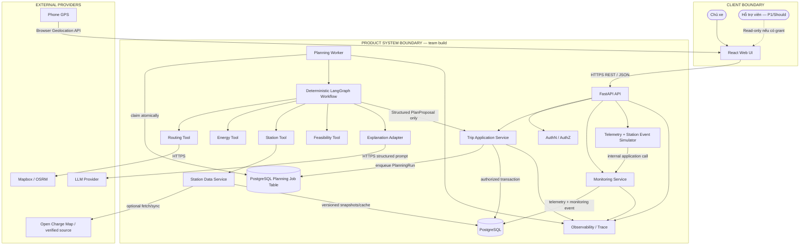

### 2.2. Luồng telemetry chuẩn

GPS điện thoại không gọi trực tiếp Monitoring Service. Luồng bắt buộc:

```text
Phone GPS
→ Browser/React Web
→ POST /api/v1/trips/{trip_id}/telemetry-events
→ API xác thực + kiểm quyền sở hữu trip
→ Monitoring Service
→ persist telemetry
→ phát MonitoringEvent nếu vượt threshold
```

SOC và station event mô phỏng đi qua simulator entrypoint hoặc internal application service có kiểm tra `scenario_id`, quyền chạy scenario và trip target. Simulator không được ghi thẳng business state.

### 2.3. Write ownership và trust boundary

- `Trip Application Service` là write boundary duy nhất cho `Trip`, `PlanVersion`, confirmation và plan lifecycle.
- `Planning Worker/Graph` chỉ trả `PlanProposal` hoặc `NoFeasiblePlan`; không có quyền ghi trực tiếp business table.
- `Monitoring Service` ghi telemetry và monitoring event nhưng không confirm, reject hoặc áp dụng plan.
- `Simulator` chỉ tạo dữ liệu mô phỏng có provenance; không khẳng định dữ liệu thật.
- `Support Workspace` chỉ đọc dữ liệu có `SupportGrant`; không sửa telemetry, không tạo simulated event, không confirm/reject.
- Provider response chưa được validate không được ghi vào `PlanVersion`.

---

## 3. Physical deployment và module view

### 3.1. Physical deployment cho MVP

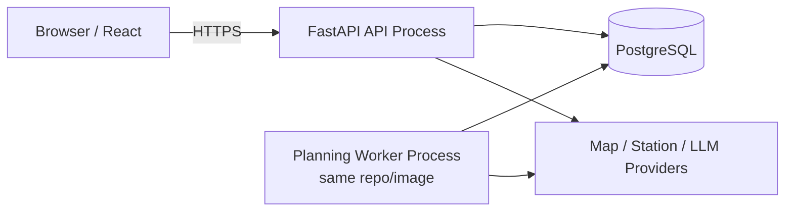

MVP dùng **modular monolith + một worker cùng codebase**, không phải microservices:

- API xử lý auth, validation, telemetry, confirm/reject và query trạng thái.
- Worker xử lý planning/replanning async.
- API và Worker dùng chung domain/application/infrastructure modules nhưng chạy process khác.
- PostgreSQL job table là queue MVP; chưa cần Redis/Kafka.

### 3.2. Module view bên trong codebase

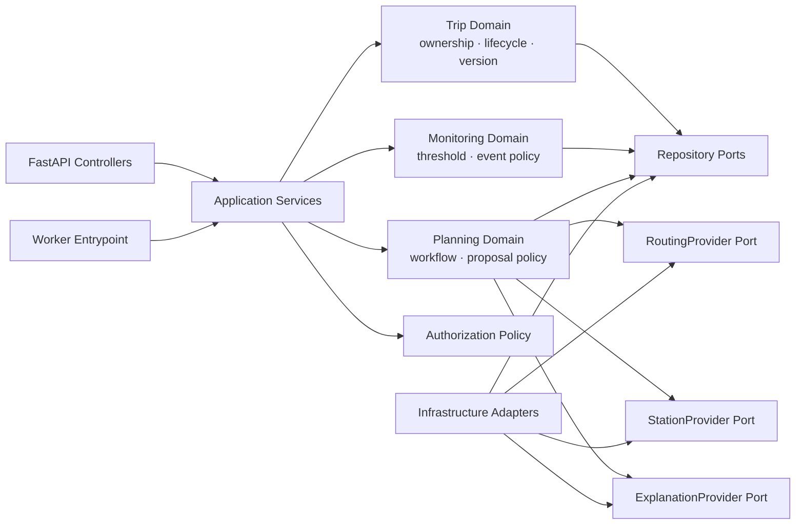

Dependency rule:

- Domain không import FastAPI, SQLAlchemy, provider SDK hoặc storage SDK.
- Application service điều phối use case và transaction boundary.
- Infrastructure adapter map SDK/provider schema sang domain DTO.
- LangGraph nằm ở application/orchestration layer; deterministic tools không phụ thuộc LangGraph.

### 3.3. Module ownership

| Module | Owns | Public surface tối thiểu |
|---|---|---|
| `trips` | Trip ownership, lifecycle, current plan, plan version | `create_trip`, `save_validated_plan`, `confirm_plan`, `reject_plan`, `get_trip` |
| `planning` | PlanningRun, workflow, proposal validation input | `request_plan`, `request_replan`, `process_planning_run` |
| `monitoring` | Telemetry, freshness, threshold, monitoring event | `record_telemetry`, `evaluate_event` |
| `simulation` | Scenario replay, deterministic SOC/event timeline | `start_scenario`, `emit_tick` |
| `station_data` | Snapshot, cache, connector/freshness normalization | `search_candidates`, `get_snapshot` |
| `authorization` | Owner/support permission policy | `can_read_trip`, `can_write_trip`, `can_support_trip` |
| `infrastructure` | DB/provider implementations | Implement repository/provider ports; không chứa safety rule |

---

## 4. Component choices, trade-offs và upgrade triggers

### 4.1. Tech stack theo component

| Layer/Component | Chọn | Mục đích |
|---|---|---|
| Web UI | React + TypeScript + Vite | Form trip, map, monitoring, confirmation, provenance badges |
| Map UI | Mapbox GL JS hoặc thư viện tương ứng provider | Hiển thị route và charging station |
| Backend/API | FastAPI + Python | REST API, validation, auth, application services |
| Schema | Pydantic | Public/internal contract validation |
| Orchestration | LangGraph với graph transition cố định | State, checkpoint, branch và HITL boundary; không cho LLM tự quyết định safety flow |
| Routing | Mapbox Directions; OSRM hoặc versioned route snapshot làm fallback | Geometry, segments, distance, duration |
| Energy | Python deterministic module | Energy interval và SOC interval |
| Station search | Python tool + Station Data Service | Lọc theo route, connector, provenance và freshness |
| Feasibility | Python deterministic rules | Reachability, reserve SOC, risk, verdict |
| Explanation | LLM provider abstraction + template fallback | Giải thích dựa trên structured results |
| Database | PostgreSQL | Trip, PlanningRun, PlanVersion, telemetry, snapshots, traces, job table |
| Queue MVP | PostgreSQL planning job table + worker poll/claim | Async planning/replanning không thêm Redis/Kafka |
| Cache MVP | PostgreSQL/in-process versioned cache | Route/station snapshot reuse |
| Simulator | Python module | Reproducible SOC timeline và station event |
| API documentation | OpenAPI sinh từ FastAPI hoặc `openapi.yaml` được kiểm thử | Executable contract |
| Testing | pytest, Vitest, React Testing Library | Unit/integration/contract/smoke tests |
| CI | GitHub Actions | Lint, test, contract check, build |
| Container | Docker | Môi trường nhất quán |
| Deployment | Vercel + Render hoặc nền tảng tương đương | Pilot deployment |
| Observability | Structured log + trace table/OpenTelemetry-compatible | Agent/tool latency, retry, error, source |

### 4.2. Decision và trade-off

| Decision | Chọn | Vì sao | Alternative loại / trade-off |
|---|---|---|---|
| Application architecture | Modular monolith + planning worker cùng repo | Team nhỏ, MVP ngắn, dễ deploy/debug; vẫn tách module boundary | Microservices tăng network, deployment và tracing nhưng chưa tạo giá trị MVP |
| Planning execution | Async qua PlanningRun/job table | Tránh giữ HTTP request 10–60 giây; hỗ trợ retry/status/idempotency | Sync đơn giản hơn nhưng dễ timeout và giữ API worker lâu |
| Queue | PostgreSQL job table | Không thêm Redis/Kafka; transaction với PlanningRun dễ kiểm soát | Queue riêng tốt hơn ở throughput cao, scheduling phức tạp |
| Workflow | LangGraph transition deterministic | Quản lý state/checkpoint/HITL; vẫn khóa thứ tự tool safety-critical | LLM tool selection tự do khó benchmark; state machine Python thường đơn giản hơn nếu không dùng checkpoint |
| Safety decision | Deterministic Energy + Feasibility | Tái lập, kiểm thử được, không phụ thuộc LLM | LLM inference không được dùng làm ground truth |
| Station data | Snapshot được version hóa + optional provider refresh | Benchmark ổn định, minh bạch freshness | Live-only data làm ground truth thay đổi giữa các lần chạy |
| Data store | PostgreSQL | Một nơi cho business data, job, telemetry, snapshot và transaction | Nhiều database tăng vận hành không cần thiết |
| Explanation | LLM + template fallback | Giải thích tự nhiên nhưng không chặn core plan | Không có fallback sẽ làm provider LLM ảnh hưởng feasibility |
| Support Workspace | Deferred P1 | Pain point chưa được xác thực; không chặn F1–F4 | Làm sớm có thể làm trượt core MVP |
| Cost Tool | Ngoài core safety path; chỉ bật nếu còn capacity | Preference MVP chỉ `balanced`; không để cost optimization chặn plan | Làm đầy đủ nhiều mode tăng scope và test matrix |

### 4.3. Upgrade triggers

| Hiện tại | Chỉ nâng cấp khi |
|---|---|
| PostgreSQL job table | Backlog thường xuyên >100 job, claim contention hoặc cần scheduled/delayed job phức tạp |
| Một API + một worker | Load test cho thấy CPU/latency hoặc concurrent planning vượt capacity assumptions |
| Modular monolith | Module có owner, SLA hoặc scale độc lập và profiling chứng minh cần tách |
| LangGraph | Giữ khi thực sự dùng checkpoint/HITL/branch; nếu không dùng, có thể thay bằng state machine Python thường |
| PostgreSQL cache | Chỉ thêm Redis khi cache hit/latency hoặc distributed coordination có số liệu rõ |
| Một routing/station provider chính | Chỉ thêm multi-provider runtime khi availability, cost hoặc coverage có số liệu yêu cầu |
| Một vehicle profile | Mở rộng khi energy model và benchmark cho Xe X đã ổn định |

---

## 5. Component responsibilities

| Component | Chịu trách nhiệm | Không chịu trách nhiệm |
|---|---|---|
| React UI | Input, map, plan, monitoring, provenance badge, confirm/reject, polling PlanningRun | Feasibility, secret, business write trực tiếp |
| API Layer | HTTP contract, auth middleware, parsing, idempotency header, response/error envelope | Tự tính route/energy hoặc tự retry provider |
| Trip Application Service | Ownership, plan lifecycle, version, transaction, current plan policy | Tính route/energy/station |
| Planning Service | Tạo PlanningRun, enqueue, xử lý result, chuyển outcome | Ghi business state bỏ qua Trip Service |
| Planning Worker | Claim job, chạy workflow, chuẩn hóa outcome, retry có giới hạn | Authorization cuối cùng, confirm plan |
| Monitoring Service | Lưu telemetry, freshness, so sánh confirmed plan, phát event | Tự replan, confirm hoặc áp dụng plan |
| Simulator | SOC/event deterministic, scenario replay, provenance | Khẳng định dữ liệu thật hoặc sửa business state |
| LangGraph Runtime | Chạy graph cố định, giữ state/checkpoint, gọi tool đúng dependency | Cho LLM bỏ qua bước safety-critical |
| Routing Tool | Route geometry/segments và provenance | Chọn charging plan |
| Energy Tool | Energy/SOC interval | Tạo route hoặc station data |
| Station Tool | Candidate station, connector, detour, provenance/freshness | Khẳng định live availability |
| Feasibility Tool | Reachability, reserve, risk, verdict | Explanation tự do hoặc override policy |
| Explanation Adapter | Explanation từ structured results; template fallback | Tạo fact mới hoặc thay đổi verdict |
| Station Data Service | Snapshot/cache, source/freshness, simulated state | Lập kế hoạch hoặc confirm plan |
| Observability | Trace, metric, audit reference | Business decision |

---

## 6. Feature-to-component mapping

| Feature | UI | Trip | Planning/Worker | Monitor | Tools | DB |
|---|---|---|---|---|---|---|
| F1 — Planning | Input/map/result | Create trip + validate proposal | PlanningRun + workflow | — | Route/Energy/Station/Feasibility | Trip + PlanningRun + PlanVersion |
| F2 — Explain/Confirm | Explanation + actions | Version/state/auth/transaction | Explanation adapter | — | Structured refs | Plan lifecycle |
| F3 — Monitoring | GPS/SOC view + badges | Read confirmed plan | Không gọi khi bình thường | Persist + compare + event | — | Telemetry + MonitoringEvent |
| F4 — Replanning | Change view + polling | Request replan + version policy | Async replan workflow | Trigger | Route/Energy/Station/Feasibility | New PlanningRun + PlanVersion |
| F5 — Support P1 | Read-only view | SupportGrant/auth | — | Read only | — | Read only; deferred |

---

## 7. Execution model và task characteristics

| Flow | Kiểu thực thi | Kết quả |
|---|---|---|
| Tạo trip | Sync | `201 Created` với Trip ở `DRAFT` |
| Tạo plan | Async | `202 Accepted` với `planning_run_id` |
| Replan | Async | `202 Accepted` với `planning_run_id` |
| Poll planning status | Sync read | `QUEUED/RUNNING/SUCCEEDED/INFEASIBLE/FAILED` |
| Telemetry update | Sync persist/evaluate | Lưu telemetry; có thể trả thêm `monitoring_event_id` hoặc `replan_run_id` |
| Confirm/reject | Sync transactional | Chỉ thành công sau DB commit |
| Mở trip/history | Sync read | Trả current state và provenance |
| Simulator replay | Background hoặc controlled tick | Cùng scenario/seed tạo cùng timeline |

### 7.1. Vì sao planning/replanning chạy async

- Provider và LLM có thể làm tổng latency tiến gần 30 giây.
- HTTP sync dài dễ timeout trên hosting hoặc giữ API worker lâu.
- PlanningRun cho phép retry, polling, audit và idempotency rõ ràng.
- Vertical slice vẫn có thể poll nhanh mỗi 1–2 giây để UX đơn giản; chưa cần WebSocket.

### 7.2. Planning job ownership

- API tạo `PlanningRun(QUEUED)` và job trong cùng transaction.
- Worker claim job atomically bằng lock/lease.
- Worker chỉ chạy một job active cho cùng `planning_run_id`.
- Retry không tạo PlanVersion trùng.
- Khi worker hoàn thành, Trip Service validate và persist outcome.

---

## 8. Workflow — pre-trip planning

```mermaid
flowchart LR
    A[POST /trips] --> B[Trip DRAFT]
    B --> C[POST /plans]
    C --> D[Create PlanningRun QUEUED]
    D --> E[Worker claim]
    E --> F[Validate input + geocode]
    F --> G[Routing Tool]
    G --> H{Route available?}
    H -->|No| X[PlanningRun FAILED\nROUTING_UNAVAILABLE]
    H -->|Yes| I[Energy Tool]
    H -->|Yes| J[Station Tool]
    I --> K[Collect structured results]
    J --> K
    K --> L[Feasibility Tool]
    L --> M{Verdict}
    M -->|INFEASIBLE| N[PlanningRun INFEASIBLE\nNoFeasiblePlan]
    M -->|FEASIBLE / RISKY| O[Optional ranking/time-cost]
    O --> P[Template/LLM Explanation]
    P --> Q[PlanProposal DTO]
    Q --> R[Trip Service validation]
    R -->|Invalid| S[PlanningRun FAILED]
    R -->|Valid| T[Save PlanVersion\nPENDING_CONFIRMATION]
    T --> U[PlanningRun SUCCEEDED]
    U --> V{Owner action}
    V -->|Confirm| W[CONFIRMED]
    V -->|Reject| Y[REJECTED]
```

### 8.1. Dependency bắt buộc

```text
Route
→ Energy và Station có thể chạy song song
→ Feasibility
→ Optional ranking/time-cost
→ Explanation
→ PlanProposal
```

- Energy cần route segments.
- Station search cần route geometry.
- Feasibility cần EnergyResult và StationResult.
- Explanation không được chạy trước Feasibility.
- LLM không quyết định có gọi Feasibility hay không.
- Nếu LLM lỗi, dùng template explanation; core verdict không thay đổi.

### 8.2. Vai trò LangGraph và LLM

```text
LangGraph:
- giữ state của PlanningRun;
- điều phối graph cố định;
- hỗ trợ checkpoint/branch/HITL boundary;
- ghi ToolRun/AgentRun trace.

LLM:
- không chọn tùy ý core tool;
- không thay đổi thứ tự safety-critical;
- không tính feasibility;
- chỉ tạo explanation hoặc chuẩn hóa input text nếu có.
```

---

## 9. Workflow — monitoring và replanning

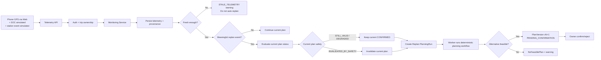

### 9.1. Event policy

Các event có thể trigger replan:

- `ROUTE_DEVIATION`.
- `SOC_UNDERPERFORMANCE`.
- `NEXT_STATION_UNREACHABLE`.
- `SIMULATED_STATION_UNAVAILABLE`.

`STALE_TELEMETRY` không mặc định trigger replan vì dữ liệu cũ không đủ tin cậy để tính plan mới. Hệ thống hiển thị cảnh báo và yêu cầu cập nhật telemetry; chỉ replan nếu policy fallback an toàn được định nghĩa và benchmark riêng.

Threshold được lưu trong `PolicyConfig`, không đặt trong prompt.

### 9.2. Current plan validity policy

```text
evaluate_current_plan_status(event, latest_telemetry)
→ STILL_VALID
→ DEGRADED
→ INVALIDATED_BY_SAFETY
```

- `STILL_VALID`: plan cũ vẫn `CONFIRMED`; plan mới chỉ là đề xuất tốt hơn.
- `DEGRADED`: plan cũ vẫn hiện hành nhưng UI phải cảnh báo rủi ro và đang replan.
- `INVALIDATED_BY_SAFETY`: plan cũ chuyển trạng thái ngay; không được hiển thị như phương án an toàn dù plan mới chưa xác nhận.

---

## 10. Sequence diagrams

### 10.1. Pre-trip planning async

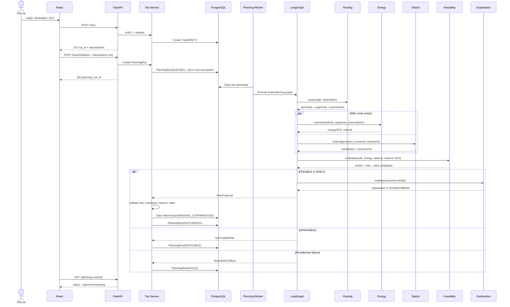

### 10.2. Monitoring và replan

```mermaid
sequenceDiagram
    participant GPS as Phone GPS
    participant UI as React
    participant API as FastAPI
    participant M as Monitoring
    participant T as Trip Service
    participant DB as PostgreSQL
    participant W as Planning Worker

    GPS->>UI: Browser location
    UI->>API: POST telemetry event
    API->>API: AuthN/AuthZ + schema validation
    API->>M: record_telemetry
    M->>DB: Save value + source + updated_at
    M->>DB: Load confirmed plan
    M->>M: freshness + threshold + safety comparison

    alt Stale telemetry
        M-->>API: STALE_TELEMETRY warning
        API-->>UI: Warning; no automatic replan
    else No meaningful event
        M-->>API: current state
        API-->>UI: Continue current plan
    else Meaningful event
        M->>T: MonitoringEvent + current plan status
        opt Current plan unsafe
            T->>DB: INVALIDATED_BY_SAFETY
        end
        T->>DB: Create Replan PlanningRun(QUEUED) + job
        API-->>UI: event + planning_run_id
        W->>DB: Claim replan job
        W->>W: Run same deterministic planning workflow
        W->>T: PlanProposal / NoFeasiblePlan / failure
        T->>DB: Save outcome
        UI->>API: Poll PlanningRun
        API-->>UI: New proposal or warning
    end
```

### 10.3. Confirm/reject

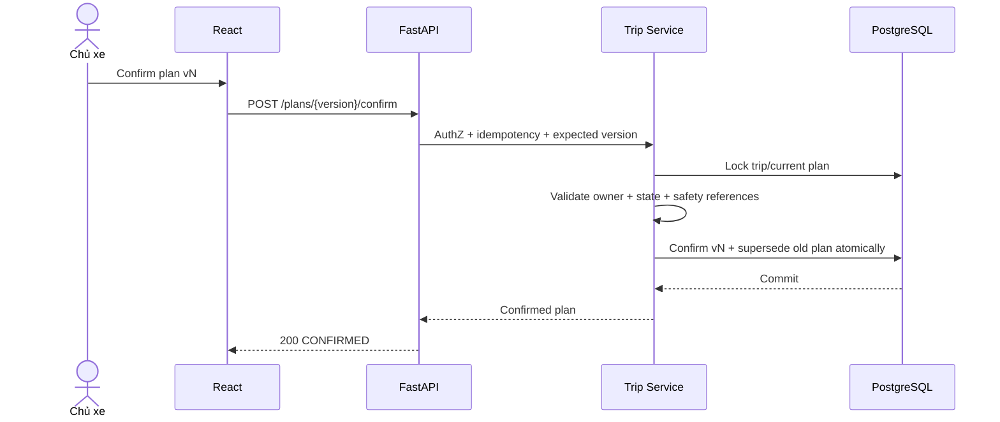

---

## 11. Interface boundary và OpenAPI

### 11.1. Source of truth

- `openapi.yaml` hoặc OpenAPI generated/validated từ FastAPI là executable contract và source of truth.
- Technical Architecture chỉ giữ endpoint, ownership, sync/async, authorization, idempotency và error taxonomy cấp cao.
- Thay đổi schema thuần túy chỉ cập nhật OpenAPI/interface design.
- Thay đổi làm đổi workflow, trust boundary, transaction hoặc dependency phải cập nhật tài liệu này.

### 11.2. Endpoint list cho MVP

| Method | Endpoint | Execution | Owner | Mục đích |
|---|---|---|---|---|
| POST | `/api/v1/trips` | Sync | Trip Service | Tạo Trip `DRAFT` |
| POST | `/api/v1/trips/{trip_id}/plans` | Async | Planning Service | Tạo pre-trip PlanningRun |
| GET | `/api/v1/planning-runs/{run_id}` | Sync read | Planning Service | Poll trạng thái/result |
| POST | `/api/v1/trips/{trip_id}/telemetry-events` | Sync evaluate | Monitoring | Gửi GPS/SOC/station event |
| POST | `/api/v1/trips/{trip_id}/replans` | Async | Planning Service | Manual/event-driven replan |
| POST | `/api/v1/trips/{trip_id}/plans/{version}/confirm` | Sync transactional | Trip Service | Confirm plan |
| POST | `/api/v1/trips/{trip_id}/plans/{version}/reject` | Sync transactional | Trip Service | Reject plan |
| GET | `/api/v1/trips/{trip_id}` | Sync read | Trip Service | Xem trip/current state |
| GET | `/api/v1/trips/{trip_id}/plans` | Sync read | Trip Service | Xem plan history |
| POST | `/api/v1/trips/{trip_id}/simulation-scenarios/{scenario_id}/start` | Controlled/P1 demo | Simulator | Bắt đầu replay scenario |

Support endpoints chưa nằm trong core MVP contract; chỉ thêm khi F1–F4 đạt smoke gate và còn capacity.

### 11.3. Idempotency

Mutation sau phải hỗ trợ `Idempotency-Key`:

- `POST /trips`.
- `POST /plans`.
- `POST /replans`.
- `POST /confirm`.
- `POST /reject`.

Idempotency record tối thiểu gồm:

```text
user_id + operation + resource_id + idempotency_key
→ request_hash
→ response/outcome reference
→ expires_at
```

- Cùng key + cùng request trả lại outcome cũ.
- Cùng key + request khác trả `409 IDEMPOTENCY_CONFLICT`.
- Double-click/retry không tạo PlanningRun hoặc PlanVersion trùng.

### 11.4. Error envelope cấp cao

```json
{
  "error": {
    "code": "ROUTING_UNAVAILABLE",
    "message": "Không thể tính tuyến tại thời điểm này.",
    "details": {},
    "retry_after_seconds": 30,
    "trace_id": "uuid"
  }
}
```

Mã lỗi chính:

- `VALIDATION_ERROR`.
- `AMBIGUOUS_LOCATION`.
- `FORBIDDEN`.
- `VERSION_CONFLICT`.
- `IDEMPOTENCY_CONFLICT`.
- `ROUTING_UNAVAILABLE`.
- `STATION_DATA_UNAVAILABLE`.
- `ENERGY_ESTIMATION_FAILED`.
- `FEASIBILITY_FAILED`.
- `NO_FEASIBLE_PLAN`.
- `RATE_LIMITED`.
- `STALE_TELEMETRY`.
- `PLANNING_TIMEOUT`.

---

## 12. Internal contracts và AI boundary

### 12.1. PlanningRun

```json
{
  "run_id": "uuid",
  "trip_id": "uuid",
  "trigger": "PRE_TRIP",
  "base_plan_version": null,
  "status": "QUEUED",
  "policy_version": "pilot-policy-v1",
  "vehicle_profile_version": "xe-x-mvp-v1",
  "route_snapshot_version": null,
  "station_snapshot_version": "stations-v1",
  "deadline_at": "2026-08-06T09:01:00Z"
}
```

`PlanningRun` là persistent execution record, không phải plan. Nó lưu trạng thái chạy, lỗi, trace và outcome reference.

### 12.2. PlanProposal

```json
{
  "proposal_id": "uuid",
  "trip_id": "uuid",
  "base_plan_version": 1,
  "trigger": "SOC_UNDERPERFORMANCE",
  "verdict": "RISKY",
  "route_result_ref": "tool-route-1",
  "energy_result_ref": "tool-energy-1",
  "station_result_refs": ["tool-station-1"],
  "feasibility_result_ref": "tool-feasibility-1",
  "charging_plan": [],
  "assumptions": [],
  "explanation": "",
  "recommended_action": "REQUEST_CONFIRMATION"
}
```

`PlanProposal` là internal DTO do workflow trả về. MVP không cần bảng `plan_proposals` riêng nếu nội dung đã được lưu thành `PlanVersion` sau validation. Proposal bị từ chối do contract/data corruption được ghi vào `PlanningRun` và `AgentRun` để audit.

### 12.3. PlanVersion

`PlanVersion` là persistent business aggregate do Trip Service tạo sau khi validate `PlanProposal`.

Trip Service phải kiểm tra trước DB write:

- User sở hữu trip hoặc có grant phù hợp.
- Base version không stale.
- Tool result refs thuộc cùng PlanningRun/AgentRun.
- Không có station bị loại trong final charging plan.
- Không tạo PlanVersion nếu verdict `INFEASIBLE`.
- Connector và reserve SOC đạt policy.
- Provenance/freshness fields đầy đủ.
- State transition hợp lệ.

### 12.4. Provider ports

```text
PlanningWorkflow → RoutingProvider ← Mapbox/OSRM Adapter
PlanningWorkflow → StationProvider ← Snapshot/OCM Adapter
PlanningWorkflow → ExplanationProvider ← LLM Adapter
```

| Concern | Port/Application owns | Adapter owns | Không được làm |
|---|---|---|---|
| Input/output | Domain DTO, invariants | Map DTO ↔ SDK schema | Rò provider schema vào domain |
| Timeout | Deadline contract | Enforce per-call timeout | Tự kéo dài quá request deadline |
| Retry | Workflow quyết định một lần trong budget | Map transient/permanent error | Retry thêm một layer |
| Validation | Cardinality, required fields, provenance | Validate raw response | Persist raw invalid data |
| Observability | Metric/error name chuẩn | Provider/model/latency | Log secret/precise location không cần thiết |

---

## 13. Data model và lifecycle

### 13.1. Entity overview

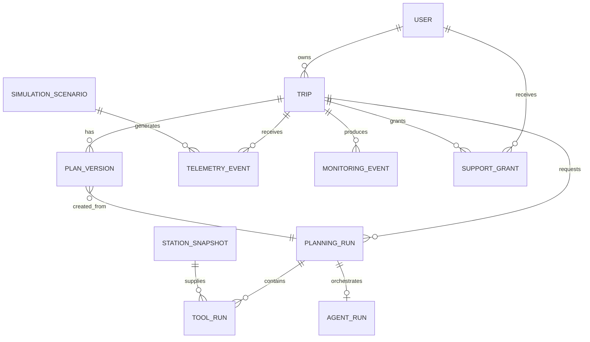

| Entity | Key fields / rule |
|---|---|
| `User` | id, role |
| `VehicleProfile` | id, version, usable battery, consumption, connector, max charge |
| `PolicyConfig` | version, reserve_soc=15%, thresholds, freshness policy |
| `Trip` | id, owner_id, status, current_confirmed_plan_version |
| `PlanningRun` | trigger, status, deadline, attempts, error, outcome_ref |
| `PlanVersion` | trip_id, version, state, verdict, assumptions, explanation, result refs |
| `TelemetryEvent` | location/SOC, source metadata, timestamp, scenario/tick |
| `MonitoringEvent` | type, threshold, telemetry refs, current plan status |
| `StationSnapshot` | station_id, normalized metadata, source, updated_at, snapshot_version |
| `SimulationScenario` | scenario_id, seed, timeline, fixture versions |
| `ToolRun` | tool, input_hash, output_ref, latency, provider, error |
| `AgentRun` | trigger, graph version, tool order, retry count, status |
| `SupportGrant` | support_user_id, trip_id, permission, expires_at — deferred P1 |
| `IdempotencyRecord` | user, operation, key, request_hash, outcome_ref |

### 13.2. Trip state

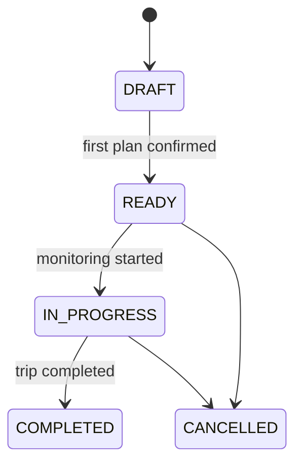

### 13.3. PlanningRun state

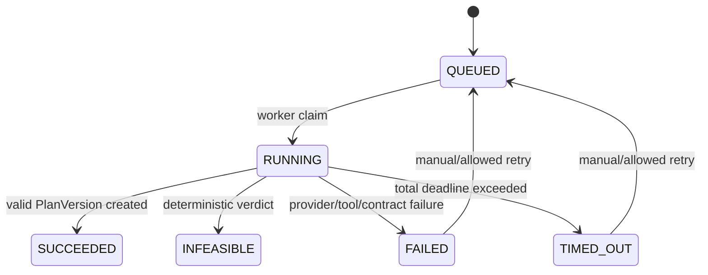

### 13.4. PlanVersion state

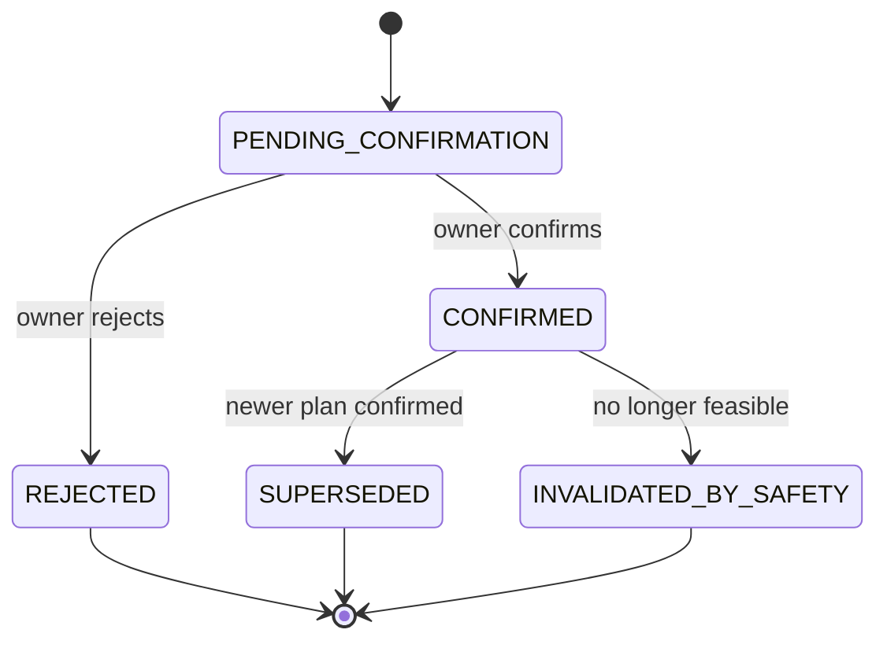

`DRAFT` không thuộc PlanVersion. `DRAFT` là trạng thái Trip; lỗi/infeasible thuộc PlanningRun.

### 13.5. Transaction boundaries

- **Create trip:** tạo `Trip(DRAFT)` và `IdempotencyRecord` atomically.
- **Request plan/replan:** tạo `PlanningRun(QUEUED)` và job atomically.
- **Worker claim:** claim bằng lock/lease atomically; job hết lease có thể được recovery.
- **Persist plan:** validate proposal, allocate version và tạo `PlanVersion(PENDING_CONFIRMATION)` cùng transaction; sau đó mark PlanningRun `SUCCEEDED`.
- **Confirm:** lock trip, kiểm expected version, confirm version mới và supersede version cũ atomically.
- **Reject:** reject pending version atomically; không thay đổi current confirmed plan nếu plan cũ còn hợp lệ.
- **Safety invalidation:** update confirmed plan thành `INVALIDATED_BY_SAFETY` và append monitoring event trong cùng transaction.

---

## 14. Data provenance contract

Mỗi field quan trọng dùng wrapper hoặc metadata tương đương:

```json
{
  "value": 42,
  "source_type": "SIMULATED",
  "source_name": "Telemetry Simulator",
  "updated_at": "2026-08-06T09:10:00Z",
  "freshness_seconds": 4,
  "scenario_id": "SOC_DROP_01",
  "snapshot_version": null
}
```

Allowed `source_type`:

- `REAL_GPS`.
- `REAL_API`.
- `SIMULATED`.
- `CACHED_SNAPSHOT`.
- `MANUAL`.

Rules:

- UI map các loại thành badge/tooltip nhất quán.
- Không mô tả `SIMULATED` là dữ liệu xe thật.
- Không mô tả station snapshot là availability thời gian thực.
- `updated_at`, `source_name`, `snapshot_version` hoặc `scenario_id` phải được giữ đến UI.
- Field safety-critical thiếu provenance/freshness phải fail closed.

---

## 15. Simulator và benchmark architecture

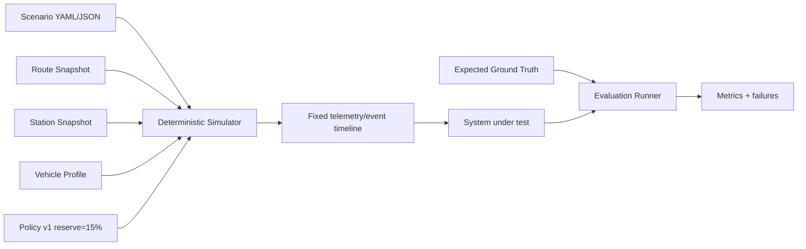

Scenario tối thiểu:

```yaml
scenario_id: REPLAN_STATION_01
seed: 1001
route_snapshot: route_01_v1
station_snapshot: stations_v1
vehicle_profile: xe_x_v1
policy_version: pilot_policy_v1
initial_soc: 60
events:
  - at_second: 300
    type: SOC_UPDATE
    value: 48
  - at_second: 600
    type: SIMULATED_STATION_UNAVAILABLE
    station_id: STATION_A
```

Rules:

- Cùng `scenario_id`, seed, snapshot và configuration phải tạo cùng timeline.
- Ground truth không gọi live API lúc chấm.
- Benchmark route/station dùng snapshot cố định.
- Tool output, policy version và graph version được lưu để truy vết.
- 20 smoke cases chạy sau mỗi build; benchmark mở rộng tối thiểu 60 case sau khi smoke ổn định.

---

## 16. Timeout, retry, rate limit, cache và fallback

### 16.1. Total deadline

| Flow | Target | Hard limit |
|---|---:|---:|
| Tạo trip | p95 ≤ 2 giây | 5 giây |
| Telemetry update | p95 ≤ 2 giây | 5 giây |
| Pre-trip planning | Theo dõi bằng PlanningRun; median mục tiêu <10 giây | 60 giây |
| Replanning | Median <10 giây; p95 <30 giây | 60 giây |
| Confirm/reject | p95 ≤ 3 giây | 5 giây |

Planning/replanning có request-level deadline. Worker không bắt đầu retry nếu remaining budget không đủ.

### 16.2. Budget đề xuất cho một PlanningRun

| Bước | Budget tổng |
|---|---:|
| Validation + geocode | 4 giây |
| Routing kể cả retry/fallback | 8 giây |
| Energy + Station song song | 8 giây |
| Feasibility | 3 giây |
| Explanation kể cả fallback | 8 giây |
| Validation + persistence | 3 giây |
| Backoff/orchestration reserve | phần còn lại trong hard limit 60 giây |

### 16.3. Dependency policy

| Dependency | Per-attempt timeout | Retry owner | Fallback | Hành vi cuối |
|---|---:|---|---|---|
| Mapbox | 5s | Workflow, tối đa 1 retry nếu còn budget | OSRM hoặc exact versioned route cache | `ROUTING_UNAVAILABLE` |
| Station provider | 5s | Workflow, tối đa 1 retry nếu còn budget | Versioned station snapshot | Hiển thị source/freshness; thiếu safety field thì fail closed |
| LLM | 8s | Workflow, tối đa 1 retry nếu còn budget | Template explanation | Không ảnh hưởng verdict |
| Energy tool | 2s | Workflow chỉ retry transient | Không | `ENERGY_ESTIMATION_FAILED` |
| Feasibility tool | 2s | Workflow chỉ retry transient | Không | `FEASIBILITY_FAILED`; không tạo plan |
| PostgreSQL | 3s | Repository/application transaction retry giới hạn | Không | Confirm chỉ thành công sau commit |

Retry policy:

```text
max_attempts_per_dependency = 2
backoff = exponential + jitter
respect Retry-After
never retry validation/schema/business-state errors
never retry in multiple layers
stop when remaining deadline is insufficient
```

### 16.4. Failure ownership

| Layer | Owns | Không làm |
|---|---|---|
| Provider adapter | Enforce timeout, normalize provider error, validate raw response | Tự retry nhiều lần hoặc fallback business |
| Planning workflow | Quyết định retry/fallback trong total deadline | Che lỗi hoặc tạo dữ liệu giả |
| Trip Service | Idempotency, version, transaction, persist outcome | Retry provider/AgentRun |
| Repository | Constraint, lock, transaction retry giới hạn | Business fallback |
| Frontend | Polling, hiển thị trạng thái/lỗi, cho phép retry rõ ràng | Tự lặp mutation khi chưa biết outcome |

### 16.5. Route/station cache key

Route cache key tối thiểu:

```text
normalized_origin
+ normalized_destination
+ routing_profile
+ provider
+ provider_options_hash
+ cache/snapshot_version
```

Station cache/snapshot key tối thiểu:

```text
route_geometry_hash
+ connector
+ max_detour_policy
+ station_snapshot_version
+ freshness_policy_version
```

Cache entry phải lưu `created_at`, `source_updated_at`, provider, geometry hash và freshness. Không fallback sang route “gần giống” hoặc dữ liệu quá cũ mà không gắn provenance.

---

## 17. Security và authorization

- JWT hoặc secure session authentication.
- Trip ownership check trong Trip Service cho mọi write/read nhạy cảm.
- Optimistic version check khi confirm/reject.
- `SupportGrant` P1 giới hạn theo trip, permission và expiry.
- Agent/Worker không có business write credential trực tiếp; mọi write đi qua application service/repository policy.
- API key chỉ ở server/secret store.
- Không log secret.
- Precise location được giảm/ẩn trong application log nếu không cần.
- Telemetry endpoint có rate limit và schema validation.
- Simulator endpoint chỉ bật trong demo/test hoặc role được cấp quyền.
- Missing safety-critical field fail closed.
- CORS, secure cookie/session, TLS và dependency pinning được cấu hình cho deployment.

---

## 18. Observability và SLO

Mỗi request có `trace_id`; mỗi PlanningRun có `run_id`.

### 18.1. AgentRun

- Trigger.
- Graph version.
- Selected nodes/tool order.
- Retry count.
- Final verdict.
- Total latency.
- Fallback used.
- Policy/vehicle/snapshot versions.

### 18.2. ToolRun

- Tool name.
- Input hash.
- Provider.
- Latency.
- Result reference.
- Error code.
- Source/freshness metadata.

### 18.3. Metrics

- Feasibility accuracy.
- Infeasible recall.
- Valid charging plan rate.
- High-risk recall.
- Hallucinated station/route facts.
- Tool order/selection accuracy.
- Unnecessary call rate.
- Provider error rate.
- Planning/replanning latency.
- Planning job backlog và failure rate.
- Cache hit rate.
- Template explanation fallback rate.
- Stale telemetry rate.
- Confirm/version conflict rate.

Logs không chứa raw secret, full precise location hoặc dữ liệu nhạy cảm không cần thiết.

---

## 19. Risks và mitigations

| Risk | Impact | Mitigation / cut line |
|---|---|---|
| Energy model sai | Verdict feasibility sai | Deterministic tests, versioned vehicle profile, benchmark boundary cases, fail closed |
| Station metadata cũ/thiếu | Chọn trạm không thực hiện được | Freshness policy, connector validation, snapshot version, provenance, không tuyên bố live |
| LLM tạo fact mới | Explanation sai | Chỉ prompt structured result, validate refs, template fallback, hallucinated facts = 0 |
| LLM/provider down | Explanation chậm hoặc lỗi | Deadline, tối đa một retry, template fallback; không ảnh hưởng core verdict |
| Routing provider down | Không tạo được plan | OSRM/exact route cache fallback; nếu không đủ thì `ROUTING_UNAVAILABLE` |
| Telemetry stale | Replan từ dữ liệu sai | Cảnh báo `STALE_TELEMETRY`; không auto-replan mặc định |
| Plan cũ không còn an toàn | Người dùng tiếp tục theo plan nguy hiểm | `INVALIDATED_BY_SAFETY` ngay khi policy kết luận unsafe |
| Double-click/retry | Duplicate PlanningRun/PlanVersion | Idempotency key + unique constraint + outcome replay |
| Async job bị chạy trùng | Ghi duplicate hoặc race | Atomic claim/lease, idempotent worker, unique version allocation |
| Dữ liệu mô phỏng bị hiểu là thật | Người dùng hiểu sai khả năng sản phẩm | Badge `SIMULATED`, scenario ID, UI/demo disclaimer |
| Scope vượt 10 ngày | F1–F4 không hoàn tất | Cắt Support P1, Cost optimization, Redis, microservices và live availability |
| LangGraph không tạo giá trị thực | Tăng độ phức tạp | Chỉ giữ nếu dùng state/checkpoint/HITL; nếu không thay state machine Python |

---

## 20. Runtime configuration, readiness và deployment

### 20.1. Runtime configuration

| Runtime | Required config | Readiness |
|---|---|---|
| Web | API base URL, map public token nếu cần | Ready khi static build thành công |
| API | DB URL, auth/session secret, policy version, CORS | Ready khi DB reachable và migration đúng version |
| Worker | DB URL, provider secrets, graph version, timeout budget | Start fail nếu config bắt buộc thiếu; provider outage làm job retry/fail, không làm API mất readiness |
| Simulator | scenario path, seed, route/station fixture version | Fail startup/endpoint nếu fixture thiếu hoặc checksum sai |
| Database | migrations, required extensions/indexes | Migration phải backward-compatible với API/Worker đang chạy |

### 20.2. Deployment diagram

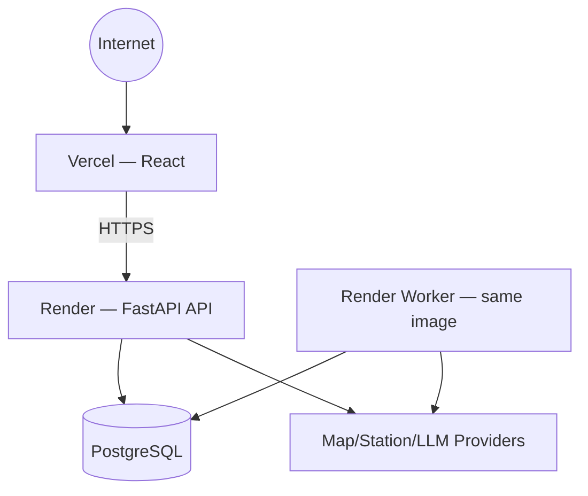

### 20.3. Readiness và health

- API readiness fail khi DB hoặc required schema không sẵn sàng.
- Worker readiness fail khi DB/job table/config không sẵn sàng.
- External AI/map provider outage không làm API readiness fail; request/job nhận normalized failure.
- Liveness chỉ phản ánh process còn chạy, không dùng để che dependency failure.

---

## 21. CI/CD, release và rollback

### 21.1. CI

```text
Pull Request
→ frontend lint/test/build
→ backend lint/type/test
→ OpenAPI contract check
→ migration check
→ smoke test fixtures
→ review
→ merge
```

### 21.2. Release order

```text
Backup database
→ run backward-compatible migration
→ deploy API
→ deploy Worker
→ deploy Web
→ smoke test create trip/plan/poll/confirm/telemetry/replan
→ monitor latency, provider error và job backlog
```

### 21.3. Rollback

- Application rollback chỉ an toàn khi migration backward-compatible.
- Destructive migration không nằm trong MVP.
- Rollback order: Web → API/Worker image → verify old version can read current schema.
- Planning job đang chạy phải giữ graph/version reference để không bị resume bằng code không tương thích.

---

## 22. Vertical slice implementation plan — 08/08

Mục tiêu là chạy được core value end-to-end, không chỉ form nhập liệu:

1. React form nhập origin, destination, SOC.
2. `POST /trips` tạo Trip `DRAFT`.
3. `POST /plans` tạo PlanningRun và worker xử lý.
4. Routing fixture/provider trả route.
5. Station fixture/provider trả ít nhất một candidate đúng connector.
6. Energy model đơn giản nhưng deterministic.
7. Feasibility rule với reserve 15%.
8. UI poll PlanningRun và hiển thị route, station, SOC dự kiến, risk, assumption, provenance.
9. Một happy-path smoke test end-to-end.

Sau vertical slice:

```text
Hoàn thiện F1
→ F2 explanation/confirmation
→ F3 monitoring
→ F4 replanning
→ F5 Support nếu còn capacity và có evidence
```

---

## 23. Open questions

| Câu hỏi | Owner đề xuất | Deadline |
|---|---|---|
| LangGraph có dùng checkpoint/resume/HITL thật hay chuyển sang state machine Python? | AI Lead + Tech Lead | Trước freeze F1 workflow |
| Map provider chính và OSRM/exact cache fallback cuối cùng? | Tech Lead | Trước integration |
| Geocoding ambiguous location xử lý bằng provider nào? | FE/BE Lead | Trước vertical slice |
| Ngưỡng route deviation và SOC underperformance cụ thể? | PO + Tech Lead | Trước F3/F4 smoke test |
| Freshness threshold cho telemetry/station snapshot? | PO + Tech Lead | Trước freeze PolicyConfig |
| Telemetry update interval chính thức trong demo? | BE + QA | Trước F3 |
| Cost Tool có nằm trong MVP hay deferred? | PO | Trước sprint planning |
| Người review ground truth và ký benchmark version? | QA owner + Mentor/SME | Trước benchmark chính thức |
| Render plan worker timeout/instance setting cụ thể? | DevOps/Tech Lead | Trước deploy |
| Có đủ evidence để mở Support Workspace P1 không? | PO | Sau F1–F4 smoke gate |

---

## 24. Design review checklist

### Scope và value

- [ ] 4 Must feature có đường đi trong diagram và feature mapping.
- [ ] Vertical slice chạy end-to-end trước MVP Day.
- [ ] Support Workspace được đánh dấu deferred P1.

### Workflow và safety

- [ ] Route trước Energy/Station.
- [ ] Feasibility sau Energy + Station.
- [ ] Core graph transition deterministic.
- [ ] LLM không điều khiển safety-critical transition.
- [ ] Agent/Worker không ghi business state trực tiếp.
- [ ] Trip Service kiểm auth/version/business rule.
- [ ] Old unsafe plan bị `INVALIDATED_BY_SAFETY`.
- [ ] `STALE_TELEMETRY` không tự trigger replan mặc định.

### Contract và data

- [ ] OpenAPI là source of truth.
- [ ] Create plan/replan là async và có PlanningRun status endpoint.
- [ ] Idempotency áp dụng cho mutation chính.
- [ ] `PlanningRun`, `PlanProposal`, `PlanVersion` có vai trò khác nhau.
- [ ] Transaction boundary và state machine được test.
- [ ] Real/simulated/cached/manual được gắn nhãn.
- [ ] Freshness, scenario và snapshot version được giữ đến UI.

### Reliability và operation

- [ ] Total deadline được enforce.
- [ ] Retry chỉ có một owner.
- [ ] Fallback/cache key được version hóa.
- [ ] Simulator tái lập được.
- [ ] Ground truth không phụ thuộc live API.
- [ ] Runtime config/readiness/release/rollback được kiểm thử.
- [ ] Capacity assumptions phù hợp deployment MVP.

### Evaluation

- [ ] 20 smoke cases chạy trong CI hoặc trước mỗi build demo.
- [ ] Infeasible recall và valid plan rate có test bắt buộc.
- [ ] Provider failure, version conflict, idempotency và timeout có test.
- [ ] Explanation không tạo fact ngoài structured tool result.

---

## 25. Approval criteria

Architecture chuyển từ **Proposed** sang **Approved for MVP implementation** khi:

- Tech Lead xác nhận component, transaction, async execution và deployment.
- AI Lead xác nhận graph deterministic, AI boundary và fallback explanation.
- QA/Evaluation owner xác nhận simulator, smoke set, ground truth và failure cases.
- OpenAPI của các luồng chính đã được chốt và contract test chạy được.
- Các open question chặn F1–F4 đã có quyết định.


Thay đổi lớn sau sign-off phải cập nhật decision/trade-off, OpenAPI và test liên quan trước khi merge.
