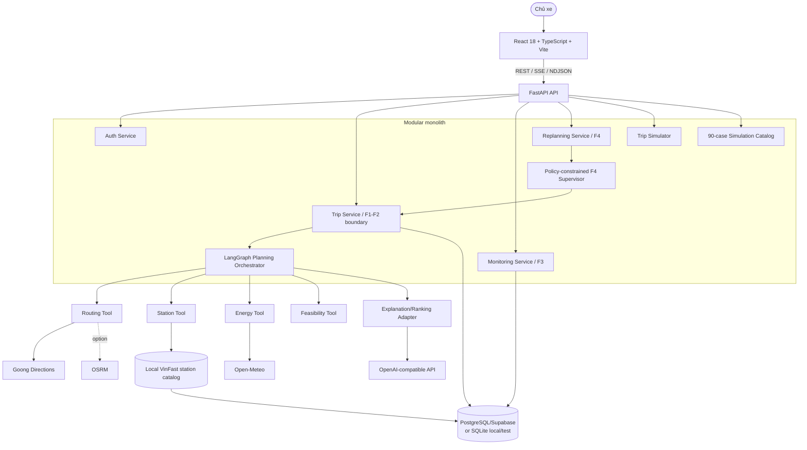
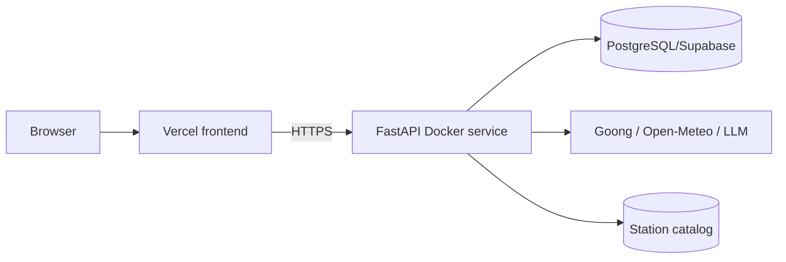
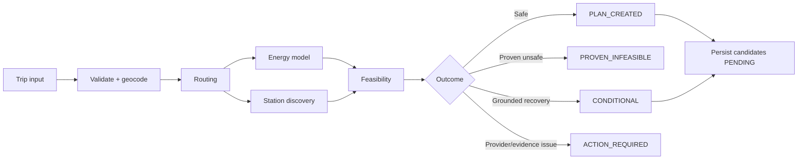
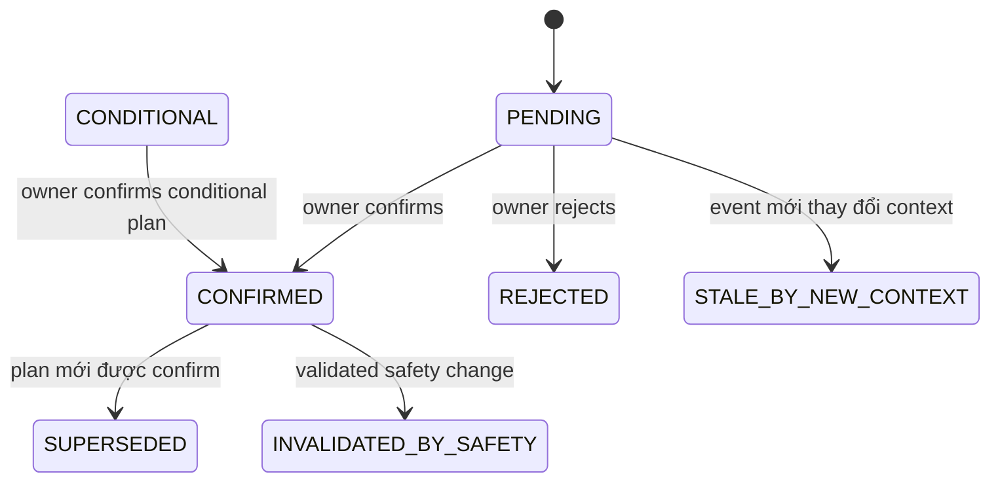
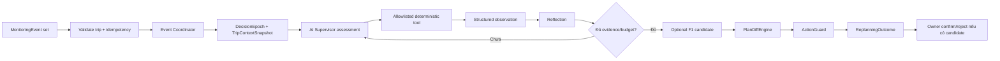

# TECHNICAL ARCHITECTURE — P-210 AI EV Trip Planner

**Phiên bản:** 3.1 (implementation-aligned revision)

**Ngày cập nhật:** 01/09/2026

**Trạng thái:** As-built baseline

**Liên kết:** [BRIEF](BRIEF_AI_EV_AGENT_v3.0.md) · [PRD](PRD_AI_EV_AGENT_v3.0.md) · [Interface Design](INTERFACE_DESIGN_AI_EV_AGENT_v1.0.md)

> Tài liệu này mô tả hệ thống đang có trong repository. Nguồn sự thật cuối cùng là FastAPI routes, Pydantic contracts, core services, migrations và frontend code. Các mục ghi “hướng nâng cấp” chưa phải capability hiện tại.

## 1. Mục tiêu và phạm vi

P-210 là ứng dụng web hỗ trợ chủ xe điện:

```text
Lập kế hoạch trước chuyến đi
→ xem route, trạm, SOC, rủi ro và nguồn dữ liệu
→ xác nhận hoặc từ chối kế hoạch
→ theo dõi telemetry mô phỏng trên plan đã xác nhận
→ phát hiện sự kiện F3
→ F4 đánh giá và tạo candidate khi cần
→ chủ xe xác nhận hoặc từ chối candidate
```

Các kết luận về route, trạm, năng lượng, SOC, reachability và feasibility phải đến từ dữ liệu có cấu trúc và công cụ tất định. AI được chọn chiến lược/tool trong policy, phản tư trên observation và tạo giải thích/hành động; AI không được tạo safety fact, vượt safety gate hoặc tự xác nhận kế hoạch.

Không thuộc capability hiện tại:

- SOC thật từ OEM/OBD-II;
- số cổng sạc trống theo thời gian thực;
- tự điều khiển xe hoặc tự áp dụng kế hoạch;
- public Phone GPS telemetry ingestion;
- production-grade HA, Kubernetes hoặc microservices;
- durable planning queue/worker chạy tách process.

## 2. Nguồn sự thật trong repository

| Phạm vi | Nguồn sự thật |
| --- | --- |
| API và middleware | `src/apps/api/main.py`, `src/apps/api/routes/` |
| Public/shared schemas | `src/packages/contracts/` |
| Auth, Trip, F1–F4 và persistence | `src/packages/core/` |
| AI orchestration | `src/packages/agent/planning/`, `src/packages/agent/replanning/` |
| Database schema | `migrations/versions/` |
| Web UI | `src/apps/web/src/` |
| Runtime config | `.env.example`, `src/apps/api/bootstrap/config.py` |
| Deployment/CI | `Dockerfile`, `docker-compose.yml`, `.github/workflows/` |

Repository không có `openapi.yaml` freeze riêng. Executable API contract do FastAPI sinh tại `/docs` từ routes và Pydantic models.

## 3. System context và trust boundary



Trust boundary:

- API layer xác thực, parse contract và gắn `X-Trace-Id`; không tự tính safety facts.
- `TripService` là write boundary cho Trip, PlanVersion và confirm/reject.
- Planning graph chỉ trả structured planning outcome; không ghi business state trực tiếp.
- F3 sở hữu telemetry fact và canonical `MonitoringEvent`.
- F4 sở hữu event coordination, investigation strategy, tool sequence, reflection, plan diff và action proposal.
- Simulator chỉ tạo dữ liệu `SIMULATED`; fault injection không được dùng với telemetry nguồn khác.
- Provider response chỉ vào plan sau normalization, provenance/freshness checks và deterministic safety validation.

## 4. Physical deployment thực tế



Backend Docker image chạy một Uvicorn process. `docker-compose.yml` cung cấp backend và profile OSRM tùy chọn. Frontend Vercel cần API base URL; backend cần `CORS_ORIGINS` chứa origin frontend.

Planning hiện thực thi trực tiếp trong API process:

- endpoint thường trả kết quả trực tiếp;
- planning SSE chạy công việc trong worker thread và phát progress/heartbeat/result;
- F4 NDJSON chạy supervisor trong background thread/task và phát public decision trace;
- chưa có PostgreSQL job queue hoặc planning worker process riêng.

Hướng nâng cấp: thêm durable queue/worker khi hosting timeout, cần resume/retry bền, backlog hoặc concurrency vượt khả năng một API process.

## 5. Cấu trúc module

```text
src/
  apps/api/                 FastAPI bootstrap, middleware và routes
  apps/web/                 React/Vite SPA
  packages/contracts/       Pydantic contracts
  packages/core/auth/       Account, token/session và user vehicles
  packages/core/trips/      Trip, planning lifecycle và persistence
  packages/core/planning/   Planning domain outcomes
  packages/core/monitoring/ F3 thresholds, risks và events
  packages/core/replanning/ F4 epoch, context, supervisor service và store
  packages/core/simulator/  Golden-case simulation
  packages/agent/planning/  LangGraph F1 orchestration và tools
  packages/agent/replanning/F4 AI supervisor và safe fallback
```

Dependency rules:

- contracts không phụ thuộc FastAPI controller;
- safety rules nằm trong core/tool, không nằm trong React hoặc prompt;
- infrastructure adapter map provider/storage schema sang domain contracts;
- core không dùng LLM output làm feasibility verdict;
- routes gọi application service thay vì ghi trực tiếp repository.

## 6. Ownership F1–F4

| Feature | Owner | Trách nhiệm | Không được làm |
| --- | --- | --- | --- |
| F1 Planning | Planning orchestrator + tools | Route → energy/station → feasibility → proposal | LLM tự tạo route/SOC/station/verdict |
| F2 Explain/Confirm | `TripService` | Plan version, owner authorization, confirm/reject, history | Tự confirm candidate |
| F3 Monitoring | Monitoring + simulator services | Telemetry, freshness, threshold, canonical event | Tự replan hoặc apply plan |
| F4 Replanning | Replanning service/supervisor | Dedup/coalesce, context, investigation, candidate, diff, action guard | Ghi đè deterministic verdict |

## 7. F1 planning workflow



Đường phụ thuộc bắt buộc là Route → Energy + Station → Feasibility. Safe-plan ranker có thể dùng OpenAI nhưng chỉ xếp hạng các candidate đã qua deterministic gate; deterministic ranker là fallback.

Planning response union hiện tại:

- `PLAN_CREATED` với plan chính và tối đa ba alternatives;
- `PROVEN_INFEASIBLE` khi có đủ bằng chứng chứng minh không an toàn;
- `CONDITIONAL` khi recovery có bằng chứng nhưng chưa đạt mức confirmed-safe;
- `ACTION_REQUIRED` khi provider/evidence failure cần retry/change endpoint/charge first.

## 8. F2 lifecycle



- `POST /api/v1/plans/{plan_id}/confirm|reject` dùng `If-Match` plan version.
- F4 confirm/reject theo trip/version dùng cả `expected_plan_version` và `expected_context_version`.
- Plan cũ chỉ bị supersede sau transaction confirm plan mới.
- Candidate F4 luôn chờ owner; `requires_owner_confirmation` không thể bị supervisor bypass.

## 9. F3 monitoring và simulator

Confirmed-trip simulator:

```text
POST /simulator/trips/{trip_id}/start
→ validate owner + confirmed plan
→ tạo deterministic telemetry theo seed/scenario
→ tick hoặc auto-control
→ MonitoringEvaluator so với confirmed plan
→ trả SimulationState với telemetry + canonical events
```

Canonical events:

| Event | Rule mặc định |
| --- | --- |
| `ROUTE_DEVIATION` | `distance_to_route_km > 2.0` |
| `SOC_UNDERPERFORMANCE` | `expected_soc - actual_soc > 5.0%` |
| `STALE_TELEMETRY` | age vượt 60 giây |
| `STATION_UNAVAILABLE` | simulated event cho station thật trong plan |

F3 chỉ chạy trên confirmed plan. Plan chưa xác nhận trả `409 PLAN_NOT_CONFIRMED`. Event chứa `event_id`, trip/base plan version, timestamps, source sequence, severity, evidence, correlation/causation, scenario/run/tick và provenance.

`RANDOM` chọn đều giữa `NORMAL` và các scenario áp dụng được. `MULTI_EVENT` chấp nhận hai hoặc ba event khác nhau. Fault control gồm `NONE`, `F1_PROVIDER_FAILURE`, `F1_PROVEN_INFEASIBLE`, mặc định bị tắt qua config.

## 10. F4 replanning supervisor



Implementation có:

- event ordering/dedup/coalescing và `DecisionEpoch`;
- `TripContextSnapshot.context_version` và active constraints;
- excluded station IDs được giữ qua event;
- stale pending candidate thành `STALE_BY_NEW_CONTEXT`;
- bounded supervisor turns, policy allowlist, safe deterministic fallback;
- phân biệt proven `INFEASIBLE`, provider failure, insufficient evidence và search exhausted;
- idempotency key server-side từ trip, telemetry snapshot, base version và sorted event IDs;
- public decision trace có `response_source` (`OPENAI`, `SAFE_FALLBACK`, `DETERMINISTIC`).

UI chỉ hiển thị mục tiêu, công cụ, bằng chứng, phần còn thiếu, kết luận, plan diff, limitation và action. Prompt, hidden reasoning và private chain-of-thought không được persist/hiển thị.

## 11. Simulation catalog và evaluation

Ngoài confirmed-trip simulator, hệ thống có catalog benchmark:

```text
5 routes × 3 SOC × 6 profiles = 90 target cases
```

Profiles: `NORMAL`, `ROUTE_DEVIATION`, `SOC_UNDERPERFORMANCE`, `STATION_UNAVAILABLE`, `STALE_TELEMETRY`, `NO_FEASIBLE_ALTERNATIVE`.

Fixture gate phân loại `READY`, `NOT_APPLICABLE`, `INVALID`. UI chỉ chạy case `READY`; station event không được tự bịa cho fixture không có charging stop thật.

Benchmark ngày 01/09/2026 dùng `f3-f4-golden-v1` gồm 60 case: F3 Macro F1 94.72%, infeasible recall 100%, forbidden violation 0%, outcome exact match 85%. Đây là benchmark local, không phải production SLO. Xem [evaluation.md](evaluation.md).

## 12. Public API as-built

| Nhóm | Endpoints |
| --- | --- |
| Health | `GET /health` |
| Auth | `/api/v1/auth/register`, `/login`, `/logout`, `/me` |
| Vehicles | `GET /vehicle-profiles`, `GET/POST/PATCH /me/vehicles` |
| Places | `GET /places/autocomplete`, `GET /places/detail` |
| Trip | `GET /config/assumptions`, `POST /trips`, `GET /trips/history`, `GET /trips/{id}` |
| Planning | `POST /trips/{id}/plans`, `POST /plans/stream`, `GET /plans`, `POST /plans/replan` |
| F2 decision | `GET /plans/{plan_id}`, `POST /plans/{plan_id}/confirm|reject` |
| F3 simulator | `GET /simulator/capabilities`, `POST/GET /simulator/trips/{id}/...` |
| F4 | `POST /trips/{id}/replans`, `POST /replans/stream`, audit GET endpoints |
| F4 decision | `POST /trips/{id}/plans/{version}/confirm|reject` |
| Benchmark simulator | `GET /simulation-cases`, `POST /simulation-runs`, control endpoints |

Không có public `/trips/{id}/telemetry-events` trong router hiện tại. Telemetry demo đi qua simulator routes.

## 13. Streaming và execution model

Planning SSE (`text/event-stream`) phát:

```text
progress → heartbeat → result → done
                    ↘ error → done
```

Frontend có cancel/watchdog; nếu stream không dùng được, client fallback sang planning endpoint thường.

F4 NDJSON (`application/x-ndjson`) phát nhiều `trace`, sau đó `complete` hoặc `error`. Stream không thay đổi safety semantics; outcome chỉ có candidate `PENDING`.

## 14. Data và persistence

Alembic migrations hiện cover:

- trip/vehicle/policy assumptions;
- auth và user vehicles;
- planning run snapshot và F1 production schema;
- F2 plan decisions/persistence;
- station catalog/graph history (graph tables cũ đã được remove qua migration);
- F4 replanning schema reconciliation và expanded statuses.

PostgreSQL/Supabase là lựa chọn môi trường dùng chung. SQLite là fallback local/test. Repository/service abstraction giữ business contract nhất quán, nhưng SQLite single-process không được xem là production HA database.

F4 `ReplanningRuntimeStore` hiện là runtime abstraction được API dependency cung cấp. Nếu triển khai nhiều instance, store/idempotency/context phải chuyển sang shared durable storage trước khi scale ngang.

## 15. Provider, cache và fallback

| Dependency | Hiện trạng | Failure behavior |
| --- | --- | --- |
| Goong Places | autocomplete/detail | Trả normalized error; không tự chọn địa chỉ mơ hồ |
| Goong Directions | routing mặc định | Retry/rate-limit cooldown; OSRM/recovery theo config |
| OSRM | option + Docker profile | Không bắt buộc khi routing provider là Goong |
| VinFast data | ingest vào local catalog | WAF/access denied được tách khỏi business infeasible; dùng cache/provenance |
| Open-Meteo | weather/elevation | cache hoặc conservative policy fallback kèm margin/warning |
| OpenAI-compatible API | ranking/explanation/F4 supervision | deterministic/safe fallback; không thay đổi safety verdict |
| Redis | option, mặc định tắt | Không phải dependency bắt buộc |

Planner fail-closed khi thiếu safety evidence. Provider failure/search exhausted không được gắn nhãn `INFEASIBLE` nếu chưa có chứng minh tất định.

## 16. Security và authorization

- Bearer token bảo vệ route nghiệp vụ; session TTL có cấu hình.
- Outside test, user chỉ tạo trip với vehicle thuộc garage của mình.
- Trip/plan/simulation/F4 read-write đều kiểm owner.
- F4 từ chối event thuộc trip khác với `EVENT_TRIP_MISMATCH`.
- Confirm/reject dùng optimistic version/context check.
- CORS lấy từ `CORS_ORIGINS`; API keys chỉ từ environment, không log/response.
- `X-Trace-Id` do client truyền hoặc middleware sinh và trả lại.
- Fault injection mặc định tắt, chỉ cho telemetry `SIMULATED`.

## 17. Observability và error contract

Error ứng dụng:

```json
{
  "error": {
    "code": "PLAN_CONTEXT_CHANGED",
    "message": "Trip context changed before plan confirmation.",
    "details": {},
    "trace_id": "uuid"
  }
}
```

Validation error trả HTTP 400 với timestamp và normalized Pydantic errors. Các run/candidate giữ provenance, tool/decision trace và correlation IDs phục vụ audit. AI logging/LangSmith được cấu hình qua environment; secret và private reasoning không được log.

`GET /health` hiện chỉ là liveness đơn giản:

```json
{"status":"ok","env":"development"}
```

Nó chưa kiểm DB/provider readiness.

## 18. Runtime configuration

Nhóm biến chính trong `.env.example`:

- LLM/ranking/replanning/recovery và timeout/turn budget;
- `DATABASE_URL`;
- Goong REST/maptiles và routing controls;
- VinFast catalog refresh/freshness;
- Open-Meteo cache/fallback margins;
- monitoring thresholds 2 km / 5% / 60 giây;
- OSRM/Redis/station graph optional capabilities;
- auth TTL, CORS, tracing/logging;
- simulator fault injection flag.

Ngoài `APP_ENV=test`, agent selection/reflection/ranking yêu cầu `OPENAI_API_KEY` theo cấu hình hiện tại. Không commit `.env`.

## 19. CI/CD và kiểm thử

GitHub Actions trên push/PR `main`, `dev`:

- backend: Python 3.11, `ruff check src/ tests/`, `pytest tests/`;
- frontend: Node 20, `npm ci`, `npm run build` (gồm typecheck);
- workflow publish riêng cho Docker và frontend.

Frontend unit tests dùng Node built-in test runner cho các library về simulation controls, replanning submission/presentation, planning watchdog và F4 confirmation.

Lệnh local:

```powershell
.\.venv\Scripts\python.exe -m ruff check src tests
.\.venv\Scripts\python.exe -m pytest tests -q
cd src/apps/web
npm test
npm run typecheck
npm run build
```

## 20. Risks và hướng nâng cấp

| Risk hiện tại | Ảnh hưởng | Hướng nâng cấp khi có số liệu yêu cầu |
| --- | --- | --- |
| Một API process làm planning/replanning | Request dài, không resume khi process chết | Durable queue + worker + shared run store |
| F4 runtime state không chia sẻ giữa instance | Không scale ngang an toàn | PostgreSQL/Redis store có transaction/idempotency |
| `/health` chỉ là liveness | Không phát hiện DB/schema unavailable | Thêm `/readyz` kiểm DB/migration/config |
| SQLite local write contention | Availability/load thấp | PostgreSQL + pool; multi-instance sau đó |
| Provider outage/quota/WAF | Không lấy được route/station live | Versioned cache, circuit breaker, OSRM/provider fallback |
| Station metadata không phải live ports | Người dùng có thể hiểu nhầm | Provenance/freshness badge và disclaimer bắt buộc |
| Benchmark local khác production | Số liệu dễ bị overclaim | Load/soak trên deployment thực, ghi rõ hardware/config |

Mọi nâng cấp phải giữ các invariant: deterministic safety, fail-closed, provenance, owner confirmation, event/run/plan audit mapping và không lộ private chain-of-thought.
