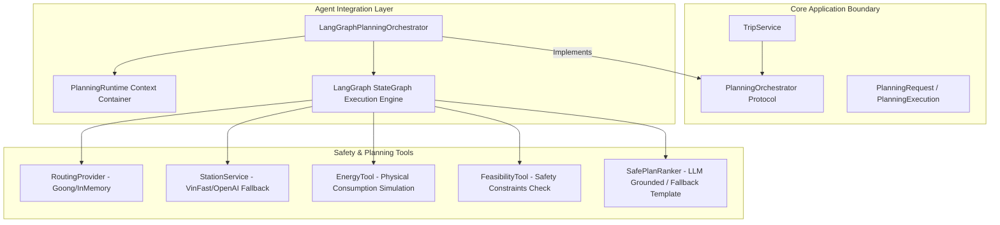
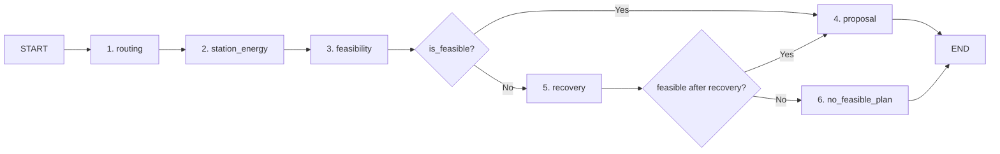

# Architecture Document — AI EV Planning Agent System

Tài liệu này mô tả chi tiết kiến trúc của hệ thống **AI EV Planning Agent System** (Mã dự án P-210), giải thích cách tổ chức mã nguồn, nguyên lý vận hành của Agent điều phối hành trình xe điện, và hướng dẫn từng bước để kiểm thử & khởi chạy sản phẩm.

---

## 1. Tổng quan Kiến trúc Agent (Agent Architecture Overview)

Hệ thống tuân theo mô hình **Hexagonal Architecture (Ports and Adapters)** kết hợp với **Deterministic LangGraph Workflow**. Ranh giới giữa logic nghiệp vụ lõi (Core Domain) và khung điều phối Agent (Agent Framework) được phân tách minh bạch:



### Nguyên tắc thiết kế cốt lõi (Core Principles):

1. **Zero-LLM Safety Decision (Tất định 100% về An toàn):**
   - Các quyết định liên quan tới tuyến đường, mức tiêu hao năng lượng chặng ($E_{\text{seg}}$), khoảng cách detour, tính tương thích chuẩn sạc (CCS2) và tỷ lệ pin dự phòng (Reserve SOC $\ge 15\%$) **được tính toán bằng thuật toán tất định 100%**.
   - LLM **không** được quyền tự ý bỏ qua tool an toàn hay tự đưa ra quyết định khả thi.

2. **Immutable PlanningRuntime & Context Isolation:**
   - Mọi dependency (Routing, Station Service, Environment, Energy Tool, Feasibility Tool, Plan Ranker) được đóng gói trong một container bất biến `PlanningRuntime`.
   - Mỗi lượt lập kế hoạch (`PlanningRequest`) chạy trong một `ContextVar` độc lập (`use_planning_runtime`). Code vẫn giữ `_legacy_runtime` mutable cho các import/test cũ; execution production dùng runtime riêng của orchestrator.

3. **Grounded Natural Language Explanation & Fallback:**
   - LLM không được quyết định các safety facts. Khi được bật, LLM có thể tham gia ở `proposal_node` để xếp hạng/giải thích các phương án đã kiểm định, hoặc ở các adapter fallback/recovery để tìm dữ liệu trạm và điểm tiếp cận.
   - Khi LLM gặp lỗi mạng/timeout hoặc bị tắt, hệ thống dùng `DeterministicPlanRanker`; kết quả feasibility không phụ thuộc vào LLM.

4. **Hai lớp Recovery độc lập:**
   - `recovery_node` nằm trong LangGraph, dùng `AdaptiveStationPlanner` và recovery station provider để tìm thêm chuỗi trạm, sau đó luôn kiểm định lại bằng routing, energy và feasibility tools.
   - `RecoverySupervisor` nằm ở application/API layer, xử lý các lỗi provider như endpoint không thể định tuyến. Gợi ý do AI tạo chỉ được trả về sau khi geocoder và routing provider xác minh lại; nếu không xác minh được, API yêu cầu người dùng chọn lại điểm.

---

## 2. Luồng thực thi Chi tiết (Detailed Graph Workflow)

LangGraph điều phối các bước xử lý qua sơ đồ trạng thái (`AgentState`):



### Chi tiết các Node xử lý:

| Node | Trách nhiệm | Tool / Module phụ trách |
|------|------------|------------------------|
| **`routing`** | Tính toán tuyến đường gốc giữa Điểm đi (Origin) và Điểm đến (Destination). | `GoongRoutingProvider` / `InMemoryRoutingProvider` |
| **`station_energy`** | Lấy danh sách trạm sạc theo corridor/window và mô phỏng mức tiêu thụ năng lượng/SOC chặng. | `StationService`, `AdaptiveStationPlanner`, `EnergyTool` |
| **`feasibility`** | Đánh giá vi phạm an toàn theo assumption snapshot: Reserve SOC, connector, detour và các chặng SOC. | `FeasibilityTool` |
| **`recovery`** | Kích hoạt sau khi tìm kiếm authoritative thất bại; tìm thêm trạm qua recovery provider và kiểm định lại bằng routing/energy/feasibility. | `AdaptiveStationPlanner` + `find_recovery_station_window` |
| **`proposal`** | Tạo tối đa ba phương án an toàn, chọn proposal đầu tiên và sinh nội dung giải thích. | `DeterministicPlanRanker` hoặc `OpenAISafePlanRanker` |
| **`no_feasible_plan`** | Đóng gói lý do thất bại có cấu trúc khi không tìm thấy hành trình an toàn. | `NoFeasiblePlan` entity |

---

## 3. Bản đồ Mã nguồn (Source Code File Mapping)

Các thành phần chính được phân bổ trong cấu trúc thư mục của monorepo:

```text
src/
├── packages/
│   ├── core/
│   │   └── planning/                    # Domain Layer — Khai báo Port & Boundaries
│   │       ├── domain/
│   │       │   └── outcomes.py          # Enum PlanningOutcomeKind (SUCCEEDED, INFEASIBLE, v.v.)
│   │       └── application/
│   │           ├── orchestrator.py      # PlanningRequest, PlanningExecution, PlanningOrchestrator Protocol
│   │           └── ports.py             # Interfaces cho Plan Ranker
│   │
│   └── agent/                           # Agent adapter/infrastructure — LangGraph & Runtime
│       └── planning/
│           ├── runtime.py               # PlanningRuntime dependency container
│           ├── orchestrator.py          # Export facade cho Orchestrator
│           ├── state.py                 # Schema AgentState (TypedDict)
│           ├── graph.py                 # LangGraph StateGraph & LangGraphPlanningOrchestrator
│           └── nodes/
│               ├── planning_nodes.py    # Chi tiết cài đặt 6 planning nodes
│               └── analysis_node.py     # Legacy/chat analysis helper
```

Runtime API cũng được lắp ráp tại `src/packages/core/trips/api/dependencies.py`. `TripService` nhận `PlanningOrchestrator` qua constructor, còn các provider production/test được chọn từ `Settings`.

---

## 4. Hướng dẫn Khởi chạy & Kiểm thử Sản phẩm (Execution Guide)

### Yêu cầu tiên quyết (Prerequisites):
- Python 3.12+
- Môi trường ảo `.venv` đã được cài đặt đầy đủ dependencies.
- Node.js 18+ (để chạy React/Vite Frontend).

---

### Bước 1: Kích hoạt Môi trường ảo (`.venv`)

Trên Windows PowerShell, kích hoạt venv bằng lệnh:
```powershell
.venv\Scripts\Activate.ps1
```
Hoặc thực thi trực tiếp bằng đường dẫn Python của `.venv`:
```powershell
.venv\Scripts\python.exe --version
```

---

### Bước 2: Đảm bảo Biến môi trường (`.env`)

Tạo hoặc kiểm tra file `.env` tại thư mục gốc dự án (`d:\Courses\workspace\BuildPhase\P-210\.env`):

```env
DATABASE_URL=sqlite:///./data/app.db
GOONG_API_KEY=your_goong_api_key_here
OPENAI_API_KEY=your_openai_api_key_here
```

---

### Bước 3: Chạy Toàn bộ Test Suite

Để kiểm tra tính đúng đắn của toàn bộ hệ thống (unit, integration và API tests; số test case thay đổi theo parametrization):

```powershell
.venv\Scripts\python.exe -m pytest
```

Chạy riêng test kiểm tra ranh giới Planning Orchestrator:
```powershell
.venv\Scripts\python.exe -m pytest tests/test_core/test_planning_orchestrator_boundary.py
```

---

### Bước 4: Khởi chạy Backend Server (FastAPI)

Chạy Uvicorn development server:

```powershell
.venv\Scripts\python.exe -m uvicorn src.apps.api.main:app --reload --port 8000
```

Sau khi khởi chạy thành công:
- **API Base URL:** `http://localhost:8000/api/v1`
- **Swagger Documentation:** `http://localhost:8000/docs`
- **ReDoc:** `http://localhost:8000/redoc`

---

### Bước 5: Khởi chạy Frontend Application (React / Vite)

Mở một cửa sổ Terminal mới và thực hiện:

```powershell
cd src/apps/web
npm install
npm run dev
```

Ứng dụng Web UI sẽ khả dụng tại: `http://localhost:5173`

---

## 5. Quy trình Kiểm thử Lập kế hoạch qua API (API Workflow Verification)

1. **Đăng ký / Đăng nhập:**
   - Send `POST /api/v1/auth/register` hoặc `POST /api/v1/auth/login`.
   - Nhận Bearer token từ response Header/Body.

2. **Tạo Chuyến đi (Trip):**
   - Send `POST /api/v1/trips` với tọa độ origin, destination và thông tin xe (`vehicle_profile_id`).

3. **Lập Kế hoạch Hành trình (Trigger Planning):**
   - Send `POST /api/v1/trips/{trip_id}/plans`.
   - Endpoint gọi `TripService` → `LangGraphPlanningOrchestrator` và trả về một trong các dạng: `PlanCreatedResponse`, `NoFeasiblePlan` hoặc response yêu cầu hành động/recovery. Khi tạo được plan, proposal chứa SOC timeline và các trạm sạc đã được kiểm định.

---

## 6. Lịch sử Thay đổi & Nhật ký Cập nhật Kỹ thuật (Technical Change Log)

### Ngày 2026-08-22: Xử lý sự cố Lập kế hoạch đường dài & Tái cấu trúc API Trạm sạc VinFast

#### 1. Chẩn đoán & Phân tích Sự cố Lập kế hoạch Chuyến đi Đường dài (Hà Nội $\rightarrow$ TP.HCM ~1.700 km)
- **Vấn đề:** Khi người dùng nhập chuyến đi dài, hệ thống không xuất ra kế hoạch hoặc trả về thông báo yêu cầu hành động `ActionRequiredResponse`.
- **Nguyên nhân chính được xác minh:**
  1. *Giới hạn tính toán của Planner:* Ngân sách kiểm định cạnh `_MAX_EDGE_VALIDATIONS` (giới hạn 60 lượt) bị vượt quá trước khi cây tìm kiếm chạm tới điểm đích.
  2. *Chặn API VinFast do WAF:* Endpoint lấy chi tiết trạm `vinfastauto.com/vn_vi/get-locator/{id}` bị chặn bởi WAF Cloudflare (`::IM_UNDER_ATTACK_BOX::` / HTTP 403), khiến `VinFastStationDataService` ném ngoại lệ `StationProviderError` và bật cờ `station_provider_unavailable`.
  3. *Nguyên tắc Safety Gate:* Khi chưa chứng minh 100% các trạm sạc an toàn, hệ thống thực thi chính xác policy **Zero-LLM Safety Decision** bằng cách từ chối cấp plan tự động.

#### 2. Thiết kế Giải pháp Kiến trúc Đường dài (Pre-computed Graph & Multi-leg Chunking)
- **Đồ thị Trạm sạc Pre-computed (Pre-built Station Graph):** Xây dựng đồ thị $G=(V, E)$ giữa các trạm sạc trong bộ nhớ. Tính toán đường đi ngắn nhất bằng Dijkstra/A* kết hợp trọng số năng lượng động (Dynamic Edge Weighting) theo `VehicleProfile`, giảm 50x-100x số lượt gọi API bên thứ ba.
- **Phương pháp Phân đoạn hành trình (Multi-leg Chunking):** Đối với các hành trình $> 500\text{ km}$, tự động chia nhỏ tuyến đường gốc thành các chặng nhỏ $\approx 350\text{ km}$ qua các điểm mốc trung gian. Thực thi tuần tự/song song trong hạn mức `_MAX_EDGE_VALIDATIONS` và ghép nối (stitching) polylines & SOC timeline liên tục.

#### 3. Tái cấu trúc Xử lý Lỗi & Tối ưu hóa Gọi API Trạm sạc VinFast (`station_service.py`)
- **Giảm tính song song & Giới hạn tốc độ Request (Rate Pacing):** Thay thế luồng gọi 8 threads song song bằng tuần tự / giới hạn concurrency với khoảng trễ pacing `min_request_interval_seconds` (mặc định 0.05s - 0.1s) giữa các request detail trạm sạc, loại bỏ hoàn toàn việc spammed API làm kích hoạt Cloudflare WAF anti-bot rate-limiting.
- **Tách lỗi 403/WAF khỏi Business Logic:** Định nghĩa lớp ngoại lệ chuyên biệt `VinFastAccessDeniedError(StationProviderError)` để nhận diện chính xác sự cố bị chặn bởi WAF/anti-bot thay vì trộn lẫn với lỗi 5xx hoặc business rejection.
- **Phòng chống Parse HTML thành JSON:** Thêm bước kiểm tra `Content-Type` và kiểm tra HTML tags (`text/html`, `<html`, `::IM_UNDER_ATTACK_BOX::`) trước khi gọi `response.json()`, loại bỏ hoàn toàn việc parse HTML challenge page thành JSON.
- **Ghi log chi tiết (Detailed Log Traceability):**
  - Trích xuất & ghi log các trường: `entity_id`, HTTP `status`, `content_type` với log prefix `[VINFAST_API_RESPONSE]` hoặc `[WAF_REJECTED]`.
  - Phân tách minh bạch trường hợp từ chối nghiệp vụ `[BUSINESS_REJECTION]` (ghi rõ `entity_id`, `charging_status`, `depot_status`, lý do từ chối: `inactive_or_maintenance`, `no_compatible_connector`) với trường hợp trạm hợp lệ `[BUSINESS_ACCEPTED]`.
- **Bổ sung Unit Tests:** Thêm test cases `test_fetch_one_detail_raises_explicit_error_on_403_waf` và `test_fetch_one_detail_raises_explicit_error_on_html_response` trong `test_vinfast_station_service.py`. Tất cả test cases (`pytest`) đã được xác minh thành công.

