# P-210 — Kết quả kiểm thử E2E gửi team

## Tóm tắt

- Sản phẩm VGo được kiểm thử tại `https://p-210-web-dev.onrender.com/` bằng Chrome với hai tài khoản thử độc lập, mỗi tài khoản có xe VF 6 Plus.
- Lượt kiểm thử diễn ra ngày `28/08/2026`, bắt đầu lúc `15:46:59` theo giờ Việt Nam.
- Website không hiển thị mã phiên bản; một số nút trên website còn mới hơn mã nguồn `a06db35`, nên chưa xác nhận được phiên bản đang chạy.
- Kết quả: **6 PASS / 28 FAIL**, đủ **34/34 case**.
- Cách đọc kết quả: **PASS** = chạy đúng; **FAIL** = có lỗi cần sửa; **BLOCKED** = chưa tới được chức năng cần kiểm tra; **INVALID** = case không phù hợp với giao diện hiện tại.
- Mức độ lỗi: **P0** = lỗi nghiêm trọng cần ưu tiên sửa trước; **P1** = lỗi quan trọng cần sửa.

## Bảng kết quả đầy đủ

| Mã case | Kết quả | Mức độ | Giải thích dễ hiểu | Bằng chứng |
|---|---|---|---|---|
| P210-F1-HAPPY-001 | PASS | — | Hoạt động đúng: tuyến ngắn tạo kế hoạch phiên bản 1 ở trạng thái chờ xác nhận, không chèn trạm sạc, dự kiến còn 59,4% pin khi tới nơi và có ghi nguồn dữ liệu Goong cùng Open-Meteo. | <a href="./P210-F1-HAPPY-001-short-trip-plan.png">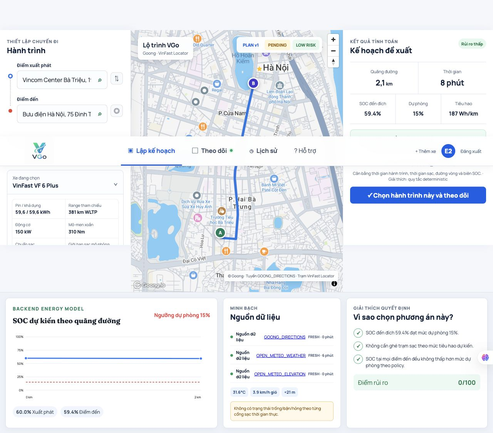</a> |
| P210-F1-HAPPY-002 | FAIL | P0 | Mong đợi: tuyến Hà Nội đến TP.HCM phải trả về một kế hoạch, hoặc nói rõ tuyến không thể thực hiện và lý do. Thực tế: trang dừng ở “Đang lấy dữ liệu thời tiết và độ cao” ít nhất 60 giây, không có kết quả hoặc cách xử lý tiếp. | <a href="./P210-F1-HAPPY-002-long-trip-after-60s.png">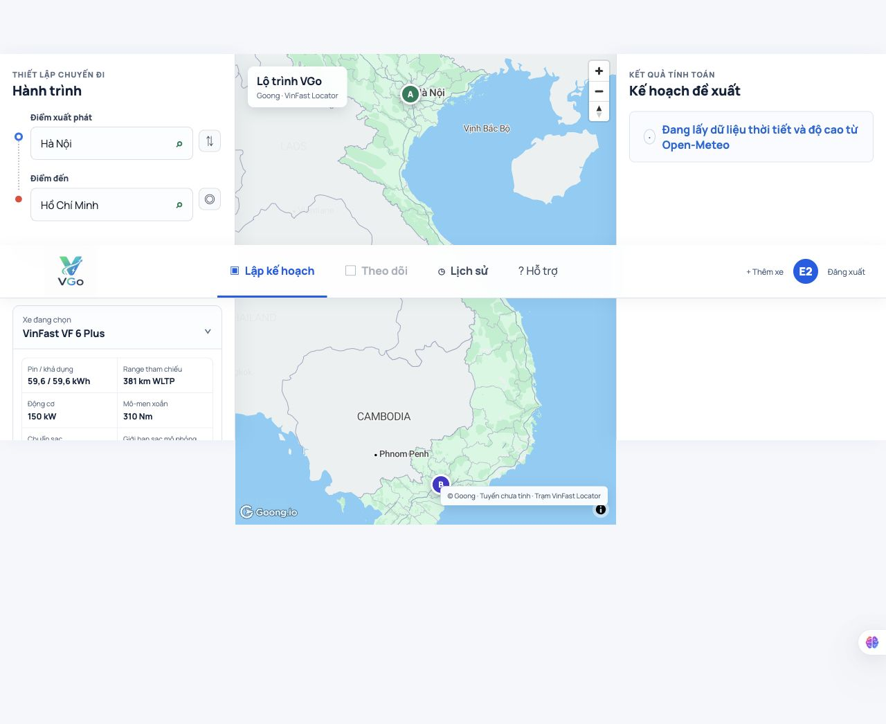</a> |
| P210-F1-EDGE-003 | PASS | — | Hoạt động đúng: với 17% pin, xe tới đích còn 15,4% sát mức pin dự phòng; với 16% pin, hệ thống chèn trạm sạc CCS2 và cho xe rời trạm ở 80%, không để xe đi thẳng dưới mức an toàn. | <a href="./P210-F1-EDGE-003-reserve-near-boundary.png">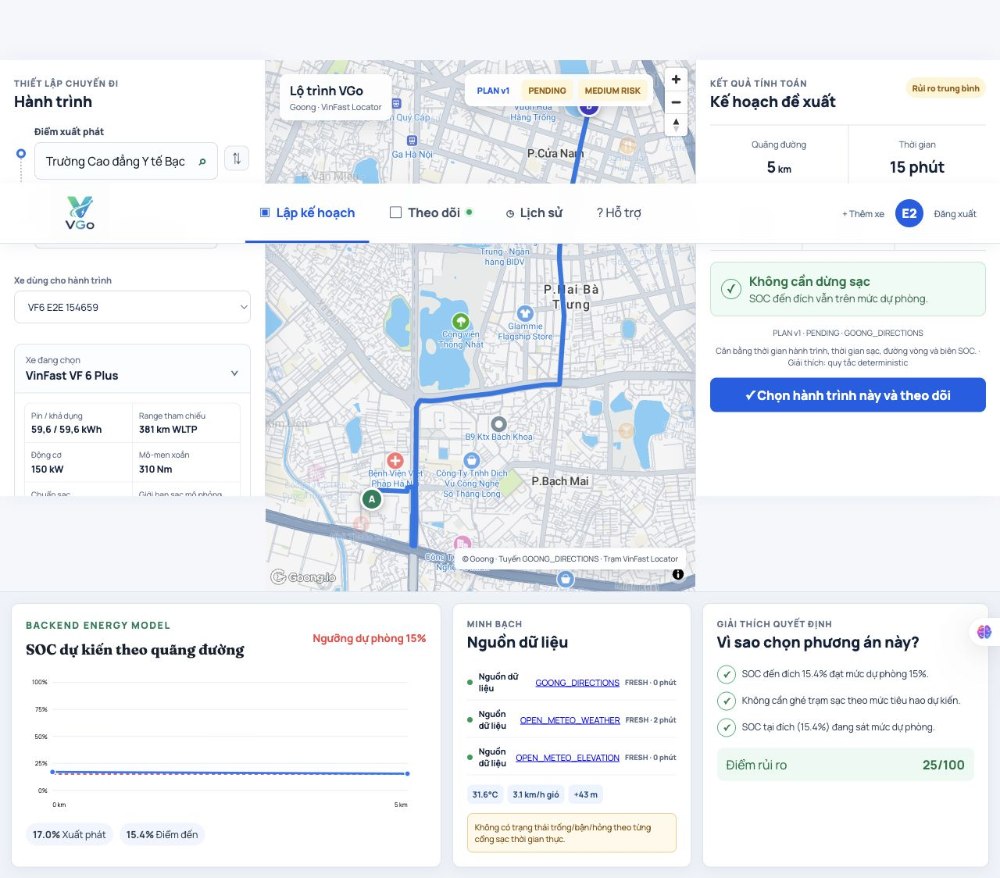</a> · <a href="./P210-F1-EDGE-003-below-reserve.png">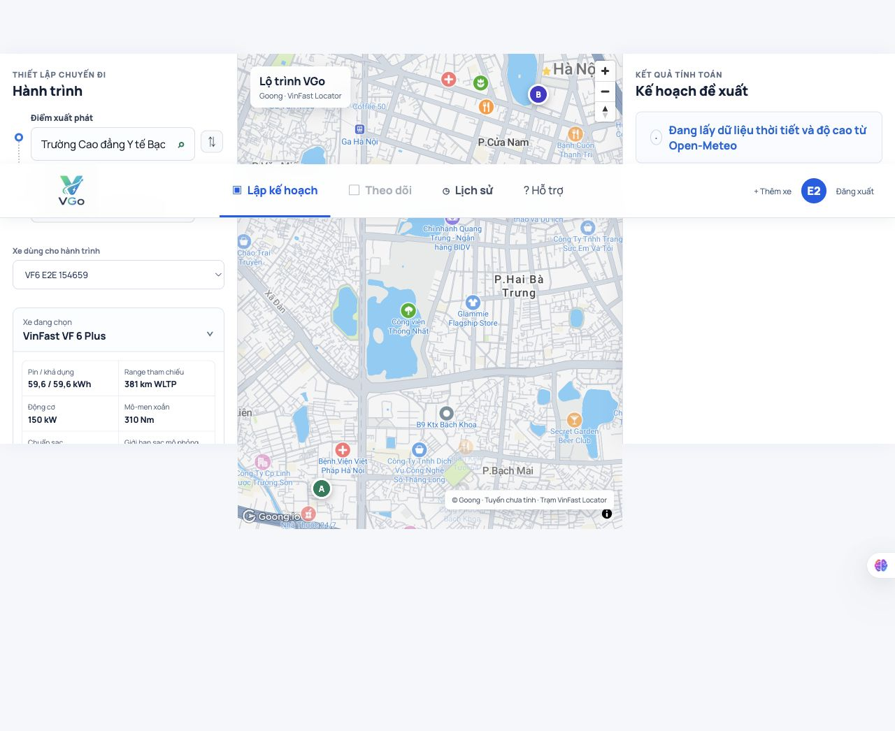</a> |
| P210-F1-UNHAPPY-004 | PASS | — | Hoạt động đúng: điểm đi hoặc điểm đến để trống, mức pin âm và mức pin 101% đều bị chặn với thông báo cụ thể trước khi tính tuyến. | <a href="./P210-F1-UNHAPPY-004-empty-validation.png">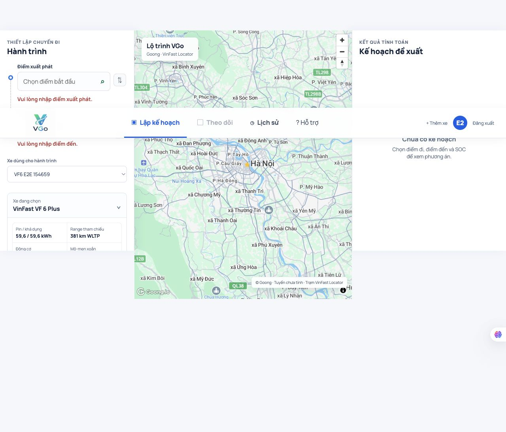</a> · <a href="./P210-F1-UNHAPPY-004-soc-negative.png">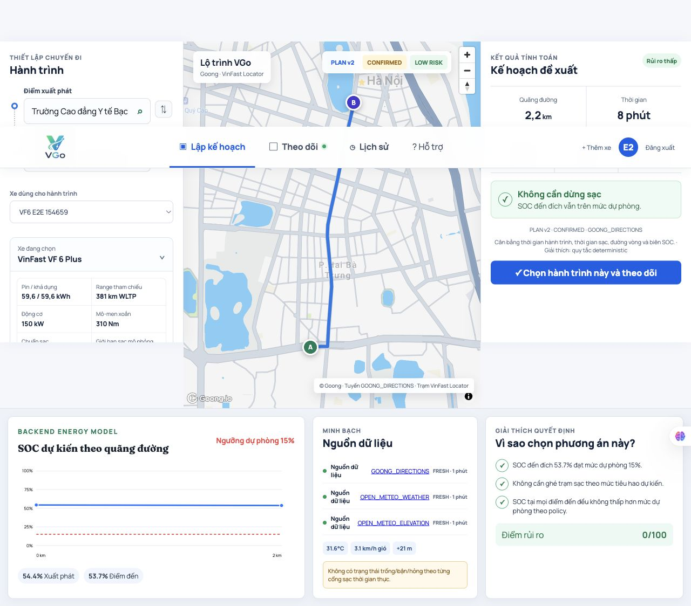</a> |
| P210-F1-EDGE-005 | FAIL | P0 | Mong đợi: hệ thống phải loại trạm có chuẩn đầu sạc không phù hợp với xe. Thực tế: mọi xe dùng thử đều bị cố định ở CCS2 và website không có trạm hoặc lựa chọn chuẩn sạc khác để chứng minh quy tắc loại trạm sai chuẩn. | <a href="./P210-F1-EDGE-005-no-connector-negative-fixture.png">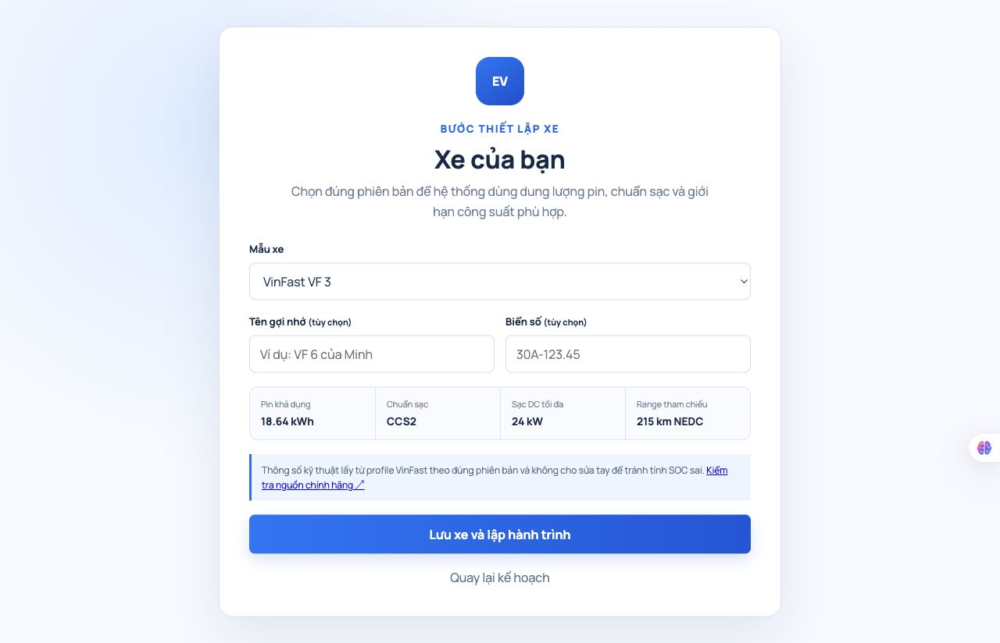</a> |
| P210-F1-UNHAPPY-006 | FAIL | P0 | Mong đợi: khi dịch vụ thời tiết hoặc độ cao không phản hồi, trang phải hết thời gian chờ, cho hủy hoặc thử lại và nói rõ đây là lỗi dữ liệu. Thực tế: nút tính bị khóa, trang tải mãi và không phân biệt lỗi dịch vụ với tuyến không thể thực hiện. |  |
| P210-F1-EDGE-007 | PASS | — | Hoạt động đúng: kế hoạch ghi rõ nguồn dữ liệu, thời điểm cập nhật và cảnh báo rằng hệ thống chưa có trạng thái cổng sạc trống hoặc bận theo thời gian thực. |  |
| P210-F2-AI-001 | PASS | — | Hoạt động đúng: phần giải thích khớp với mức pin, mức pin dự phòng và quyết định không cần sạc của kế hoạch, không nói trái kết quả tính tuyến. | <a href="./P210-F2-AI-001-grounded-explanation.png">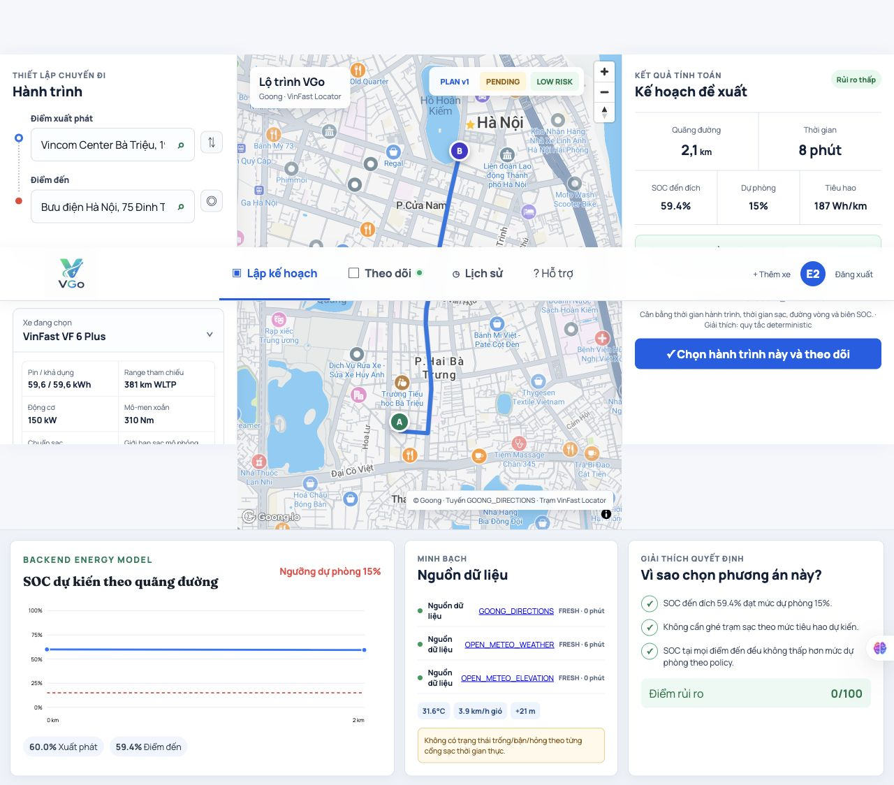</a> |
| P210-F2-HAPPY-002 | FAIL | P0 | Mong đợi: kế hoạch đang chờ xác nhận phải còn nguyên sau khi tải lại để người dùng xác nhận đúng phiên bản. Thực tế: kế hoạch có trước khi tải lại nhưng biến mất hoàn toàn sau khi tải lại trang. |  · <a href="./P210-F2-HAPPY-002-pending-lost-after-refresh.png">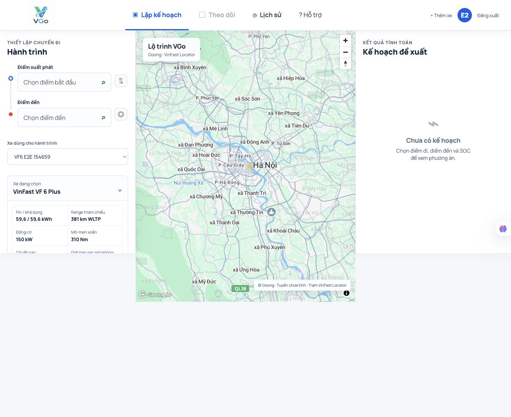</a> |
| P210-F2-HAPPY-003 | FAIL | P0 | Mong đợi: người dùng có thể chấp nhận hoặc từ chối kế hoạch mới; khi từ chối, kế hoạch cũ vẫn giữ nguyên. Thực tế: kế hoạch chờ chỉ có nút chọn, không có nút từ chối và không lưu được quyết định từ chối. |  |
| P210-F2-UNHAPPY-004 | FAIL | P0 | Mong đợi: nếu kế hoạch cũ đã không an toàn mà người dùng từ chối kế hoạch mới, hệ thống phải cảnh báo dừng xe hoặc gọi hỗ trợ. Thực tế: không có nút từ chối, nên cũng không có cảnh báo an toàn sau khi từ chối. | <a href="./P210-F2-UNHAPPY-004-no-unsafe-reject-control.png">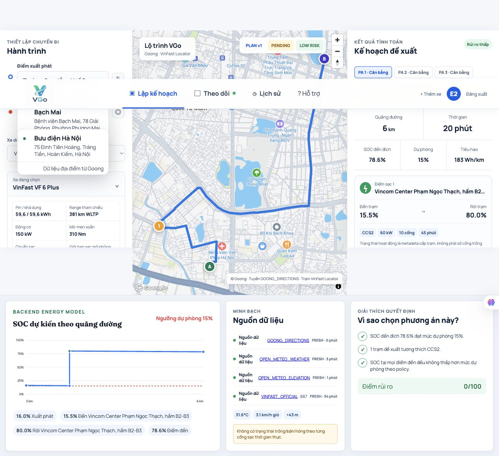</a> |
| P210-F2-EDGE-005 | FAIL | P0 | Mong đợi: khi hai tab cùng xử lý một kế hoạch, chỉ quyết định đầu tiên được chấp nhận và tab còn lại phải báo phiên bản đã cũ. Thực tế: kế hoạch chờ biến mất sau khi tải lại và giao diện không có thông báo xung đột phiên bản, nên không thể hiện rõ quyết định nào thắng. |  |
| P210-F2-AI-006 | PASS | — | Hoạt động đúng: mỗi kế hoạch có phần giải thích dựa trên quy tắc tính rõ ràng; việc dùng tuyến và đánh giá có đi được hay không không phụ thuộc vào câu văn do AI tạo. |  |
| P210-F3-HAPPY-001 | FAIL | P0 | Mong đợi: có thể chọn một chuyến mô phỏng bình thường để chạy lại cùng kết quả. Thực tế: trình mô phỏng tự chọn ngẫu nhiên sự kiện pin tiêu hao bất thường, không có lựa chọn cố định cho chuyến bình thường. |  |
| P210-F3-EDGE-002 | FAIL | P0 | Mong đợi: có thể phát lại dữ liệu tại 1,99 km, 2,00 km và 2,01 km để kiểm tra chính xác ranh giới quãng đường. Thực tế: màn hình chỉ có nút bắt đầu và tình huống ngẫu nhiên, không cho nhập ba mốc này. |  |
| P210-F3-EDGE-003 | FAIL | P0 | Mong đợi: có thể kiểm tra độ lệch pin tại 4,9%, 5,0% và 5,1% để xác nhận đúng ranh giới phát hiện bất thường. Thực tế: trình mô phỏng không cho nhập hoặc chọn các mức độ lệch này. |  |
| P210-F3-HAPPY-004 | FAIL | P0 | Mong đợi: có thể chọn tình huống trạm sạc không hoạt động để kiểm tra phản ứng của hệ thống. Thực tế: trình mô phỏng chọn ngẫu nhiên, không có lựa chọn tình huống và lượt này chỉ tạo sự kiện về pin. | <a href="./P210-F3-HAPPY-004-no-station-event-control.png">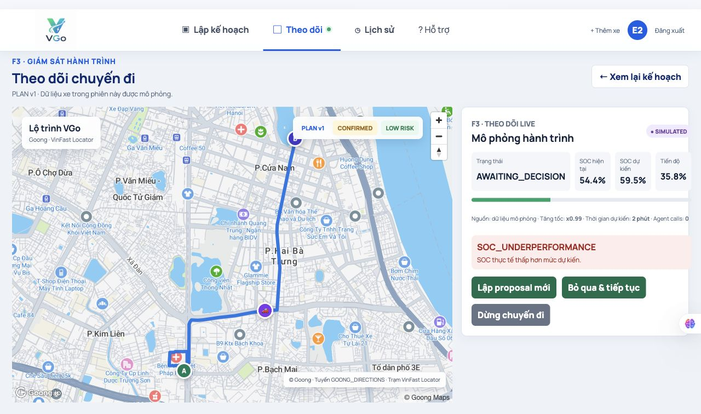</a> |
| P210-F3-EDGE-005 | FAIL | P0 | Mong đợi: có thể tạm dừng dữ liệu 60 hoặc 61 giây để kiểm tra cảnh báo dữ liệu xe đã cũ và cách khôi phục. Thực tế: giao diện không có cách tạm dừng, nhập mốc thời gian hoặc tạo trạng thái dữ liệu cũ. | <a href="./P210-F3-EDGE-005-no-stale-control.png">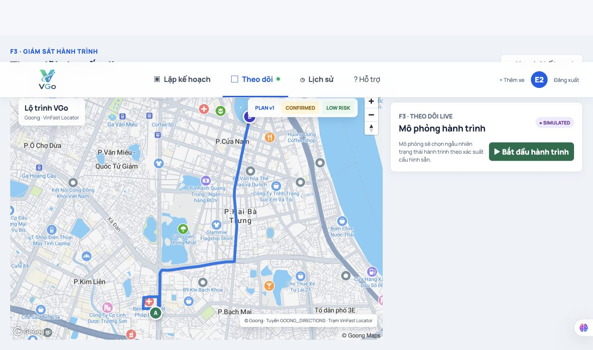</a> |
| P210-F3-EDGE-006 | FAIL | P1 | Mong đợi: trình mô phỏng có thể tạm dừng, chạy tiếp, đặt lại và chạy lại cùng tình huống để bảo đảm một sự kiện không bị ghi trùng. Thực tế: chỉ có nút bắt đầu, không có các điều khiển còn lại. |  |
| P210-F4-HAPPY-001 | FAIL | P0 | Mong đợi: khi lập lại kế hoạch, hệ thống phải dùng mức pin hiện tại và lịch sử phải lưu đúng mức pin đó, đồng thời cho người dùng thấy điểm khác giữa kế hoạch cũ và mới. Thực tế: biểu đồ dùng 54,4% nhưng lịch sử sau xác nhận lại ghi 60,0% và không có bảng so sánh hai kế hoạch. |  · <a href="./P210-XFLOW-001-history-after-replan.png">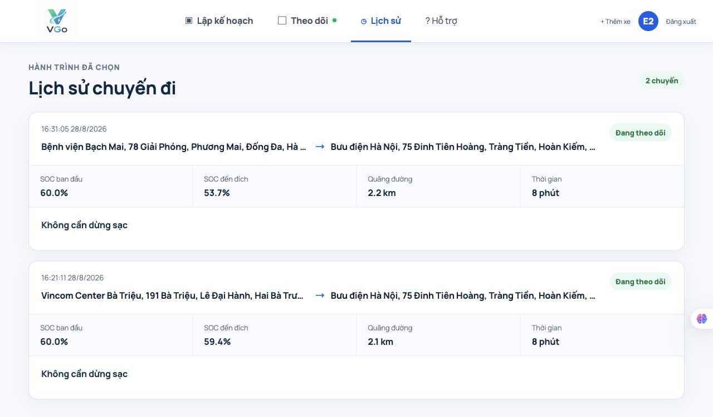</a> |
| P210-F4-HAPPY-002 | FAIL | P0 | Mong đợi: khi trạm sạc không hoạt động, hệ thống phải loại trạm đó và giải thích vì sao chọn trạm khác. Thực tế: không chọn được tình huống trạm không hoạt động và giao diện không hiển thị danh sách trạm bị loại hoặc lý do chọn trạm thay thế. |  |
| P210-F4-EDGE-003 | FAIL | P0 | Mong đợi: khi ba sự kiện xảy ra gần nhau, hệ thống phải kết hợp chúng thành một kế hoạch mới nhất quán. Thực tế: giao diện không có cách phát ba sự kiện trên cùng một trạng thái chuyến đi để kiểm tra kết quả. |  |
| P210-F4-UNHAPPY-004 | FAIL | P0 | Mong đợi: dữ liệu xe đã quá cũ phải chặn việc lập kế hoạch mới cho tới khi có mẫu dữ liệu mới. Thực tế: không có tình huống dữ liệu cũ hoặc cách điều khiển mẫu dữ liệu để chứng minh quy tắc này. |  |
| P210-F4-UNHAPPY-005 | FAIL | P0 | Mong đợi: khi dịch vụ dữ liệu bị lỗi, trang phải nói “chưa đủ dữ liệu”, cho thử lại và phân biệt với trường hợp đã tính được rằng tuyến không thể thực hiện. Thực tế: trang chỉ tải kéo dài, không có thông báo hoặc nút thử lại. |  |
| P210-F4-HAPPY-006 | FAIL | P0 | Mong đợi: sự kiện pin tạo một kế hoạch mới có phần so sánh với kế hoạch cũ và cả nút chấp nhận lẫn từ chối. Thực tế: kế hoạch phiên bản 2 được tạo ở trạng thái chờ nhưng không có phần so sánh và chỉ có nút xác nhận. | <a href="./P210-F4-HAPPY-006-pending-no-diff-reject.png">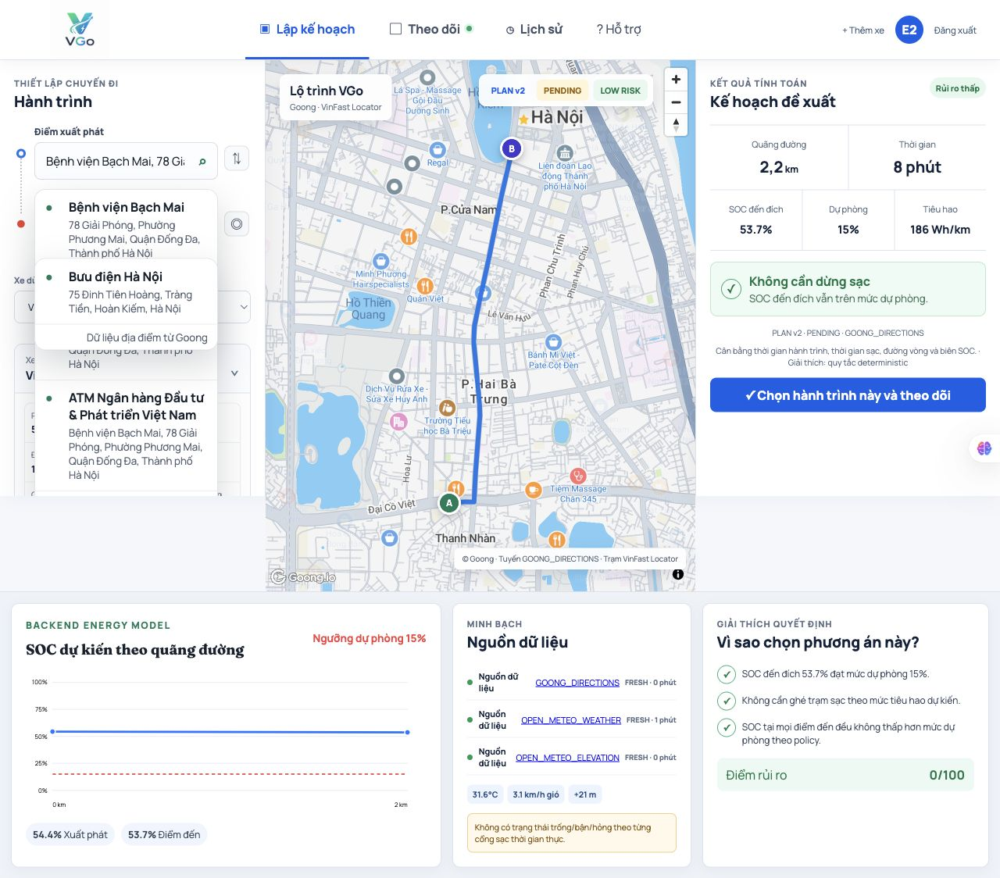</a> |
| P210-F4-EDGE-007 | FAIL | P0 | Mong đợi: khi kế hoạch chờ đã cũ, trang phải đánh dấu rõ và từ chối xác nhận phiên bản đó. Thực tế: không có dấu hiệu kế hoạch cũ; kế hoạch chờ còn biến mất sau khi tải lại nên không thể kiểm tra bảo vệ phiên bản. |  |
| P210-F4-SEC-008 | FAIL | P0 | Mong đợi: tài khoản B không được xem hoặc thay đổi chuyến và kế hoạch của tài khoản A, kể cả khi đoán đường dẫn. Thực tế: danh sách của B trống, cho thấy phần xem danh sách được tách đúng; nhưng giao diện không lộ mã chuyến hoặc đường dẫn thao tác để thử thay đổi và quan sát hệ thống từ chối. | <a href="./P210-F4-SEC-008-user-b-empty-history.png">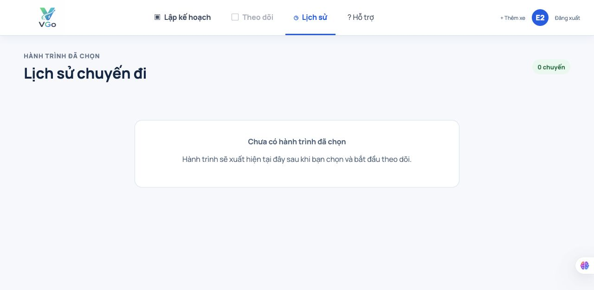</a> |
| P210-F4-AI-009 | FAIL | P1 | Mong đợi: nếu sản phẩm giới thiệu có bộ điều phối AI, sự kiện pin phải có dấu vết cho thấy hệ thống đánh giá, chọn cách xử lý và kiểm tra an toàn. Thực tế: sự kiện đã xảy ra nhưng màn hình ghi `Agent calls: 0`, không có dấu vết xử lý tương ứng. | <a href="./P210-F4-AI-009-zero-agent-calls.png">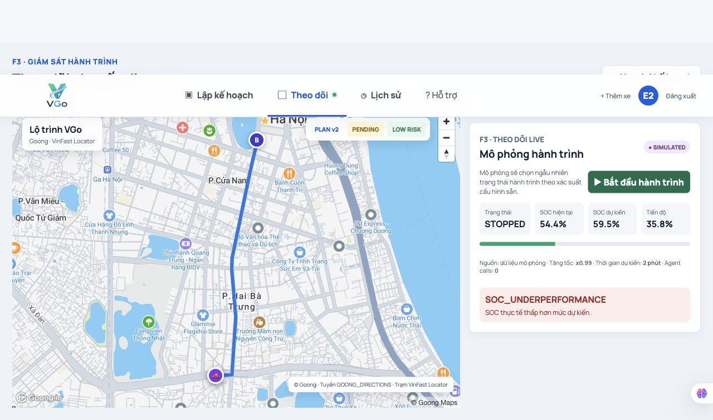</a> |
| P210-XFLOW-001 | FAIL | P0 | Mong đợi: sau khi lập lại kế hoạch, lịch sử chỉ có một chuyến đang được theo dõi và phải lưu mức pin hiện tại 54,4%. Thực tế: lịch sử có hai chuyến cùng ghi “Đang theo dõi”; bản mới còn ghi mức pin ban đầu 60%. |  |
| P210-F1-AI-901 | FAIL | P1 | Mong đợi: với câu “Đi từ Hà Nội vào miền Trung”, hệ thống phải hỏi người dùng muốn tới tỉnh hoặc thành phố nào ở miền Trung. Thực tế: trang chỉ báo chung rằng phải chọn cả điểm đi và điểm đến. | <a href="./P210-F1-AI-901-ambiguous-destination.png">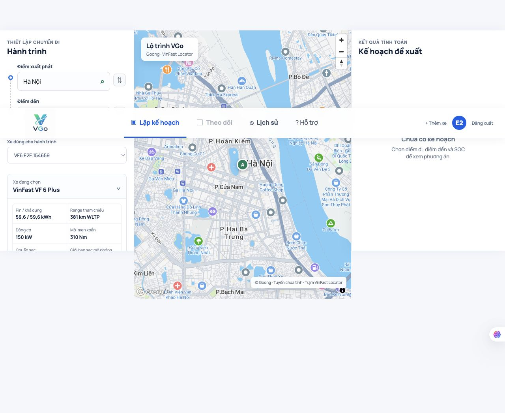</a> |
| P210-F1-AI-902 | FAIL | P0 | Mong đợi: người dùng có thể nhập yêu cầu “không dừng sạc”; nếu yêu cầu đó không an toàn, hệ thống phải từ chối và giải thích bằng số pin. Thực tế: trang chỉ nhận điểm đi, điểm đến, mức pin và xe, không có nơi nhập yêu cầu này. |  |
| P210-F2-AI-903 | FAIL | P1 | Mong đợi: người dùng có thể sửa chuẩn đầu sạc của xe và yêu cầu tính lại trạm phù hợp. Thực tế: chuẩn sạc bị khóa theo hồ sơ xe và không có nơi sửa hoặc tính lại. |  |
| P210-F4-AI-904 | FAIL | P0 | Mong đợi: khi sự kiện pin và trạm sạc xảy ra gần nhau, hệ thống phải tạo một kế hoạch duy nhất xử lý cả hai. Thực tế: trình mô phỏng chọn ngẫu nhiên và không có cách phát hai sự kiện chồng nhau để chứng minh hành vi này. |  |
| P210-F4-AI-905 | FAIL | P0 | Mong đợi: người dùng phải có quyền từ chối kế hoạch mới không an toàn và sau đó nhận hướng dẫn dừng xe hoặc gọi hỗ trợ. Thực tế: kế hoạch không an toàn không có nút từ chối, nên không quan sát được cảnh báo tiếp theo. |  |

## Việc cần sửa trước Demo Day

1. Lưu kế hoạch đang chờ và kế hoạch đang dùng ở máy chủ; sau khi tải lại phải còn đúng phiên bản và đúng mức pin hiện tại.
2. Thêm phần so sánh kế hoạch cũ với mới, nút Chấp nhận, nút Từ chối và cảnh báo khi một tab đang dùng phiên bản cũ.
3. Bổ sung trình mô phỏng có thể chọn tình huống cố định, nhập đúng mốc ranh giới, tạm dừng, chạy tiếp, đặt lại và phát nhiều sự kiện gần nhau.
4. Khi dịch vụ dữ liệu lỗi, phải có thời gian chờ tối đa, nút hủy hoặc thử lại và thông báo phân biệt “chưa đủ dữ liệu” với “tuyến không thể thực hiện”.
5. Nếu tiếp tục giới thiệu bộ điều phối AI, hãy hiển thị dấu vết xử lý thật; nếu sản phẩm chỉ chạy theo quy tắc cố định, hãy mô tả đúng phạm vi này.
